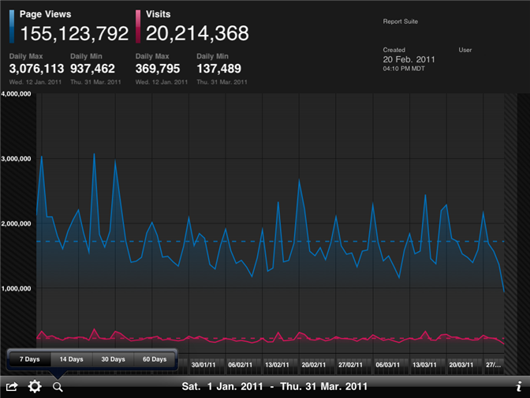

# Adobe Analytics for iOS

You can use Analytics for iOS any time or anywhere to view, present, or e-mail real-time trend data. 

 

You can view trend data by day, week, or month, or up to 90 days. The clear, simple-to-use interface lets you quickly access and present trend data reports of up to three metrics. 

Download Adobe Analytics for iOS from the App Store. If your iPad requires a newer version of the iOS, you can use iTunes to download the update. Always use the latest version of iTunes for best results. 
