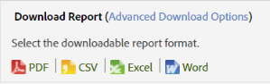
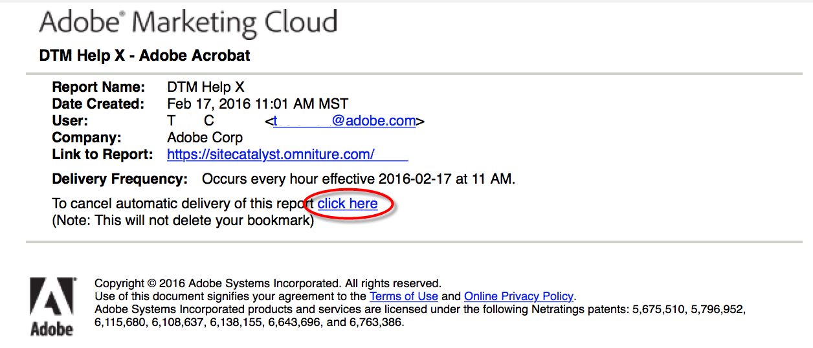

# Report Schedule and Distribution

## Report Schedule and Distribution {#concept_4EA333DFC7FD4E9CA086385A3DA10BE9}
>Information about scheduling, downloading and distributing reports.When you schedule a report for delivery in an Adobe Analytics application, you can use the Scheduling and Distribution tools to view what files have been automatically sent and modify or terminate the deliveries. 

Due to differences in processing mechanisms and platforms, the various types of downloadable and scheduled reports available in Adobe Analytics have different limitations regarding the maximum number of rows they can process in a single request. Here are the limits of each: 

* Word, CSV, Excel, HTML and PDF: The same number of rows visible in the report. By default this limit is 50 rows but can increase up to 200. Breakdown reports have a hard limit of 50 rows.
* Data Extracts: 50,000 rows
* Data Warehouse: Unlimited
Note that these limitations are for individual scheduled and downloaded reports; dashboards are limited to the amount of space available within a reportlet. 
>## Send a report {#task_27642CD33D484FD0BF59EBD159EEF52C}
>Steps that describe how to download and email reports in a variety of formats, and schedule a report for delivery.
<!-- t_send_report.xml -->

>1. Run a report, then click **[!UICONTROL  More]** > **[!UICONTROL  Send]**.
>1. Specify delivery options:

>    <table id="choicetable_554B0AD007A442B399686C5B0E68EAAB" keycol="0"> 
 <thead class="chhead sthead"> 
  <th class="choptionhd"> 
Option 
 </th> 
  <th class="chdeschd"> 
Description 
 </th> 
 </thead> 
 <tr class="chrow strow"> 
  <td class="choption"><strong>Format</strong></td> 
  <td class="chdesc stentry"> 
Select PDF or HTML. 
 </td> 
 </tr> 
 <tr class="chrow strow"> 
  <td class="choption"><strong>Send To</strong></td> 
  <td class="chdesc stentry"> 
Provide an email address to receive the report. 
 </td> 
 </tr> 
 <tr class="chrow strow"> 
  <td class="choption"><strong>Subject</strong></td> 
  <td class="chdesc stentry"> 
Subject of the email. 
 </td> 
 </tr> 
 <tr class="chrow strow"> 
  <td class="choption"><strong>Scheduling</strong></td> 
  <td class="chdesc stentry"> 
Select to send the report immediately or at a different interval. 
 </td> 
 </tr> 
</table>

>1. Click **[!UICONTROL  Advanced Delivery Options]** to specify a delivery schedule.

>    <table id="choicetable_2934E54FEE6E4D33B07EAC21F6DF628E" keycol="0"> 
 <thead class="chhead sthead"> 
  <th class="choptionhd"> Option </th> 
  <th class="chdeschd"> Description </th> 
 </thead> 
 <tr class="chrow strow"> 
  <td class="choption"><strong>Report File Name</strong></td> 
  <td class="chdesc stentry"> 
Specifies the name of the report. The default format is  &amp;lt;report name&amp;gt; for &amp;lt;suite&amp;gt; - &amp;lt;report date range&amp;gt; . 
 
To specify a custom name, select  Custom . 
 </td> 
 </tr> 
 <tr class="chrow strow"> 
  <td class="choption"><strong>Report Format</strong></td> 
  <td class="chdesc stentry"> 
Lets you specify PDF, CSV, Excel, HTML, Word, or Mobile formats for delivery. If you select CSV, you can also specify the encoding for CSV: 
 
 
    <ul id="ul_4A2EB8D9512246589994052CF482BFD7"> 
     <li id="li_A4FC4D795A9D4F92AAB187ACDFBA180D"> 
  Shift-JIS : Japanese character encoding. 
 </li> 
     <li id="li_405C7EC97F994D649A50F84466FADA3D"> 
  EUC-JP : Extended Unix Code, primarily for Japanese, Korean, and simplified Chinese. 
 </li> 
    </ul> 
 </td> 
 </tr> 
 <tr class="chrow strow"> 
  <td class="choption"><strong>Report Contents</strong></td> 
  <td class="chdesc stentry"> 
  Number of rows in the table : Specifies the number of rows you want visible in the table of the report you are sending. 
 
  Language for header and footer : Specifies the language of the header and footer. 
 
  Comments : Specifies the text that appears at the beginning of the report. 
 </td> 
 </tr> 
 <tr class="chrow strow"> 
  <td class="choption"><strong>Send Digital Signature File</strong></td> 
  <td class="chdesc stentry"> 
When you request a report, such as a bookmarked report or data warehouse requests, you can request a data signature. Adobe’s digital signature doesn't restrict who has access to the data, but the purpose of the Digital Signature File (.sig) is to verify the validity of the delivered report file. Using the digital signature, report recipients can verify that the file came from Adobe and has not been altered. 
 </td> 
 </tr> 
 <tr class="chrow strow"> 
  <td class="choption"><strong>Report Destination</strong></td> 
  <td class="chdesc stentry"> 
  Email : Lets you configure email address settings, the subject line, and notes. 
 
  FTP : Lets you configure FTP settings, including the Host, Port, Directory, Username, and Password. 
 </td> 
 </tr> 
</table>

>1. Click **[!UICONTROL  Scheduling Options]**.

>    <table id="choicetable_589A39087F4C497D8913364FFF0125B7" keycol="0"> 
 <thead class="chhead sthead"> 
  <th class="choptionhd"> Option </th> 
  <th class="chdeschd"> Description </th> 
 </thead> 
 <tr class="chrow strow"> 
  <td class="choption"><strong>Send Report Now</strong></td> 
  <td class="chdesc stentry"> 
Sends the report immediately. 
 </td> 
 </tr> 
 <tr class="chrow strow"> 
  <td class="choption"><strong>Schedule for Later</strong></td> 
  <td class="chdesc stentry"> 
Displays options to specify a time frame and delivery options. 
 </td> 
 </tr> 
 <tr class="chrow strow"> 
  <td class="choption"><strong>Report Time Frame</strong></td> 
  <td class="chdesc stentry"> 
  Fixed : Prevents the date from advancing as time passes. 
 
  Rolling : Allows the date to advance as time passes. Some considerations: 
 
 
    <ul id="ul_5CDCCBEFEB364800A428614183A0E6A1"> 
     <li id="li_37B8F32A9E3B4979B5239A58F0C5A71C"> 
If you select rolling for both the start and end dates, and you select a daily report for the previous day, you receive an email each day with a report for the previous day. 
 </li> 
     <li id="li_83FFD2400C6A453783CDD9BB3B9BA3F9"> 
If you select fixed for the starting day, and rolling for the end day, you receive on the first day a report for the previous day. The second day you receive a report for the previous two days, and on the third day you receive a report for the previous three days, and so on. 
 </li> 
     <li id="li_28F8552D699841BC942058247D39DBB9"> 
If you select fixed for both the beginning and ending dates, each day you receive an identical report for the days that you specified. 
 </li> 
     <li id="li_A594A6E2A4044ED6AC0A80F88EB203B3"> 
You cannot select a rolling start and a fixed finish date. 
 </li> 
    </ul> 
 </td> 
 </tr> 
 <tr class="chrow strow"> 
  <td class="choption"><strong>Delivery Frequency</strong></td> 
  <td class="chdesc stentry"> 
  Hourly : Delivers the email every hour, every other hour, or any other interval of hours. 
 
  Daily : Sends the email every day, every other day, every third day, or any other interval of days. You can also have it sent every weekday. 
 
  Weekly : Sends the email every week, other week, every third week, or any other interval of weeks. You can also specify which day of the week it is sent. 
 
  Monthly : Specifies the interval in numbers of months, and you can also select the day of the month on which it is sent, or the day of the week in a specific week of the month. 
 
  Yearly : Specifies the day of the year on which the report is sent, or you can send on a specific day of the week in any week of the year. 
 
  Time of Day : Applies to the time zone attached to the selected report suite. 
 </td> 
 </tr> 
 <tr class="chrow strow"> 
  <td class="choption"><strong>End Delivery Options</strong></td> 
  <td class="chdesc stentry"> 
  Never end : Specifies no end. 
 
  End after &amp;lt;value&amp;gt; occurrences : Specifies the number of occurrences before ending delivery. 
 
  End on : Lets you specify a specific date. 
 
If you want to process the data on the same date as the report data, the report contains only data that has been put in the database at the time the report is sent. Because complete processing for a day can take up to 24 hours, complete data might not be available at the time the report is sent. For complete data, always set the processing time for 24 hours after the end of the reporting period. 
 </td> 
 </tr> 
</table>

>## Print a report {#task_0F7CF6D6ED54462CAE4A793E271AF7E5}
>Steps that describe how to print a report.
<!-- t_reports_print.xml -->

>1. Run a report.
>1. Click **[!UICONTROL  More]** > **[!UICONTROL  Print]**.  
>## Download a report using basic options {#task_43660107A1C9485D92981CD75B562577}
>Download detailed information about a specific report in PDF, CSV, Excel, or Raw Data Export formats.
<!-- t_download-report.xml -->

>1. In  **[!UICONTROL  Analytics]** > **[!UICONTROL  Reports]** , select a report to view.
>1. Click **[!UICONTROL  Download]**.

>        
>1. Select the desired format for the report:
>    * **[!UICONTROL  PDF]**: Specifies that the report will be downloaded in Adobe PDF, which lets you share the report with others, regardless of which computer system the recipient is running. 

>    * **[!UICONTROL  CSV]**: Specifies that the report will be downloaded in [!DNL  .csv] (comma-separated values format). 

>    * **[!UICONTROL  Excel]**: Specifies that the report will be downloaded in Microsoft Excel format, which lets you share the report with other who can open it in a spreadsheet program. 

>    * **[!UICONTROL  Word]**: Specifies that the report will be downloaded in Microsoft Word format. 

>   >[!NOTE]
>   >
>   >If you use one of the raw export formats to download a report and the page name is blank, Adobe Analytics likely has not had enough time to process the data. Download the report at a later time.

>
>## Manage scheduled reports {#task_C17677C543454FF2B06D10EA5652DFBC}
>Information about managing scheduled reports.
<!-- t_schedule_manage.xml -->
In the [!UICONTROL  Schedule Reports Manager], you can edit and delete recurring report deliveries. You can create delivery schedules that send your reports via email or FTP to a specified address. You can configure these schedules to automatically send the reports at specified intervals for a duration of time or indefinitely, or stop the delivery of a recurring report. 

The [!UICONTROL  Schedule Report Manager] shows the items that a specific user has created. If the user account is disabled in the application, all scheduled deliveries stop. 

>1. To access the manager, click **[!UICONTROL  Analytics]** > **[!UICONTROL  Components]** > **[!UICONTROL  Scheduled Reports]**.
>## Share a report link {#task_9711DDE9E140451B8C914EC5513E21EC}
>Steps that describe how to share a report by generating a report link (URL) to send to another user.
<!-- t_reports_share_link.xml -->
When the recipient clicks the link, the system requests login credentials (company name, user name, and password). After logging in, the recipient is shown the report generated by the original user. Standard permission restrictions apply. 

**To share a report link** 

>1. Run a report.
>1. Click **[!UICONTROL  More]** > **[!UICONTROL  Link to This Report]**.
>## Unsubscribe from scheduled reports {#concept_6B48360F935740B6851BA85D32DEF637}
>You can unsubscribe from scheduled reports. You will no longer receive the report even if your user name is re-added to the scheduled report.
<!-- t_schedule_unsubscribe.xml -->

>[!IMPORTANT]
>
>In order for you to again receive the report, a new schedule needs to be created.

To unsubscribe from a scheduled report: 

1. Bring up the email with the link to the report from which you want to unsubscribe.  

1. Click the **[!UICONTROL  click here]** link next to **[!UICONTROL  To cancel automatic delivery of this report]**.
1. Confirm that you want to cancel the report delivery. 
   >[!NOTE]
   >
   >This workflow is the same whether you are the report scheduler or the report recipient.

Unsubscribing from a report does not cancel the scheduled report. 

To cancel a scheduled report, navigate to the Schedule Manager and click on the red X next to the report name. [ More... ](../reports_analytics_bucket/scheduling.md#task_C17677C543454FF2B06D10EA5652DFBC) 
