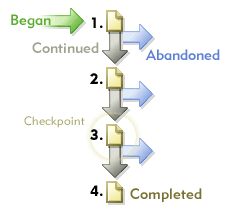

# Paths

Displays information about the order in which pages of your website are accessed. You can gather information about where a visitor goes before and after any page visited on your site.

## Paths {#topic_39F11BCBEDC3495EA1300149FC6D4F14}

Displays information about the order in which pages of your website are accessed. You can gather information about where a visitor goes before and after any page visited on your site.

Paths reports include standard in-depth and optional advanced analysis reports that reveal the click-stream of pages viewed. You can uncover full paths, longest paths, and most popular paths; explain page flow, fallout, and dropout graphically; show new and changing patterns over time; and analyze entry and exit paths.

**[!UICONTROL Next Page Flow]** or **[!UICONTROL Next Site Flow]**: Displays a two-level-deep branching graphic of a selected page (or section, department, and so on), that your visitors view after moving away from the selected page. Use this report to analyze and identify the steps your visitors take most often after viewing a selected page. You can:

* Understand what steps are taken most frequently after viewing a selected page.
* Optimize your site path design to funnel your traffic to a desired goal page.
* Identify where visitors are going instead of your desired goal pages.

**[!UICONTROL Next Page]** (or next categories): Provides detailed site path analysis by showing you the pages on your site that visitors viewed after seeing a selected page. For example, when selecting and reporting on your entire site, the report shows you the top ten landing pages, with the five most popular next pages listed below each landing page. This data can help you understand which content, features, and other data, most often compel your visitors to move through your site

**[!UICONTROL Previous Page Flow]** (or other previous categories flow): Displays two levels of the most popular pages that your visitors view before the selected page. The report also highlights when visitors enter your site.

**[!UICONTROL Previous Page]** (or other previous categories): Provides detailed site path analysis by showing you the pages on your site that visitors viewed before seeing a selected page on your site.

**[!UICONTROL Fallout]**: Displays the visit attrition and conversion rates between each checkpoint you define. Steps are arranged top-to- bottom, with raw numbers and percentages shown on the left, and conversion and fall-out percentages on the right.

See [Fallout Report](/help/components/c-variables/dimensionslist/reports-fallout.md).

**[!UICONTROL PathFinder]**: Lets you further dissect your full paths into fragments, yielding the precise patterns that are instrumental to optimizing your site. The Pathfinder wizard lets you specify selection criteria that is used to generate the report, so that you can analyze the path fragments and query for ones that begin with a certain page, end with a certain page, or even ones that begin with one page and end with another.

**[!UICONTROL Path Length]**: Shows how deep visitors browse into your site (both by percentage and by total count). In other words, the report indicates how many pages the average visitor to your site views before leaving.

**[!UICONTROL Page Analysis]**: Contains a subset of reports that let you analyze the following:

* **[!UICONTROL Page Summary / Site Category Summary]**: Tells you everything you need to know about the page report. It collects and organizes page-specific information about a single page and presents it in a single report.
* **[!UICONTROL Reloads]**: Shows the number of times individual pages were reloaded by visitors.
* **[!UICONTROL Time Spent on Page / Site Category]**: Displays the length of time that visitors browse individual pages in your site. The time spent is divided into ten categories: less than 15 seconds, 15-30 seconds, 30-60 seconds, 1-3 minutes, 3-5 minutes, 5-10 minutes, 10-15 minutes, 15-20 minutes, 20-30 minutes and greater than 30 minutes.
* **[!UICONTROL Clicks to Page]**: Identifies the number of clicks visitors used to access each page in your site. Depth for a page is measured by counting the number of pages viewed before it.

**[!UICONTROL Entries & Exits]**: The Entry Page report shows you, by percentage and by total visits, which pages on your site are the first ones seen by new visitors. You can view:

* **[!UICONTROL Entry Pages]** (or sections): Displays, by percentage and by total visits, which pages on your site are the first pages seen by a new visitor. You can use this report to identify which of your web pages are the most frequent points of entry, optimize the primary entry points on your site, and drive entry traffic to your key messages.
* **[!UICONTROL Original Entry Pages]**: Shows the first page viewed for first-time visitors to your site. Each user is counted only once unless they delete their cookies or are not being tracked with cookies.
* **[!UICONTROL Single Page Visits]**: Shows pages that are most often both the entry and exit pages for visitor browsing sessions.
* **[!UICONTROL Exit Pages]**: Displays, by percentage and by total visits, the pages on your site that were the last pages visitors viewed before leaving your site.

