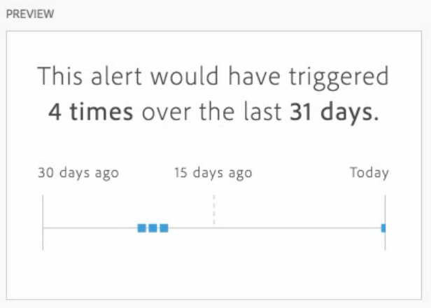

# Create alerts

>[!NOTE]
>
>Intelligent Alerts are available to Adobe Analytics Prime and Adobe Analytics Ultimate customers only.

Intelligent Alerts (or just "alerts") in Adobe Analytics allow you to be notified immediately when abnormal events occur in your data. (Server call usage alerts are a different kind of alert that are available only to Analytics administrators. These alerts notify you of the risk or occurrence of an overage in your server call consumption and commitment data. For more information, see [Server call usage alerts](/help/admin/admin/c-server-call-usage/scu-alerts.md).)

For more detailed overview information about Intelligent Alerts, see [Intelligent Alerts overview](/help/components/c-alerts/intellligent-alerts.md).

To create an Intelligent Alert:

1. Begin creating an alert by accessing the alert builder. You can access the alert builder in any of the following ways:

   * Open a project in Analysis Workspace, then select **[!UICONTROL Components]** > **[!UICONTROL Create alert]**.
   * Open a project in Analysis Workspace, then use the following shortcut:

     `ctrl (or cmd) + shift + a` 
   * Open a project in Analysis Workspace, select one or more line items in a freeform table, then right-click and select **[!UICONTROL Create alert from selection]**.
     
     This instantly pre-populates the alert builder to create an alert with the correct metrics and filters.
   * Create an alert [from the alert manager](/help/components/c-alerts/alert-manager.md#create-alerts). 

   The alert builder displays. This interface is familiar to those who have built segments or calculated metrics in Analytics:

   

1. Specify the following options to configure the alert:

   | Option | Description | 
   |---------|----------|
   | [!UICONTROL **Title**]  | Specify a name for the alert. The alert name might contain the name of the report or the metrics threshold. | 
   | [!UICONTROL **Description (optional)**] | Specify a description for the alert. | 
   | [!UICONTROL **Time granularity**] | Select how often you want the metric to be checked: Daily, Weekly, or Monthly.
<b>Note:</b>For data views with a custom calendar, we do not support monthly granularity in the Alert Builder.<!--true?-->
 | 
   | [!UICONTROL **Recipients**] | Specify where the alert can be sent. An alert can be sent to an Analytics user, an Analytics group, a raw email address, or to a phone number.
<b>Important:</b>The phone number must be preceded by a "+" and a [country code](https://countrycode.org/).

The e-mail that a user would receive once an alert has been triggered looks similar to this:

 | 
   | [!UICONTROL **Expiration date**] | Set the date and time when you want the alert to expire. | 
   | [!UICONTROL **Send an alert when**] | [!UICONTROL **Any of these metrics trigger**]: Drag and drop metrics (including calculated metrics) here to create triggers for the alert.
An **"incompatible components"** message appears if not all the metrics, dimensions, or segments in the alert are compatible with the currently selected data view.

Determine the threshold that the metric must exceed before an alert is set. You can set this value to a threshold and then to one of the following conditions:
<ul><li>anomaly exists</li><li>anomaly is above expected</li><li>anomaly is below expected</li><li>is above or equals</li><li>is below or equals</li><li>changes by</li><li>You can set a threshold of 90%, 95%, 99%, 99.75%, and 99.9%.</li></ul>
[!UICONTROL **With all of these filters**]: Drag and drop segments or dimensions to add filters. For example, adding a "Mobile Devices Only" segment would mean that the rule triggers only for mobile devices. You can add additional filters by using an AND statement. You can add AND or OR rules by clicking the gear icon.

See [Intelligent Alerts - use cases](/help/components/c-alerts/alerts-use-cases.md) for example uses cases.
 | 
   | [!UICONTROL **Preview**] | The interactive alert preview shows you how often, approximately, an alert will fire based on past experience.
For example, if you set the time granularity to daily, the preview can tell you that the alert would have been triggered for a certain metric x times during the last 30 or 31 days.

If you find that too many alerts would have been triggered, you can adjust the threshold in the [Alert Manager](/help/components/c-alerts/alert-manager.md).

 |

1. Select [!UICONTROL **Save**].
