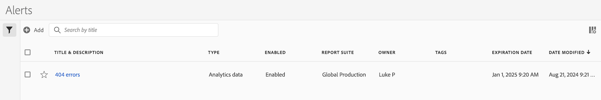

# Alert Manager

The Alert Manager is structured very much like the [Segment Manager](https://experienceleague.adobe.com/docs/analytics/components/segmentation/segmentation-workflow/seg-manage.html) and the [Calculated Metric Manager](https://experienceleague.adobe.com/docs/analytics/components/calculated-metrics/calcmetric-workflow/cm-manager.html).

 

## Access the Alert manager

1. In Adobe Analytics, select [!UICONTROL **Components**] > [!UICONTROL **Alerts**].

## Available actions in the Calculated metrics manager

In the Calculated metrics manager, you can:

* Access the Alert Builder by clicking **[!UICONTROL + Add]**.
* Tag alerts. This allows you to organize them for ease of use.
* Delete alerts.
* Rename alerts.
* Approve alerts.
* Copy alerts.
* Enable/disable alerts.
* **Renew** an alert expiration date. When one or more alerts are selected, they can be renewed by clicking **[!UICONTROL Renew]**.This extends their expiration dates to be 1 year from the day **[!UICONTROL Renew]** was clicked, regardless of their original expiration date.
* Export an alert to a .CSV file.
* Edit alerts by double-clicking the alert title.
* Search for alerts.
* Add alerts to other report suites.
* Specify/change the owner of an alert.
* Add other filters.
* Define an alert **expiration date**.

## Configure columns

You can configure the information displayed for each alert in the Alerts manager by configuring the columns that are displayed.

To configure the visible columns in the Alerts manager:

1. In Adobe Analytics, select the **[!UICONTROL Components]** tab, then select **[!UICONTROL Alerts]**. 

1. In the Alert manager, select the **Customize columns** icon , then select the columns that you want to be displayed in the Alerts manager.

   The following columns are available:

   | Column title  | Description |
   |---|---|
   | Favorites  | Displays star icons next to each alert, allowing you to mark alerts as favorites. <!-- For more information, see [Mark calculated metrics as favorites](/help/components/c-calcmetrics/c-workflow/cm-workflow/cm-favorite.md). --> |
   | Title and description | These values are provided in the Alert builder. To edit the title and description, select the title link to open the Alert builder.  |
   | Report suite | Indicates in which report suite the alert was last saved.  |
   | Owner | Indicates who owns the alert. As a non-admin, you can see only alerts you own or those that were shared with you.  |
   | Tags | Shows tags that were applied to the alert, either by you or by people who shared the alert with you.  |
   | Shared with | Lists individuals or groups (admin only) or All (admin only) that you shared the alert with.  |
   | Date modified | Indicates the date when the alert was last modified.  |
   | Last used | Shows the date when the alert was last used. 
This information can help you determine whether an alert is valuable to users in your organization, or whether it should be deleted.
 |

   {style="table-layout:auto"}
