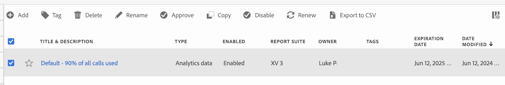

# Manage alerts

You can filter, tag, delete, rename, copy, enable, disable, renew, and export alerts from a central [!UICONTROL Alerts] management interface. To manage alerts:

* Select **[!UICONTROL Components]** in the main interface, then select **[!UICONTROL Alerts]**.

The Alerts manager is structured like the [Segment manager](/help/components/segmentation/segmentation-workflow/seg-manage.md) and the [Calculated metric manager](/help/components/c-calcmetrics/c-workflow/cm-workflow/cm-manager.md).

## Alerts manager

The Alerts manager has the following interface elements:

### Alerts list

The alerts list ➊ displays all the alerts that you own, the alerts that have been scoped to all your projects, and the alerts that have been shared with you. The list has the following columns:

| Column | Description |
|---|---|
|   | Select to favor  or un-favor  an alert. |
| **[!UICONTROL Title and description]** | To edit the alert, select the title link, which opens the [Alerts builder](alert-builder.md#alert-builder).|
| **[!UICONTROL Type]** | The type of the alert: an Adobe Analytics data alert or a Server call usage alert. | 
| **[!UICONTROL Enabled]** | The alert is enabled or disabled. | 
| **[!UICONTROL Report suite]** | The reports suites that this alert applies to.  | 
| **[!UICONTROL Owner]** | The owner of the alert. As a non-administrator, you only see alerts that you own or alerts that are shared with you. |
| **[!UICONTROL Tags]** | The tags for this alert. |
| **[!UICONTROL Expiration Date]** | The date and time when the alert is set to expire. | 
| **[!UICONTROL Date modified]** | The date and time that the alert was last modified. |

<!-- 

When "Last used" column is added, add this information as the description: Shows the date when the alert was last used. 
This information can help you determine whether a component is valuable to users in your organization, where it is used, and if it needs to be deleted or modified.

Consider the following when viewing this column:
<ul><li>This information does not include usage from the API, Report Builder, or Data Warehouse.</li><li>For some components, this column might not contain data if the component was last used prior to September 2023.</li></ul>

-->

Use  to specify which columns you want to display.

### Action bar

You can action on alerts using the action bar ➋. The action bar contains the following actions:

| Icon | Action | Description |
|:---:|---|---|
|  |**[!UICONTROL Add]** | Add another alert, using the [Alert builder](alert-builder.md#alert-builder). |
|  |[!UICONTROL *Search by title*] | When no alert is selected in the list, search for alerts using this search field. |
| | **[!UICONTROL Tag]** | Tag the selected alerts. In the **[!UICONTROL Tag Alert]** dialog, select or de-select the tags for the selected alerts. Select **[!UICONTROL Save]** to save the tags for the selected alerts.|
| | **[!UICONTROL Delete]** | Delete the selected alerts. You are prompted for a confirmation. |
| | **[!UICONTROL Rename]** | Rename a single selected alert. When selected, you can rename the alert inline. |
|  | **[!UICONTROL Copy]** | Copy the selected alert. New alerts are created with the same name and suffix `(Copy)`. | 
| | **[!UICONTROL Enable]** or **[!UICONTROL Disable]** | Enable or disable the selected alerts. |
|| **[!UICONTROL Renew]** | Renews the alert expiration date. The  expiration date extends 1 year from the day that you select this option, regardless of the original expiration date. |
| | **[!UICONTROL Export to CSV]** | Export the alerts to an `Alerts List.csv` file. |

### Active filter bar

The filter bar ➌ shows the active filters applied from the filter panel to the list of alerts (if any). You can quickly remove a filter using . If more than one filter is specified, you can remove all filters using **[!UICONTROL Remove all]**.

### Filter panel

You can filter the list of alerts using the  **[!UICONTROL Filter]** left panel ➍. The filter panel displays the type of filter and the number of alerts that honor the specific filter.

1. Select  to open the Filters panel. If you need more space for the Alerts list, you can select  once more to close the panel.
1. Select filters from any of the available filter sections. 

#### Tags filter section

{{tagfiltersection}}

#### Reports suite filter section

{{reportsuitefiltersection}}

#### Owners filter section

{{ownerfiltersection}}

#### Enabled status filter section

{{enabledstatusfiltersection}}

#### Type filter section

{{typefiltersection}}

#### Other filters filter section

{{otherfiltersfiltersection}}

## Edit alerts

You can edit an alert

* In the [[!UICONTROL Alert] list](#alerts-list), select the title of the alert.

You use the [Alert builder](alert-builder.md#alert-builder) to edit the alert.

## Troubleshoot an alert

When troubleshooting an issue with an alert, provide the JID (Job Instance ID) number to Adobe Support. The JID number is located at the bottom of the alert email notification that you receive.

<!--

# Manage alerts

You can manage existing alerts in the Alerts manager. You can perform various management tasks on alerts, such as tagging, renaming, deleting, and more.

The Alerts manager is structured very much like the [Segment Manager](https://experienceleague.adobe.com/docs/analytics/components/segmentation/segmentation-workflow/seg-manage.html) and the [Calculated Metric Manager](https://experienceleague.adobe.com/docs/analytics/components/calculated-metrics/calcmetric-workflow/cm-manager.html).

 

## Create alerts

To create alerts from the Alerts manager:

1. Select **[!UICONTROL Components]** > **[!UICONTROL Alerts]** to access the Alerts manager in Adobe Analytics.

   

1. Select [!UICONTROL **Add**] (or [!UICONTROL **Create new alert**] if you don't have any existing alerts).

1. Select the alert type that corresponds to the alert that you want to create:

   * [!UICONTROL **Analytics data alert**]: An alert to notify you when abnormal events occur in your data. 

     If you select this option, continue with [Create alerts](/help/components/c-alerts/alert-builder.md) for more details about creating alerts.

   * [!UICONTROL **Server call usage alert**]: An alert to notify you of the risk or occurrence of an overage in your server call consumption and commitment data. 

     If you select this option, continue with [Server call usage alerts](/help/admin/admin/c-server-call-usage/scu-alerts.md).

     >[!NOTE]
     >
     >You must be an Analytics administrator or a user with the Server call usage permission in order to have access to server call usage. 

## Manage existing alerts

You can perform various actions on existing alerts, such as tagging, renaming, deleting, and so forth.

To manage existing alerts in the Alerts manager:

1. Select **[!UICONTROL Components]** > **[!UICONTROL Alerts]** to access the Alerts manager in Adobe Analytics.

   

1. Select one or more alerts that you want to manage.

   

1. In the action bar, select any of the following options:

   | Action | Function | 
   |---------|----------|
   | [!UICONTROL **Tag**] | Apply a tag to an alert. This helps you to organize alerts for ease of use. | 
   | [!UICONTROL **Delete**] | Deletes the alert. | 
   | [!UICONTROL **Rename**] | Renames the alert. |
   | [!UICONTROL **Approve**] | Mark the alert as Approved. |
   | [!UICONTROL **Copy**] | Creates a copy (duplicate) of the alert. |
   | [!UICONTROL **Disable**] | Disables an alert that is currently enabled. |
   | [!UICONTROL **Enable**] | Enables an alert that is currently disabled. |
   | [!UICONTROL **Renew**] | Renews the alert expiration date. This extends the  expiration date to be 1 year from the day you selected this option, regardless of the original expiration date. |
   | [!UICONTROL **Export to CSV**] | Exports the alert to a .CSV file. |

## Edit an alert

To edit an existing alert:

1. Select **[!UICONTROL Components]** > **[!UICONTROL Alerts]** to access the Alerts manager in Adobe Analytics.

   

1. Select the alert name in the [!UICONTROL **Title and description**] column.

1. Edit the alert as desired. 

   Following are some of the things you can do when editing an alert:

   * Add alerts to other report suites
   * Add or modify the description
   * Modify the time granularity
   * Modify the recipients 
   * Modify the expiration date
   * Modify the metrics and filters

1. Select [!UICONTROL **Save**].

## Configure columns 

You can configure the information displayed for each alert in the Alerts manager by configuring the columns that are displayed.

To configure the visible columns in the Alerts manager:

1. In Adobe Analytics, select the **[!UICONTROL Components]** tab, then select **[!UICONTROL Alerts]**. 

1. In the Alert manager, select the **Customize columns** icon , then select the columns that you want to be displayed in the Alerts manager.

   The following columns are available:

   | Column title  | Description |
   |---|---|
   | Title and description | These values are provided in the Alert builder. To edit the title and description, select the title link to open the Alert builder.  |
   | Favorites  | Displays star icons next to each alert, allowing you to mark alerts as favorites. |
   | Type | Shows whether the alert is an Analytics data alert or a Server call usage alert. |
   | Enabled | Shows whether the alert is currently enabled or disabled. | 
   | Report suite | Indicates in which report suite the alert was last saved.  |
   | Owner | Indicates who owns the alert. As a non-admin, you can see only alerts you own or those that were shared with you.  |
   | Tags | Shows tags that were applied to the alert, either by you or by people who shared the alert with you.  |
   | Expiration date | Shows the date and time when the alert is set to expire. |
   | Date modified | Indicates the date when the alert was last modified.  |

   {style="table-layout:auto"}
   
   
    When "Last used" column is added, add this information as the description: Shows the date when the alert was last used. 
This information can help you determine whether a component is valuable to users in your organization, where it is used, and if it needs to be deleted or modified.

Consider the following when viewing this column:
<ul><li>This information does not include usage from the API, Report Builder, or Data Warehouse.</li><li>For some components, this column might not contain data if the component was last used prior to September 2023.</li></ul> 
   
-->

