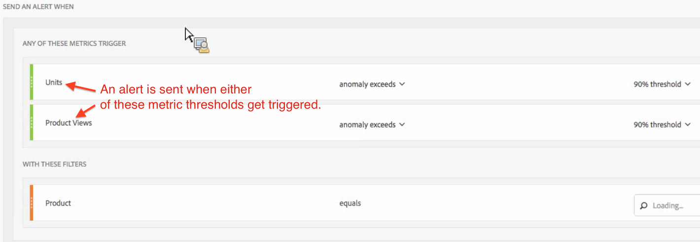

# Intelligent alerts - use cases

## Create simple alert filtered by two segments {#section_2E96FFFA93D44F7D8DBCEC97203204AA}

<!-- 

Update screenshots for better readability.

 -->

## Create an alert from a Table Selection {#section_AE6D42E1255D498D908A2FA60370A419}

In Freeform Tables, you can now create in-context alerts by right-clicking a table row and selecting **[!UICONTROL Create Alert from Selection]**.

This instantly pre-populates the Alert Builder to create an alert with the correct metric/s and filter/s:

## Consolidate (stack) Alerts instead of creating multiple alerts {#section_B27B0856BA104B9FB6D0BBB317633F18}

Stacking alerts ensures that alerts get combined and you don't get a number of separate alerts.

