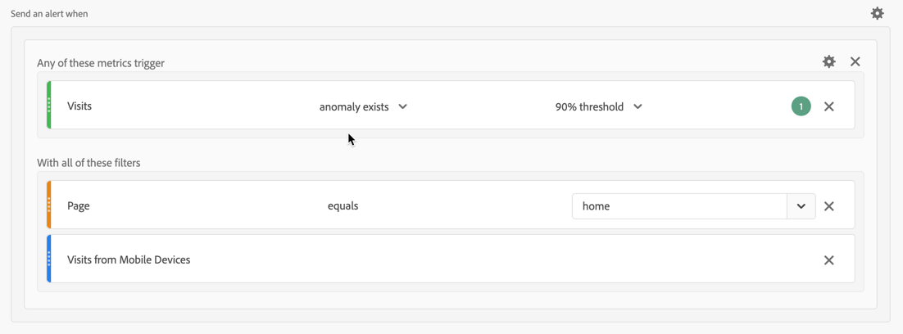

# Alert use cases

You can create alerts as described in [Create alerts](alert-builder.md). 

The following sections illustrate example use cases to consider as you create alerts.

## Filter alerts

You can create simple alerts  using segments. For example, define an alert on number of sessions for people visiting the home page through a mobile app session.

## Stack alerts

You can consolidate (stack) alerts instead of creating multiple alerts. Stacking alerts ensures that alerts get combined and you don't get a number of separate alerts. In the example below an alert is sent when either of the metrics tresholds is triggered.

