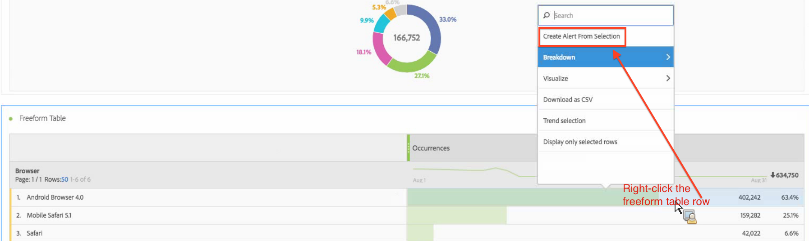
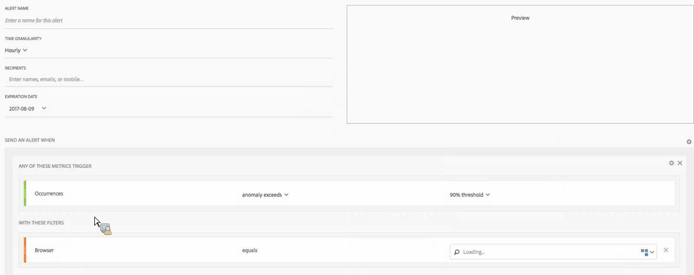

# Intelligent alerts - use cases

## Create simple alert filtered by two segments {#filter}

## Create an alert from a Table Selection {#from-selection}

In Freeform Tables, you can now create in-context alerts by right-clicking a table row and selecting **[!UICONTROL Create Alert from Selection]**.

This instantly pre-populates the Alert Builder to create an alert with the correct metric/s and filter/s:

## Consolidate (stack) Alerts instead of creating multiple alerts {#stacking}

Stacking alerts ensures that alerts get combined and you don't get a number of separate alerts.

