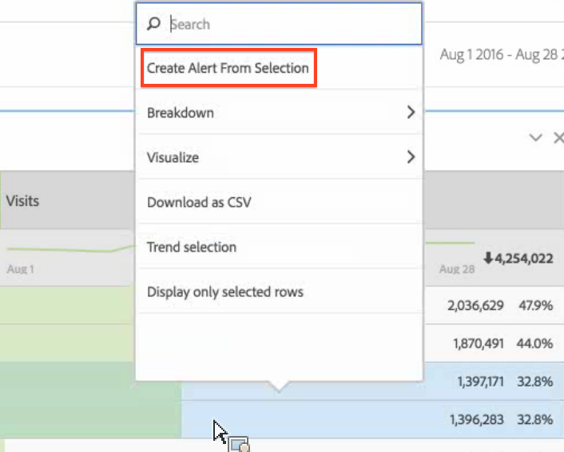
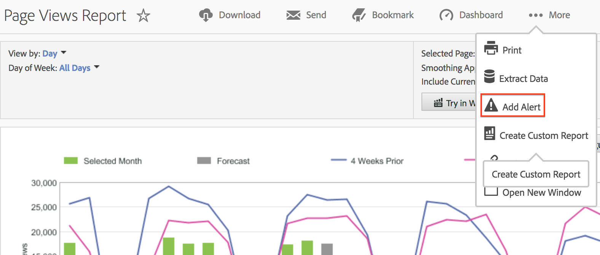

# Intelligent alerts

The new Intelligent Alerts system allows for more granular control over alerts and integrates anomaly detection with the alert system.

## Overview {#section_6AC8CA81DEA94E99B0F192B60D0FDF03}

>[!IMPORTANT]
>
>Intelligent Alerts are available to Adobe [!DNL Analytics] Prime and Adobe [!DNL Analytics] Ultimate customers only.

The new Alert Builder and Alert Manager replace the existing alert functionality in Adobe [!DNL Analytics]. Intelligent Alerts let you

* Build alerts based on anomalies (90%, 95%, 99%, 99.75%, and 99.9% thresholds; % change; above/below).
* Preview how often an alert will trigger.
* Send alerts by e-mail or SMS with links to auto-generated Analysis Workspace projects.
* Create "stacked" alerts that capture multiple metrics in a single alert.

Components of the new alert system include: Alert Builder, Alert Manager, Alert Preview, and better in-context access to creating alerts. The old alert system user interface will no longer be available, but the alerts will be migrated. Some legacy alert features [will no longer be available](https://experienceleague.adobe.com/docs/analytics/analyze/reports-analytics/alerts.html).

There are four ways get to the Alert Builder:

* By using the following shortcut in Analysis Workspace:

  `ctrl (or cmd) + shift + a` 
* By going directly to the Alert Builder:  **[!UICONTROL Workspace]** > **[!UICONTROL Components]** > **[!UICONTROL New Alert]** .
* By selecting one or more freeform table line item/s, right-clicking and selecting **[!UICONTROL Create Alert from Selection]**. This will open the Alert Builder and will pre-populate the builder with the appropriate metrics and filters applied from the table. You can then edit the alert, if needed.

  

* From within a [!UICONTROL Reports & Analytics] report, by going to  **[!UICONTROL More]** > **[!UICONTROL Add Alert]** . This will open the new Alert Builder and will pre-populate the builder with the appropriate metrics and filters applied from the report. You can then edit the alert, if needed.

  

## FAQ: How Alerts are Calculated and Triggered {#section_1F3B1DAF21784306953B49AAD4C3DCAB}

The % thresholds are standard deviations. For example, 95% = 2 standard deviations and 99% = 3 standard deviations. Depending on the time granularity you choose, [different models](/help/analyze/analysis-workspace/virtual-analyst/c-anomaly-detection/statistics-anomaly-detection.md) are used to calculate how far away (how many standard deviations) each data point is from the norm. If you set a lower threshold (such as 90%), you will get more anomalies than if you set a higher threshold (99%). 99.75% & 99.99% thresholds were introduced specifically for the hourly granularity so that it wouldn't trigger as many anomalies.

<table id="table_B3AA85E1DE3543DCA34966A52E3CE4AB"> 
 <thead> 
  <tr> 
   <th colname="col1" class="entry"> Question </th> 
   <th colname="col2" class="entry"> Answer </th> 
  </tr> 
 </thead>
 <tbody> 
  <tr> 
   <td colname="col1"> 
<b>Q: How far back does the alert's anomaly detection go to determine data anomalies?</b> 
 </td> 
   <td colname="col2"> 
The training period varies based on the granularity selected. See Statistical Techniques used in <a href="/help/analyze/analysis-workspace/virtual-analyst/c-anomaly-detection/statistics-anomaly-detection.md">Anomaly Detection</a> for more detail. Here is a summary: 
 
    <ul id="ul_4F8C2A41F06C498DBF5E7AE5DE803773"> 
     <li id="li_E246091A3F1E484C8444AF4052FCA784">Monthly = 15 months + same range last year </li> 
     <li id="li_CC014FB38AE1492B9647E990C29BFB3C">Weekly = 15 weeks + same range last year </li> 
     <li id="li_2517EE2097534324BE9C1B54CD181A62">Daily = 35 days + same range last year </li> 
     <li id="li_710BC8B009354542AA4962A59A646099">Hourly = 336 hours </li> 
    </ul> </td> 
  </tr> 
  <tr> 
   <td colname="col1"> 
<b>Q: If I want to be alerted to only a dip in behavior or only a spike in behavior, can I use the anomaly feature or do I need to use absolute value?</b> 
 </td> 
   <td colname="col2"> 
Using absolute value would still trigger alerts on dips as well as spikes. You cannot isolate alerts for just dips or just spikes. 
 </td> 
  </tr> 
  <tr> 
   <td colname="col1"> 
<b>Q: Can I configure alerts to trigger only during certain hours of the day (such as business hours vs. non-business hours)? </b> 
 </td> 
   <td colname="col2"> 
Currently, no. 
 </td> 
  </tr> 
  <tr> 
   <td colname="col1"> 
<b>Q: Can I get a table of the "expected values" that comprise the dotted line, or some sort of output of what those values are? </b> 
 </td> 
   <td colname="col2"> 
Not in Workspace, but you can in Report Builder (see this video on <a href="https://experienceleague.adobe.com/docs/analytics-learn/tutorials/exporting/report-builder/anomaly-detection-in-report-builder.html"  > Anomaly Detection in Report Builder </a>). 
 
Keep in mind that Report Builder uses less sophisticated anomaly detection methods. It uses a fixed 30-day training period, fixed 95% interval. 
 </td> 
  </tr> 
 </tbody> 
</table>
