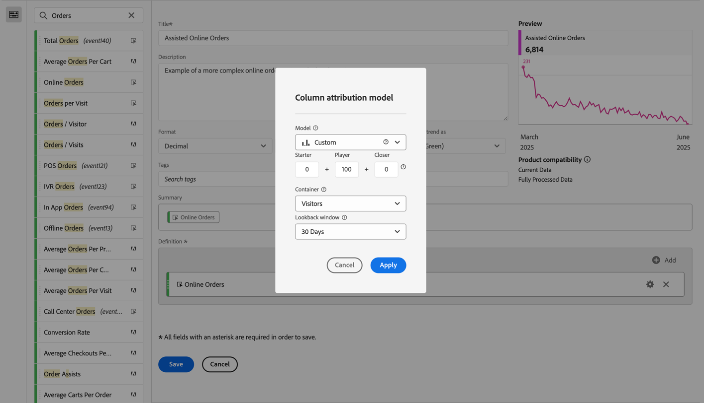

# Build a more complex calculated metric

This article explains a more complex example of a calculated metric. This calculated metrics shows which Marketing Channels assist in driving orders. This type of calculated metric can be adapted to any dimension or success event. 

1. Start to build a calculated metric, as described in [Build metrics](/help/components/c-calcmetrics/c-workflow/cm-workflow/c-build-metrics/cm-build-metrics.md).

1. In the Calculated metrics builder, name the metric `Assisted Online Orders` or something similar.

1. Select the **[!UICONTROL Online Orders]** metric from the **[!UICONTROL Metrics]** components and drag the metric into the **[!UICONTROL Definition]** area. 

   1. Select  for the metric.
   1. Select **[!UICONTROL Use non-default attribution model]**.
   1. Adjust the attribution model in the **[!UICONTROL Column attribution model]**.
      1. Select **[!UICONTROL Custom]** for **[!UICONTROL Model]**. Set **[!UICONTROL Starter]** to `0`, **[!UICONTROL Player]** to `100`, and **[!UICONTROL Closer]** to `0`.
      1. Select **[!UICONTROL Visitor]** for **[!UICONTROL Container]**.
      1. Select **[!UICONTROL 30 Days]** for **[!UICONTROL Lookback window]**.

      1. Select **[!UICONTROL Apply]**.

      

1. Select **[!UICONTROL Save]** to save the calculated metric.

To use the calculated metric:

1. In Analysis Workspace, create a freeform table with the **[!UICONTROL Marketing Channel]** dimension, **[!UICONTROL Online Orders]**, and your new **[!UICONTROL Assisted Online Orders]** metric.

   

1. (Optional) Share the metric with other users in your organization, as described in [Share calculated metrics](/help/components/c-calcmetrics/c-workflow/cm-workflow/cm-sharing.md).

This is an easy way to tell which Marketing Channels assisted in driving orders. Alternatively, from a freeform table, you can select any metric and from the context menu adjust the attribution model directly from the table.
