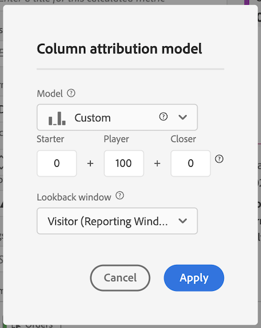

# Order Assists Metric

Explains how to create a metric that shows which Marketing Channels assist in driving orders. This can be adapted to any dimension or success event of interest.

1. In the Calculated Metrics Builder, name the metric "Assisted Orders".
1. In the Definition canvas, drag in an Orders metric. Then, adjust the attribution model through the settings gear by checking the **[!UICONTROL Use non-default attribution models]** checkbox.

   

1. Select **[!UICONTROL Custom]** as the attribution model. Change the weights to 0 (starter), 100 (player), and 0 (closer).

   

1. Save the metric.
1. Create a freeform table in Analysis Workspace with the Marketing Channel dimension, Orders and your new Assisted Orders metric.

   

This is an easy way to tell which Marketing Channels assisted in driving orders. Alternatively, from a freeform table, you can right-click any metric and adjust the attribution model directly from the table.
