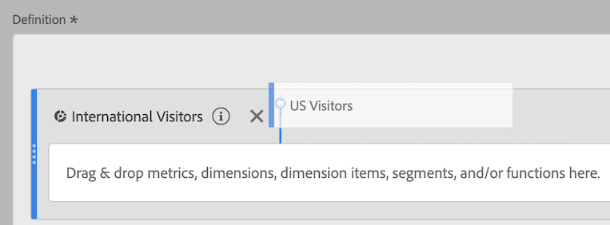
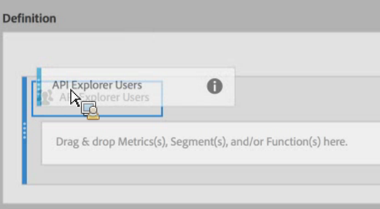

# Stack and replace segments

You can stack and replace segments within the Calculated metric builder.

## Stack segments {#section_3FC1118FEE2B40B7BB90F29C8521AF53}

In the Definition canvas, simply drop the new segment next to the existing one:

## Replace one segment with another {#section_3DA899DF522A44D7A583C5DC8C0A033E}

In the Definition canvas, simply drop the new segment on top of the existing one:

