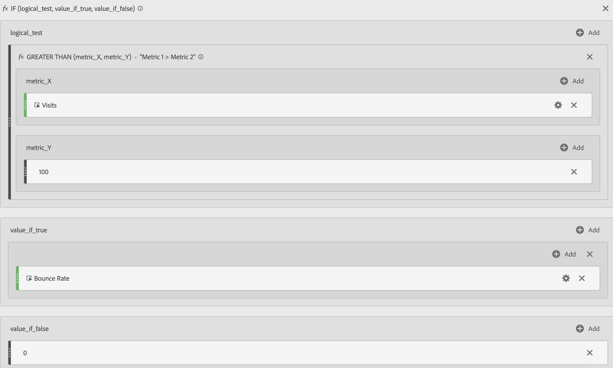
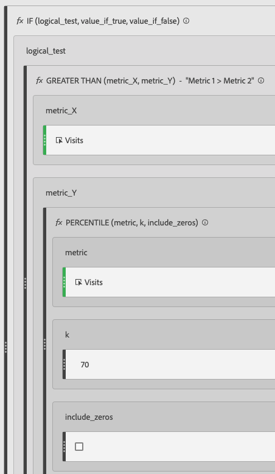

# Filtered and weighted metrics

Shows examples of filtered and weighted metrics.

## Filtered Bounce Rate {#section_D42F2452E4464948934063EB6F2DAAB4}

This simple filtered metric shows the bounce rate for only those pages with over 100 visits:

Keep in mind that this formula is dependent on a consistent time range. If you run a report for a single day, any page with more than 20 visits is worth looking at. If you run it for a month, you may want the filter to include more visits.

## Filtered Bounce Rate with Percentile {#section_4F3E6D33A1FD438A932FA662B3510552}

This filter shows the Bounce Rate for the top 30 percent of pages, when sorted by visits.

## Weighted Metric {#section_F2D16B14569948289CF1310F9E6E3FC2}

Suppose you want to sort by bounce rate in general, but pages with higher visits should be higher on the list. You could create a Weighted Bounce Rate that looks like this:

