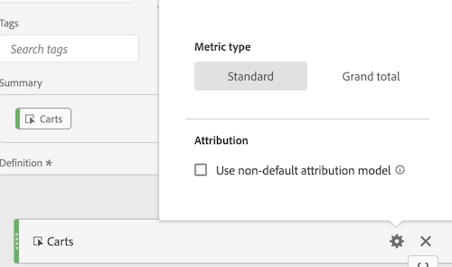

# Metric Type and Attribution

Selecting the gear icon next to a metric lets you specify the metric type and the attribution model.

## Metric Type

 

|  Metric Type  | Definition  |
|---|---|
|  Standard  | These metrics are the same metrics used in standard [!DNL Analytics] reporting. If a formula consisted of a single standard metric, it displays identical data to its non-calculated-metric counterpart. Standard metrics are useful for creating calculated metrics specific to each individual line item. For example, [Orders] / [Visits] takes orders for that specific line item and divides it by the number of visits for that specific line item.  |
|  Total  | Use the total for the reporting period in every line item. If a formula consisted of a single total metric, it displays the same total number on every line item. Total metrics are useful for creating calculated metrics that compare against site total data. For example, [Orders] / [Total Visits] shows the proportion of orders against ALL visits to your site, not just the visits to the specific line item.  |

## Column Attribution Model

>[!IMPORTANT]
>
>In July 2018, [!DNL Analytics] introduced [Attribution IQ](https://experienceleague.adobe.com/docs/analytics/analyze/analysis-workspace/panels/attribution/attribution.html), which revised the way allocation models in calculated metrics are evaluated. As part of this change, calculated metrics that use a non-default allocation model were migrated to new improved attribution models: 
>
>* For a full list of non-default attribution models and lookback windows supported, see the [Attribution IQ](https://experienceleague.adobe.com/docs/analytics/analyze/analysis-workspace/panels/attribution/attribution.html) documentation.
>* "Marketing Channel Last Touch" and "Marketing Channel First Touch" allocation models will be migrated to new "Last Touch" and "First Touch" attribution models respectively (Note: "Marketing Channels" will not be deprecated - only the two allocation models that appear in calculated metrics will be).
>* In addition, we will correct the way Linear allocation is calculated. For customers using calculated metrics with "Linear" allocation models, the reports may change slightly to reflect the new, corrected attribution model. This change to calculated metrics will be reflected in Analysis Workspace, Reports & Analytics, the Reporting API, and Report Builder. For more information, see **How Linear Allocation works (as of July 19, 2018**, below.
>

## How linear allocation works (as of July 19, 2018) 

In July 2018, Adobe changed how linear allocation is reported for Calculated Metrics. This change impacts Analysis Workspace, Reports & Analytics, Report Builder, Activity Map, and the Reporting APIs. The change primarily impacts eVars and other dimensions that have persistence. Note that these changes apply only to calculated metrics and do not impact other reports using linear allocation (such as the Pages report in Reports & Analytics). Other reports using linear allocation will continue to use the existing method of linear allocation.

The following example illustrates how calculated metrics with linear allocation will change in reporting: 

| | Hit 1 | Hit 2 | Hit 3 | Hit 4 | Hit 5 | Hit 6 | Hit 7 |
|--- |--- |--- |--- |--- |--- |--- |--- |
|Data Sent In|PROMO A|-|PROMO A|PROMO B|-|PROMO C|$10|
|Last Touch eVar|PROMO A|PROMO A|PROMO A|PROMO B|PROMO B|PROMO C|$10|
|First Touch eVar|PROMO A|PROMO A|PROMO A|PROMO A|PROMO A|PROMO A|$10|
|Example prop|PROMO A|-|PROMO A|PROMO B|-|PROMO C|$10|

In this example, the values A, B, and C were sent into a variable on hits 1, 3, 4, and 6 before a $10 purchase was made on hit 7. In the second row, those values persist across hits on a last touch visit basis. The third row illustrates a first-touch visit persistence. Finally, the last row illustrates how data would be recorded for a prop which does not have persistence.

## Differences in how linear allocation works in Reports & Analytics versus Workspace

There are some differences in how linear attribution works between these two tools:

* In Reports & Analytics, (processed) linear attribution is always visit based, whereas in Workspace, it can be visit or visitor based.
* In Reports & Analytics, if No value was passed on the first hit of a visit, the (initial) value would persist from the pervious visit. This is NOT the case in Workspace (Attribution IQ). If no value is passed on the first hit of a visit, then 'None' is the initial value.

## How linear allocation worked prior to July 2018

Prior to July 19, 2018, linear attribution was calculated after first touch or last touch persistence has already occurred. This meant that for the last touch eVar above, the $10 would be distributed as follows: A = 10 &#42; (3/6) = $5, B = 10 &#42; (2/6) = $3.33, C = 10 &#42; (1/6) = $1.67.

For the first touch eVar above, all $10 would be given to A. For the prop: A = 10 &#42; (2/4) = $5, B = 10 &#42; (1/4) = $2.50, and C = 10 &#42; (1/4) = $2.50. To summarize linear allocation as it worked previously: 

|  Values  | Current Last Touch eVar  | Current First Touch eVar  | Current Prop  |
|---|---|---|---|
|  PROMO A  | $5.00  | $10.00  | $5.00  |
|  PROMO B  | $3.33  | $0  | $2.50  |
|  PROMO C  | $1.67  | $0  | $2.50  |
|  Total  | $10.00  | $10.00  | $10.00  |

**Summary of how linear allocation works as of July 19, 2018**

After July 19th, we corrected this behavior in calculated metrics. Instead of using the persisted values based on last touch or first touch, [!DNL Analytics] now uses only the values that were passed in (the first row of the top table). As such, the dimension allocation settings no longer impact the way linear allocation is calculated (meaning props and eVars will be treated in the same way), and the results reflect what was originally passed in rather than the first or last touch values that may have persisted. So, in all three cases, A = 10 &#42; (2/4) = $5, B = 10 &#42; (1/4) = $2.50, and C = 10 &#42; (1/4) = $2.50.

|  Values  | New Last Touch eVar  | New First Touch eVar  | New Prop  |
|---|---|---|---|
|  PROMO A  | $5.00  | $5.00  | $5.00  |
|  PROMO B  | $2.50  | $2.50  | $2.50  |
|  PROMO C  | $2.50  | $2.50  | $2.50  |
|  Total  | $10.00  | $10.00  | $10.00  |
