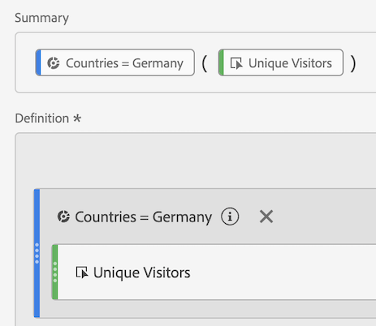

# Segmented metrics

In the Calculated metric builder, you can apply segments within your metric definition. This is helpful if you want to derive new metrics to use in your analysis. Keep in mind, segment definitions can be updated through the Segment builder. If changes are made, the segment will automatically update anywhere it is applied, including if it is part of a calculated metric definition.

## Create a segmented metric {#create}

Let's say you want to compare different aspects of a "German Visitors" segments to those of an "International Visitors" segment. You can create metrics that will give you insights such as:

* How does content browsing behavior compare between the two groups? (Another example would be: How does the conversion rate compare between the two segments?) 
* As a percentage of total visitors, how many German visitors browse certain pages, versus International visitors? 
* Where are the biggest differences in terms of which content is accessed by these different segments?

Build and save a metric called "German Visitors" and a metric called "International Visitors":

1. Create an adhoc segment in the Calculated metric builder called "German Visitors", where "Countries" equals "Germany". 

   Drag the Countries dimension into the Definition canvas and select [!UICONTROL **Germany**] as the value:

   

    >[!NOTE]
    >
    >You can also do this in the [Segment Builder](/help/components/segmentation/segmentation-workflow/seg-build.md), but we have simplified the workflow by making dimensions available in the Calculated metric builder. "Adhoc" means that the segment is not visible in the **[!UICONTROL Segments]** list in the left rail. You can however, make it public by hovering over the "i" icon next to it and clicking **[!UICONTROL Make public]**.

1. Drag the Germany segment into the Definition canvas and drag the Unique Visitors metric within it:

   

1. Select [!UICONTROL **Save**] to save the calculated metric.

1. Create an adhoc segment in the Calculated metric builder called "International Visitors", where "Countries" does not equal "Germany".  

   Drag the Countries dimension into the Definition canvas, select [!UICONTROL **Germany**] as the value, then select [!UICONTROL **does not equal**] as the operator.

1. Drag the Unique Visitors metric within it.

1. Select [!UICONTROL **Save**] to save the calculated metric.

1. In Analysis Workspace, drag the **[!UICONTROL Page]** Dimension into a Freeform Table and drag the 2 new calculated metrics next to each other to the top:

   

Here is a video overview:

>[!VIDEO](https://video.tv.adobe.com/v/25409/?quality=12&learn=on)

## Percent of total metrics {#percent-total}

You can take the example above a step further by comparing your segment to a total population. To do so, create two new metrics, "% of Total German Visitors" and "% of Total International Visitors":

1. Drop the German (or International) Visitors segment into the canvas.
1. Drop another German (or International) Visitors segment below. However, this time, click its configuration (gear) icon to select the Metric Type "Total". The Format should be "Percent". The operator should be "divided by". You end up with this metric definition:

   

1. Apply this metric to your project:

   
