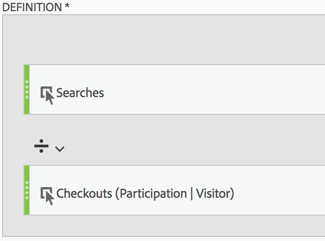
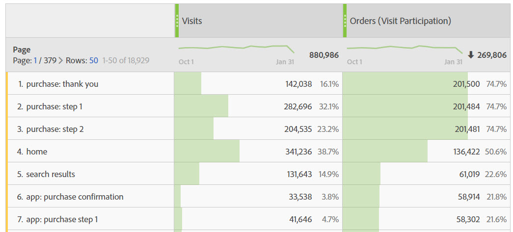

# Build a "Participation" metric

The following information explains how to create a metric that shows which pages contributed to (or participated in) visits that contained an order.

This type of information could be useful for any content owner.

>[!NOTE]
>
>You can enable participation metrics in the Admin Tools, but only for custom events 1 - 100.

1. Begin creating a calculated metric, as described in [Build metrics](/help/components/c-calcmetrics/c-workflow/cm-workflow/c-build-metrics/cm-build-metrics.md).

1. In the Calculated metrics builder, name the metric "Participation".

1. Drag the success event "Orders" into the Definition canvas.

1. Change the [attribution model](/help/components/c-calcmetrics/c-workflow/cm-workflow/c-build-metrics/m-metric-type-alloc.md) of that event to **[!UICONTROL Participation]** under the **[!UICONTROL Settings]** gear. Select **[!UICONTROL Visit]** lookback. The definition should look similar to this:

   

1. Select [!UICONTROL **Save**] to save the metric.

1. Use the calculated metric in a **[!UICONTROL Pages]** report.

    

1. (Optional) Share the metric with other users in your organization, as described in [Share calculated metrics](/help/components/c-calcmetrics/c-workflow/cm-workflow/cm-sharing.md).
