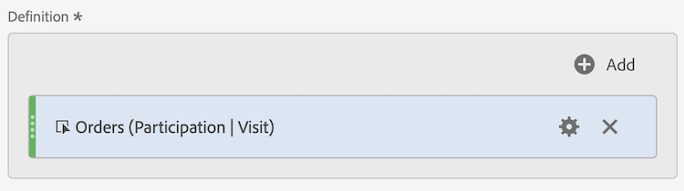

# Participation metrics

Participation metrics are used to quantify how individual values for a dimension (like Page Views) contribute to, or participate in visits that contain a specific metric (like Orders).

The steps below show how you can create a participation metric.

1. [Create a calculated metric](../cm-workflow.md), and in the [Calculated metrics builder](cm-build-metrics.md), name the metric `Orders (Visit Participation)` or something similar.
1. Drag a metric containing a success event, for example [!DNL Online Orders], into [!UICONTROL **[!UICONTROL Definition]**] area.
1. Select  for the metric. 
1. In the popup that appears, select **[!UICONTROL Use a non-default attribution model]** to define the [attribution model](m-metric-type-alloc.md#attribution-models) of that event to **[!UICONTROL Participation]** and select **[!UICONTROL Visits]** for the [!UICONTROL Container]. Select **[!UICONTROL Apply]** to confirm.

    

    **(Partipation|Visits|30 Days)** is added to the metric component name. 

  

1. Select [!UICONTROL **Save**] to save the metric.
1. Use the calculated metric in your report. For example, use the calculated [!DNL Orders (Session Participation)] metric in a report to show which Customer Tier contributed to (or participated in) sessions that contained an order.

    

<!--

The following information explains how to create a metric that shows which pages contributed to (or participated in) visits that contained an order.

This type of information could be useful for any content owner.

>[!NOTE]
>
>You can enable participation metrics in the Admin Tools, but only for custom events 1 - 100.

1. Begin creating a calculated metric, as described in [Build metrics](/help/components/c-calcmetrics/c-workflow/cm-workflow/c-build-metrics/cm-build-metrics.md).

1. In the Calculated metrics builder, name the metric "Participation".

1. Drag the success event "Orders" into the Definition canvas.

1. Change the [attribution model](/help/components/c-calcmetrics/c-workflow/cm-workflow/c-build-metrics/m-metric-type-alloc.md) of that event to **[!UICONTROL Participation]** under the **[!UICONTROL Settings]** gear. Select **[!UICONTROL Visit]** lookback. The definition should look similar to this:

   

1. Select [!UICONTROL **Save**] to save the metric.

1. Use the calculated metric in a **[!UICONTROL Pages]** report.

    

1. (Optional) Share the metric with other users in your organization, as described in [Share calculated metrics](/help/components/c-calcmetrics/c-workflow/cm-workflow/cm-sharing.md).
-->