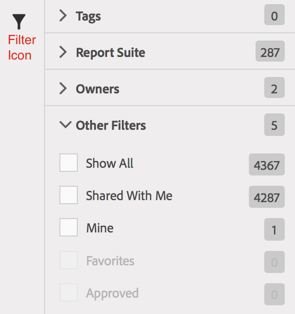

# Find metrics

Describes the two main ways of finding your metrics: sorting and filtering.

## Sorting {#section_89F9C4D515084F5796F2A54D468BF6C8}

When you open a report and click the Metrics icon  ) to the left of a report to bring up the Metrics rail, the **[!UICONTROL Sort By]** drop-down list in the Metrics Selector shows four sorting options:

|  Option  | When to use it  |
|---|---|
|  Alphabetical  | Useful if you know the name.  |
|  Recommended  | Common metrics that people use in the report - this is gathered by the back end from metrics users commonly use with this report.  |
|  Frequently Used  | Useful if you are a novice user and need to see what is commonly used on the report.  |
|  Recently Used  | Useful if you are working on a project and using the same set of metrics over and over.  |

## Filtering - Advanced Selection {#section_33818CC048C04F098703AC229693F8CA}

When you open a report and click the Metrics icon, then click **[!UICONTROL Manage]**. Now click the Filter icon. You can filter in a number of ways.

<table id="table_269081BC9DF54FFDA4E949FFC7488F42"> 
 <thead> 
  <tr> 
   <th colname="col1" class="entry"> If you want to </th> 
   <th colname="col2" class="entry"> Then sort by </th> 
  </tr>
 </thead>
 <tbody> 
  <tr> 
   <td colname="col1"> Show all metrics in this report suite. </td> 
   <td colname="col2"> Other Filters &gt;  Show All </td> 
  </tr> 
  <tr> 
   <td colname="col1"> Show only the metrics that you have </td> 
   <td colname="col2"> Other Filters &gt;  Mine </td> 
  </tr> 
  <tr> 
   <td colname="col1"> Show Metrics shared with me from someone else </td> 
   <td colname="col2">Either  Owners or 
 Other Filters &gt;  Shared with Me 
 </td> 
  </tr> 
  <tr> 
   <td colname="col1"> Show only metrics that are approved by the company. </td> 
   <td colname="col2"> Approved </td> 
  </tr> 
  <tr> 
   <td colname="col1"> Filter on the metrics for a project you are working on. </td> 
   <td colname="col2">One of the  Tags. </td> 
  </tr> 
 </tbody> 
</table>
