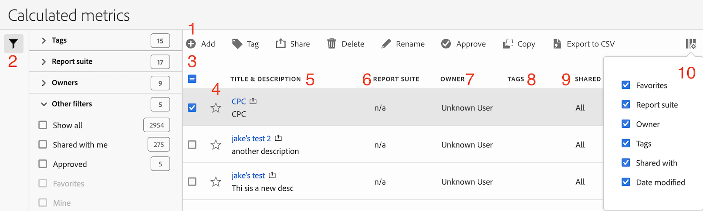

# Calculated Metric Manager

The Calculated Metric Manager offers many ways of curating metrics, such as sharing, filtering, tagging, approving, copying, deleting, and marking as favorites.

The Calculated Metric Manager shows you all the segments you own and that have been shared with you. Admin-level users can see all custom metrics in the organization. This overview presents the user interface and the capabilities of the Calculated Metric Manager. Access it by

* Going to **[!UICONTROL Analytics]** > **[!UICONTROL Components]** in the left navigation. Then click **[!UICONTROL Calculated Metrics]**.

| UI Feature  | Description  |
|---|---|
| Calculated Metrics Management Tool Bar  | Once you have checked a metric, this tool bar appears. Most management tasks can be completed from this tool bar.  |
| Show/Hide Filters  | Clicking Show Filters brings up the filter menu. You can filter by Tags, Report Suites, Owners, Show All (Admin only), Shared with Me, Mine, Favorites, and Approved.  |
| Check boxes  | Check a custom metric in order to manage it.  |
| Favorites  | Clicking the star next to a metric turns the star yellow and marks the metric as a favorite.  |
| Segment titles and descriptions  | Provided in the Calculated Metric Builder. To edit the title and description, click the title link - this takes you back to the Calculated Metric Builder.  |
| Report Suites  | This column indicates in which report suite the metric was last saved.  |
| Owner  | Indicates who owns the custom metric. As a non-Admin, you can see only metrics you own or those that were shared with you.  |
| Tags  | Shows tags that were applied to the metric, either by you or by people who shared the segment with you.  |
| Shared with  | Lists individuals or groups (Admin only) or All (Admin only) that you shared the segment with.  |
| Column selector  | Lets you select or deselect columns in the Calculated Metric Manager so that you can customize the view.  |
| Shared icon (not shown)  | Indicates that this custom metric is shared by you or with you.  |
| Approved icon (not shown)  | Indicates that this custom metric has been approved by an Administrator.  |
