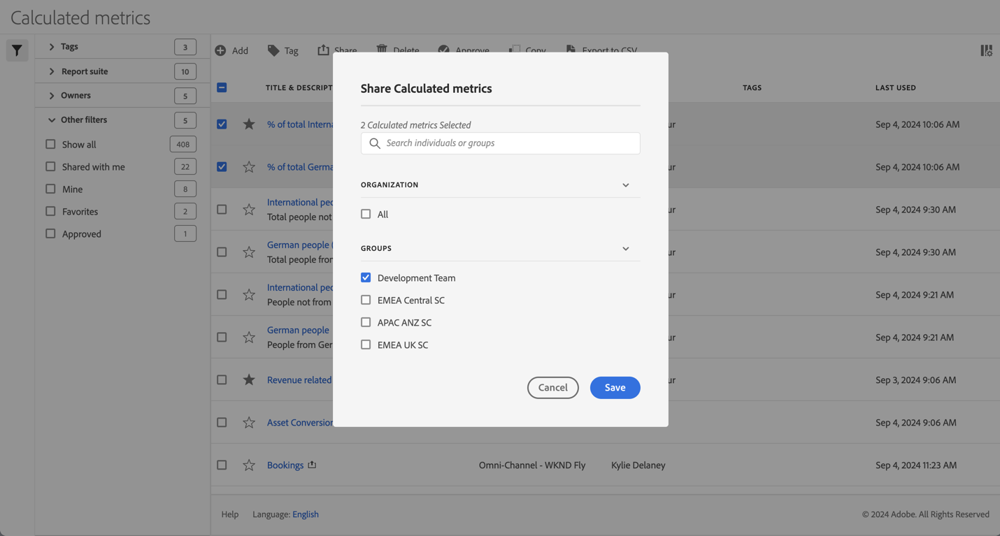

# Share calculated metrics

In the [Calculated metrics manager](cm-manager.md), you can share calculated metrics. Depending on your permissions, you can share calculated metrics with your whole organization, groups, or individual users: 

* **Administrators**: Administrators can share calculated metric with the whole organization, with groups within an organization, and with individual users. See the [Admin Console documentation](https://helpx.adobe.com/enterprise/using/manage-products.html) for more information. 
* **Non-administrators**: Non-administrators can only share the calculated metric they have created and only with individual users.

To share one or more calculated metric:

1. In the [Calculated metric manager](cm-manager.md), select one or more of the calculated metrics you want to share.
1. From the action bar, select  **[!UICONTROL Share]**.
1. In the **[!UICONTROL Share Calculated metric]** dialog:
   
   

   1. (optionally) use  to *Search individuals or groups* for and limit the list of groups or individuals you want to share the calculated metrics with.
   
   1. Select one or more options from the **[!UICONTROL Organization]** or **[!UICONTROL Groups]** section or search for and select one or more individuals. What options are available depends on your role.

   1. Select **[!UICONTROL Save]** to share the calculated metrics. Select **[!UICONTROL Cancel]** to cancel.

## Best practices

Below are some best practices when you should share calculated metrics and with whom you should share calculated metric.

* As an administrator, only share a calculated metric with All if you are convinced anyone in your organization is comfortable using the calculated metric. You can also consider favoring these calculated metrics. See [Mark a calculated metric as favorite](cm-favorite.md) for more information.

* As an administrator, share a calculated metric with a specific group if that calculated metric provides business value for the users part of that group.

* As an administrator or an individual user, share a calculated metric with one or more individuals to validate a calculated metric. If the segments do not prove to be useful, you can delete the calculated metric.  

<!--
Depending on your permissions, you can share metrics with your whole organization, groups, or individual users.

|  Role | Permissions |
|---|---|
|  Administrator  | Can share metrics with All, with Groups, and with Users. Groups are set up as permission groups in the Admin Console. |
|  Non-Administrator  | Can share metrics only with individual users.  |

To share a calculated metric:

1. In Adobe Analytics, select the **[!UICONTROL Components]** tab, then select **[!UICONTROL Calculated metrics]**. 

1. In the Calculated metrics manager, select the checkbox to the left of any metrics that you want to share. 

1. Select the **[!UICONTROL Share]** icon. 
   
   The Share Calculated metric dialog box displays.

   

1. Select **[!UICONTROL Share]**.

1. Choose who you want to share with:

   * **[!UICONTROL All]** (Administrators only): Shares with all users in the organization.

     Consider sharing with all only if it's of use to the entire company and everyone is comfortable using it. In this case, you should also consider making it an [approved metric](/help/components/c-calcmetrics/c-workflow/cm-workflow/cm-approving.md).
   
   * **[!UICONTROL Groups]** (Administrators only): Select any groups you want to share with.

     Consider sharing with a group if the metric provides good business value for that team.
   
   * **[!UICONTROL Individual users]**: Search for and select the individual users you want to share with.

      This is the only share option available to all users. Administrators might want to use this option to vet and validate a metric prior to making it available to a group or to everyone. If the metric isn't useful, it can be discarded. Administrators should not officially approve this type of metric.

1. Select **[!UICONTROL Share]**.

   The Shared icon appears next to the metric: .

1. You can filter on metrics shared with you by going to **[!UICONTROL Filters]** > **[!UICONTROL Other Filters]** > **[!UICONTROL Shared with Me]**.

1. (Optional) To filter the list of calculated metrics in the Calculated metrics manager to show only metrics that are shared with you, select the **Filter** icon, expand **[!UICONTROL Other filters]**, then select **[!UICONTROL Shared with me]**.
-->
