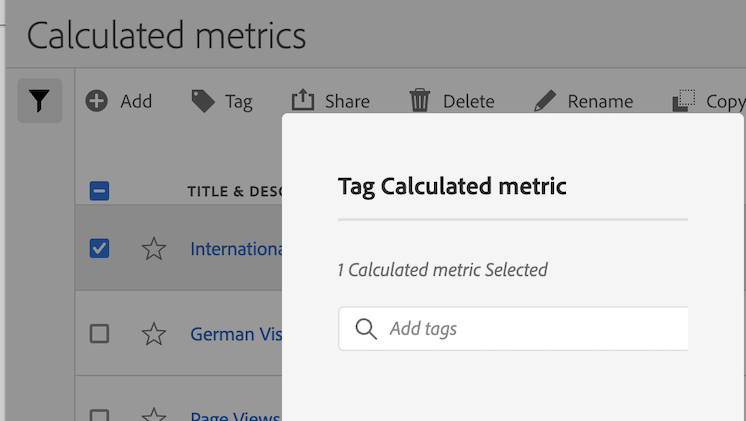

# Tag calculated metrics

In the Calculated metric manager, you can organize segments by tagging them.

All users can create tags for calculated metrics and apply one or more tags to a metric. However, you can see tags only for those calculated metrics that you own or that have been shared with you. 

>[!TIP]
>
>The most useful types of tags are usually tags that are based on the following criteria:
>
>* **Team names**, such as Social Marketing or Mobile Marketing.
>* **Projects** (analysis tags), such as Entry-page analysis.
>* **Categories**, such as Women's or Geography.
>* **Workflows**, such as To be approved or Curated for (a specific business unit)

## Apply tags to a calculated metric

1. In Adobe Analytics, select [!UICONTROL **Components**] > [!UICONTROL **Calculated metrics**] to go to the Calculated metrics manager.

1. In the Calculated metrics manager, select the checkbox next to any metrics that you want to tag. 

   
   
1. In the **[!UICONTROL Tag Calculated metric]** dialog box:

    * Add a new tag. Type the name in the [!UICONTROL **Add tags**] field, then press Enter.
    * Select one or more existing tags to apply to the selected metrics. 

1. Select [!UICONTROL **Save**] to apply the tags.

## View applied tags

1. In Adobe Analytics, select [!UICONTROL **Components**] > [!UICONTROL **Calculated metrics**] to go to the Calculated metrics manager.

1. In the Calculated metrics manager, tags appear in the [!UICONTROL **Tags**] column. (Click the gear icon on the top-right to manage your columns.)

## Filter metrics by tags

1. In Adobe Analytics, select [!UICONTROL **Components**] > [!UICONTROL **Calculated metrics**] to go to the Calculated metrics manager.

1. In the Calculated metrics manager, select the **Filter** icon, then select the tags that you want to filter by. 

   Only metrics that have the filter you select are shown.
