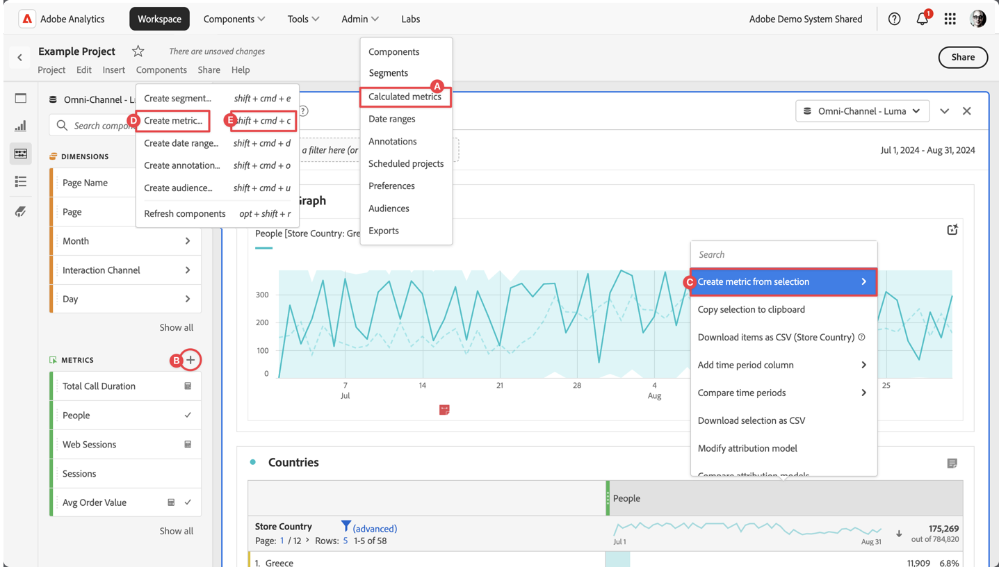

# Create calculated metrics

By default, only administrators can create calculated metrics. Users have rights to view calculated metrics, similar to how users view other components (such as segments, annotations, and more).

You can create a calculated metric in the following ways:

* **A**. In the main interface, select **[!UICONTROL Components]** and select **[!UICONTROL Calculated metrics]**. Select  [!UICONTROL **[!UICONTROL Add]**] from the [[!UICONTROL Calculated metrics] manager](cm-manager.md). 
* **B**. In a Workspace project, from the Components left panel, select  at  **Metrics**.
* **C**. In a Workspace project, from the context menu in metrics column header, select **[!UICONTROL Create metric from selection]**. From the submenu, you can select a function, or select **[!UICONTROL Open in calculated metric builder]**.  If you select a function, the calculated metric is defined as a project-only metric. When you later edit this metric, through the [Component info](/help/analyze/analysis-workspace/components/use-components-in-workspace.md) popup, you see a notification in the [Calculated metric builder](c-build-metrics/cm-build-metrics.md).
* **D**. In a Workspace project, select **[!UICONTROL Components]** from the menu, and select **[!UICONTROL Create metric]**. 
* **E**. In a Workspace project, use the shortcut **[!UICONTROL shift+cmd+c]** (macOS) or **[!UICONTROL shift+ctrl+c]** (Windows).

To define the new calculated metric, you use the [Calculated metric builder](c-build-metrics/cm-build-metrics.md).

## Workflow 

Before you create calculated metrics, carefully consider the following workflow:

| Workflow Task | Description |
| --- | --- |
| Plan calculated metrics | Especially for metrics that are going to be officially "approved", it makes sense to outline which calculated metrics will be widely used and how they will be defined. |
| [Build](c-build-metrics/cm-build-metrics.md) calculated metrics | Build and edit calculated and advanced calculated metrics for use in [!DNL Analytics] components.  See [examples](c-build-metrics/cm-build-metrics.md) of how to build calculated metrics. |
| [Tag](cm-tagging.md) calculated metrics | Tag calculated metrics for ease of organization and sharing. See how to plan and assign tags for simple and advanced searches and organization. |
| [Approve](cm-approving.md) calculated metrics | Approve calculated metrics to make them canonical. |
| Use calculated metrics | Use the calculated metrics in your projects. |
| [Share](cm-sharing.md) calculated metrics | Share your calculated metrics with other individuals, groups, or organizations. |
| [Filter](cm-filter.md) calculated metrics | Filter calculated metrics by tags, owners, and other filters (Show All, Mine, Shared With me, Favorites, and Approved.) |
| Mark calculated metrics as [favorites](cm-finding.md) | Marking metrics as favorites is another way to organize them for ease of use.|
