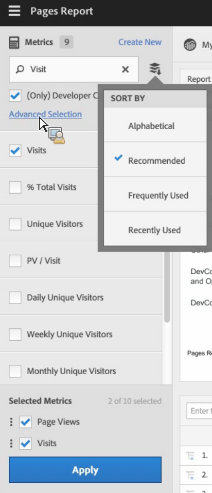

# Calculated and Advanced Calculated (Derived) metrics

Calculated and Advanced Calculated (or Derived) metrics are custom metrics that you can create from existing metrics.

Our Calculated Metrics tools offer a highly flexible way of building, managing and curating metrics. They allow you as marketers, product managers and analysts to ask questions of the data without having to change your [!DNL Analytics] implementation. The custom metrics available in each [!DNL Analytics] package are:

* Adobe [!DNL Analytics] Foundation: Calculated 
* [Adobe Analytics Select](https://www.adobe.com/data-analytics-cloud/analytics/select.html): Calculated + Advanced Calculated 
* [Adobe Analytics Prime](https://www.adobe.com/data-analytics-cloud/analytics/prime.html): Calculated + Advanced Calculated 
* [Adobe Analytics Ultimate](https://www.adobe.com/data-analytics-cloud/analytics/ultimate.html): Calculated + Advanced Calculated

Here is a comparison of Calculated metrics and Advanced Calculated metrics capabilities: 

|  Builder Options  | Calculated metrics  | Advanced Calculated (Derived) metrics  |
|---|---|---|
| [Format types (decimal, time, percent, currency)](/help/components/c-calcmetrics/c-workflow/cm-workflow/c-build-metrics/cm-build-metrics.md)  | Yes  | Yes  |
| [Attribution changes (default, linear, participation, etc.)](/help/components/c-calcmetrics/c-workflow/cm-workflow/c-build-metrics/m-metric-type-alloc.md)  | Yes  | Yes  |
| [Metric types (standard, total)](/help/components/c-calcmetrics/c-workflow/cm-workflow/c-build-metrics/m-metric-type-alloc.md)  | Yes  | Yes  |
|  Basic operators (add, subtract, multiply, divide)  | Yes  | Yes  |
| [Apply segments](/help/components/c-calcmetrics/c-workflow/cm-workflow/c-build-metrics/metrics-with-segments.md)  | No  | Yes  |
| [Basic functions (count, abs value, mean, etc)](/help/components/c-calcmetrics/cm-reference/cm-functions.md)  | No  | Yes  |
| [Advanced functions (regression, if/then, t-score, etc)](/help/components/c-calcmetrics/cm-reference/cm-adv-functions.md)  | No  | Yes  |

## Capabilities {#section_A0A5C275B68A4D628950BBB0B1EE631F}

You can

* Create metrics across [!UICONTROL Analysis Workspace], [!UICONTROL Reports & Analytics], [!UICONTROL Report Builder], [!UICONTROL Anomaly Detection], and [!UICONTROL Contribution Analysis].
* Create segmented metrics that are derived at report run time, without having to change the implementation. These can be viewed historically because they are based on segments.

  >[!VIDEO](https://video.tv.adobe.com/v/25407/?quality=12&learn=on)

* Share metrics across report suites. This means that all newly created metrics apply to all reports suites in the same login company.
* (Advanced Calculated metrics only) Segment on metrics. For example, you can create a metric for "New visitors", with a count of people for whom this is the first session. 

* (Advanced Calculated metrics only) Incorporate statistical functions to help you better describe your data. For example, you can count the number of items in a report or add in the number of standard deviations for each item.

  >[!VIDEO](https://video.tv.adobe.com/v/25409/?quality=12&learn=on)

## Limitations {#section_CB878B02451541D68A68B508D4DBD19A}

Some [!DNL Analytics] features let you use events but not calculated metrics:

* [!UICONTROL Funnels] in [!UICONTROL Reports & Analytics] 
* [!UICONTROL Fallout] in [!UICONTROL Analysis Workspace] 
* [!UICONTROL Cohort Analysis] in Analysis Workspace 
* [!UICONTROL Data Warehouse] 
* [!UICONTROL Segments] 
* [!UICONTROL Real-Time] reports 
* [!UICONTROL Current Data] reports 
* [!DNL Analytics] for [!DNL Target]

## Tools {#section_D65E9C067E9C45E1A50DD30F50561BB2}

Here is a short overview of the [!UICONTROL Calculated metrics] tools: 

<table id="table_520AFE97DB514958ABE23FD3C9CE0ABD"> 
 <thead> 
  <tr> 
   <th colname="col1" class="entry"> Tool </th> 
   <th colname="col2" class="entry"> Capabilities </th> 
  </tr>
 </thead>
 <tbody> 
  <tr> 
   <td colname="col1"><a href="/help/components/c-calcmetrics/c-workflow/cm-workflow/c-build-metrics/cm-build-metrics.md"  > Calculated Metric Builder</a> </td> 
   <td colname="col2"> 
    <ul id="ul_E6F02AB9DF204C2F9A0AC92A31594B3E"> 
     <li id="li_A4A6E716374243A190C539A3F4A41C0C">Create calculated and advanced calculated metrics using advanced allocation models. </li> 
     <li id="li_C8C97BA4E227463E98077ABA5818FFC6">Add segments inline to metric formulas. </li> 
     <li id="li_8503D9E06A3C46569B5CDB4B90F72446">Compare segments in the same report. For example, compare local visitors vs. international visitors. </li> 
     <li id="li_4B528FDE1F96400DBA0D3276408FF919">Use statistical functions. </li> 
     <li id="li_C1162B1EA6784B8189A8A87E2B0DA79A">Provide detailed metric descriptions (show what it does, where to use it, where NOT to use it). </li> 
     <li id="li_DEA13F5E8BF94AF1B311C467FE6E2A74">Copy definitions into new metrics. </li> 
     <li id="li_8C21F55015D44910904202D2BF74221C">Provide an inline metric preview. </li> 
     <li id="li_3704F66C321C477F9D4F52E068C231BD">Set metric polarity, which indicates whether it's good or bad if a given custom event (metric) goes up. </li> 
     <li id="li_9D45319FA965476FB1C90DE8AA72BBD7">Tag metrics. </li> 
    </ul> </td> 
  </tr> 
  <tr> 
   <td colname="col1"><a href="/help/components/c-calcmetrics/c-workflow/cm-workflow/cm-manager.md"  > Calculated Metric Manager</a> </td> 
   <td colname="col2"> 
    <ul id="ul_E4D20D5DD3904CC6A85785B5BD4C1B1E"> 
     <li id="li_E0B216BA1478406EB6212263DF71D85B">Share metrics with others. </li> 
     <li id="li_96EB16FAF3454211AAEF78EA5B08927F">Approve and curate metrics. </li> 
     <li id="li_3ADBD2428EAC4B0AA61222D87C3AF2B7">Organize (tag) your metrics so people can find them. </li> 
     <li id="li_726F3C3390744E49BA63606FE196880E">Delete metrics. </li> 
     <li id="li_F306BA4FA8AF4A6E987BA62634659A2F">Rename metrics. </li> 
    </ul> </td> 
  </tr> 
  <tr> 
   <td colname="col1"> Metric Selector rail </td> 
   <td colname="col2"> 
Replaces the  Show Metrics popup in  Reports & Analytics. 
 
It lets you search for and add/apply metrics to the report. You can also change the <a href="/help/components/c-calcmetrics/c-workflow/cm-workflow/cm-finding.md"  > sort</a> order (options are: alphabetical, recommended, frequently used, recently used.) In addition, you can filter on Report Suites to show only metrics created in a specific report suite. 
 
To access this Metric Selector, click the Metrics icon  to the left of a report. This is what the Metric Selector looks like: 
 
 
 </td> 
  </tr> 
  <tr> 
   <td colname="col1"><a href="https://www.adobe.io/apis/experiencecloud/analytics/docs.html#!AdobeDocs/analytics-2.0-apis/master/README.md"  > API for Calculated Metrics</a> </td> 
   <td colname="col2"> 
Part of the Adobe Analytics 2.0 API set. 
 </td> 
  </tr> 
 </tbody> 
</table>
