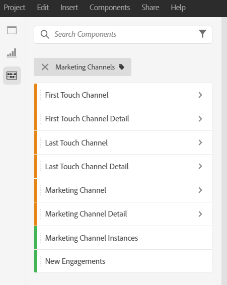
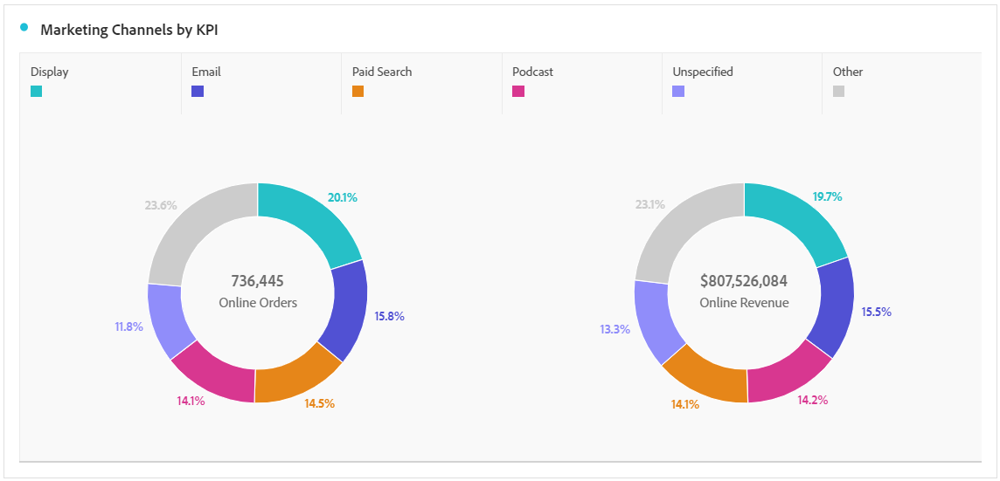
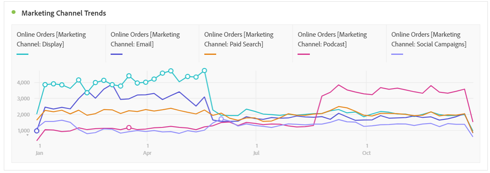
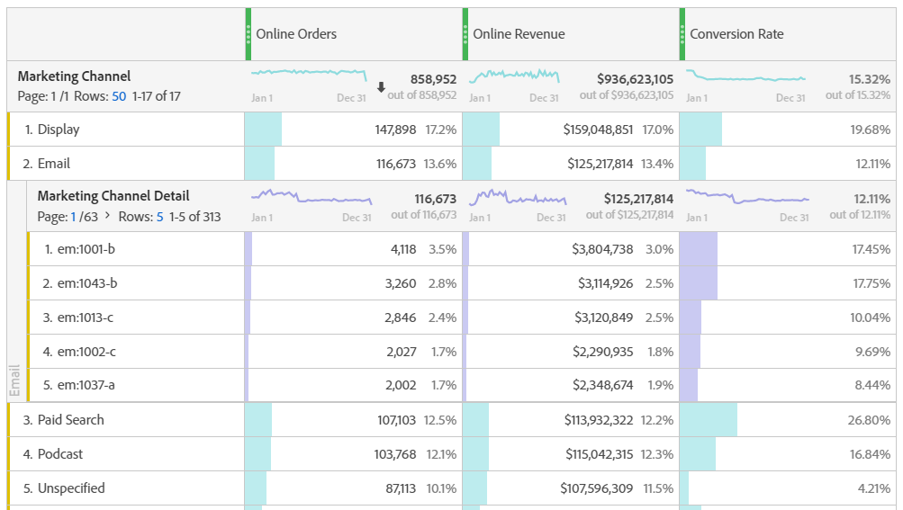
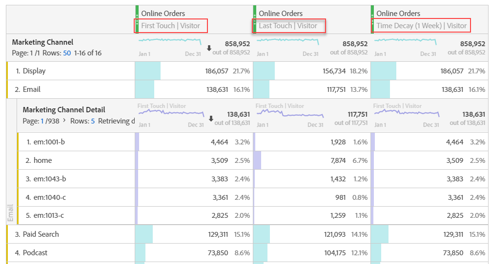
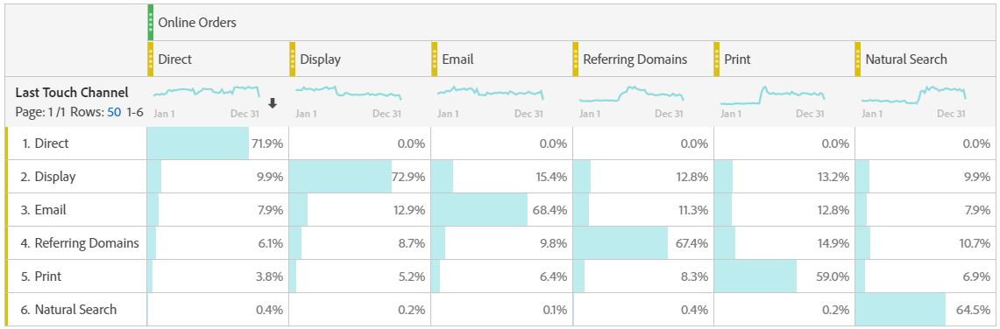

# Analyze Marketing Channels

>[!NOTE]
>
>To maximize effectiveness of Marketing Channels for Attribution IQ and Customer Journey Analytics, we have published some [revised best practices](/help/components/c-marketing-channels/mchannel-best-practices.md).

You probably want to know which of your marketing channels is the most effective, and with whom, so you can better target your efforts and receive a better return on your marketing dollars. In Adobe Analytics, the Marketing Channels dimensions and metrics in Workspace are one of the tools that can help you track the influence of different channels on your orders, revenue, etc. and give you useful channel insights. Here are the dimensions and metrics you can use related to Marketing Channels:

| Dimension/Metric | Definition |
| --- | --- |
| Marketing Channel |This is the recommended Marketing Channels dimension to use. Attribution IQ models can be applied to it at run-time. This dimension behaves identically to Last Touch Channel dimension, but is labeled differently to prevent confusion when using it with a different attribution model.|
| Last Touch Channel | Legacy dimension, with last touch attribution model pre-applied and unchangeable. |
| First Touch Channel | Legacy dimension, with first touch attribution model pre-applied and unchangeable. |
| Marketing Channel Instances | This metric measures the number of times a marketing channel was defined in an image request, including standard page views and custom link calls. Does not include persisted values. |
| New engagements | This metric is similar to Instances, but is only incremented when first-touch marketing channel is defined in an image request. |

## Basic analysis

This Freeform table shows the metrics Online Orders, Online Revenue, and the Conversion Rate for each of the Marketing Channels:

Here you see each Marketing Channel's Online Orders and Online Revenue in a Donut chart:

This Line chart shows trends in Online Orders for various channels over time:

## Advanced analysis

Marketing Channels Details dives more deeply into each channel to show you specific campaigns, placements, etc. You can break down each Marketing Channel into details:

## Apply attribution models

You can use [Attribution IQ](https://experienceleague.adobe.com/docs/analytics/analyze/analysis-workspace/panels/attribution/use-attribution.html) to apply different attribution models instantaneously:

Notice how the same metric (Online Orders) generates different results when you apply different attribution models.

## Cross-tab marketing analysis

Using the legacy First-Touch Channel and Last-Touch Channel, you can get a helpful view into channel interactions:

Learn more about cross-tab marketing analysis in this video: [Using Cross-tab Analysis to Explore Basic Marketing Attribution in Analysis Workspace](https://experienceleague.adobe.com/docs/analytics-learn/tutorials/analysis-workspace/attribution-iq/using-cross-tab-analysis-to-explore-basic-marketing-attribution-in-analysis-workspace.html).
