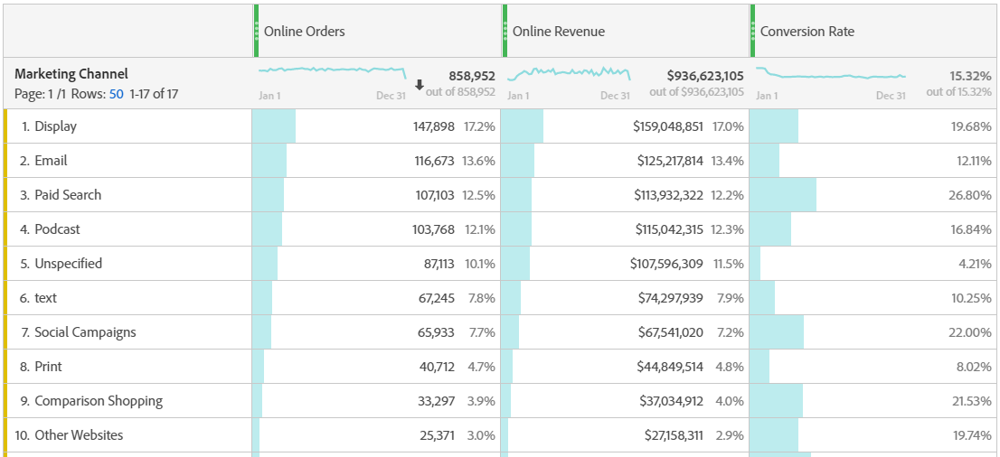

# Analyze Marketing Channels

You probably want to know which of your marketing channels is the most effective, and with whom, so you can better target your efforts and receive a better return on your marketing dollars. In Adobe Analytics, the Marketing Channels dimensions and metrics in Workspace are one of the tools that can help you track the influence of different channels on your orders, revenues, etc. and give you useful channel insights. Here are the dimensions and metrics you can use related to Marketing Channels:

|Dimension/Metric| Definition|
|---|---|
|Marketing Channel|This is the  Marketing Channels dimension we recommend using. Attribution IQ models can be applied to it at run-time. The generic Marketing Channels dimension behaves identically to Last Touch Channel dimensions, but is labeled differently to prevent confusion when using it with a different attribution model.|
|Last Touch Channel|Legacy dimension, with attribution model pre-applied and unchangeable.|
|First Touch Channel|Legacy dimension, with attribution model pre-applied and unchangeable.|
|Marketing Channel Instances|This metric...|
|New engagements|This is a legacy metric that is incremented only when a channel has 'first touch' allocation applied to it.|

## Basic analysis

This Freeform table shows the metrics Online Orders, Online Revenue, and the Conversion Rate for each of the Marketing Channels:

Here you see each Marketing Channel's Online Orders and Online Revenue in a Donut chart:

This Line chart shows trends in Online Orders for various channels over time:

## Advanced analysis

Marketing Channels Details dives more deeply into each channel to show you specific campaigns, placements, etc. You can break down each Marketing Channel into details:

## Apply attribution models

You can use [Attribution IQ](https://docs.adobe.com/content/help/en/analytics/analyze/analysis-workspace/panels/attribution/use-attribution.html) to apply different attribution models instantaneously:

Notice how the same metric (Online Orders) generates different results when you apply different attribution models.

Here are a few videos explaining Attribution IQ in more detail: [Attribution IQ playlist](https://www.youtube.com/playlist?list=PL2tCx83mn7GuDzYEZ8jQlaScruZr3tBTR).

## Cross-tab marketing analysis

Using the legacy First Touch Channel and Last Touch Channel, you can get a helpful view into channel interactions:

Learn more about cross-tab marketing analysis in [this video](https://www.youtube.com/watch?v=M3EOdONa-3E).