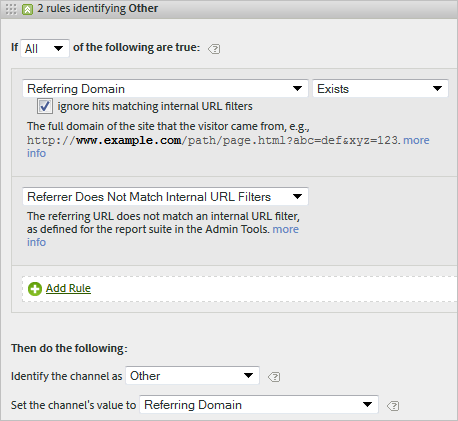

# Marketing Channels FAQs

See [Create Marketing Channel Processing Rules](/help/components/c-marketing-channels/c-rules.md) for definitions of fields displayed on the [!UICONTROL Marketing Channel Processing Rules] page.

## Frequently asked questions {#faq}

Every implementation of marketing channel processing rules can differ, depending on your tracking codes. Configuring rules that provide results you are looking for can require some creative thinking to solve problems.

**Question**: My tracking codes do not follow a pattern, and I have thousands that must be specified for my Affiliates channel.

* Use the process of elimination. If your Email and Affiliates channels use the same query string parameter, but you have only a few email tracking codes, you can specify the email tracking codes in a rule set defining email. Then, you classify all other tracking codes with *`affiliates.`* 
* In your email system, add a query string parameter to all landing page URLs, such as *`&ch=eml`*. Create a rule set detecting whether the ch query parameter equals *`eml`*. If it does not contain *`eml`*, then it is an affiliate.

**Question**: Referring domains contain more data than I expect.

* Referring domains might be too high in the processing rule list. It should be one of the last (or the last) rule sets, because processing order is important.

**Question**: I've created a rule that matches a query string parameter and it's not working.

* Make sure that the parameter name is specified in the query string parameter fields (typically an alphanumeric value). Also, make sure that the parameter value is specified after the operator, as shown in the following example of an email rule.

  

**Question**: Why is all of my last-touch traffic is attributed to an internal domain?

* You have a rule that matches internal traffic. Keep in mind that these rules process for every hit that a visitor makes on your site, not only the first visit. If you have a rule like *`Page URL exists`* without other criteria, that channel is matched on each successive hit on your site, because a page URL always exists.

**Question**: How do I debug traffic displaying in No Channel Identified on the report?

* Rules process in order. If no specific criteria has matched, hits fall into one of three categories:

1. No referrer (a direct visit).

  2. Internal referrer, on the first page of a visit.

  3. A processing glitch on the page.

  Make sure that you have a channel for these three possibilities. For example, create rules that say:

1. **[!UICONTROL Referrer]** and **[!UICONTROL Does Not Exist]** and **[!UICONTROL Is First Page of Visit]**. (See [Direct.](/help/components/c-marketing-channels/c-faq.md))

  2. **[!UICONTROL Referrer Matches Internal URL Filters]** and **[!UICONTROL Is First page of Visit]**. (See [Internal](/help/components/c-marketing-channels/c-faq.md).)

  3. **[!UICONTROL Referrer]** and **[!UICONTROL Exists]** and **[!UICONTROL Referrer Does Not Match Internal URL Filters]**.

  Lastly, create an *Other* channel that captures the remaining hits, as described in [No Channel Identified](/help/components/c-marketing-channels/c-faq.md#no-channel-identified).

## Relationship between First & Last Touch

To understand the interaction between legacy first and last touch dimensions, and confirm that overrides work as expected, you can pull a first-touch channel report, sub-related to a last-touch channel report, with your key success metric added in (see example below). The example demonstrates the interaction between first and last-touch channels.

The intersection where first equals last touch is the diagonal of the table. Both Direct and Session Refresh only get last-touch credit if they were also the first-touch channel, because they cannot take credit from other persisting channels (highlighted rows).

## Reasons for No Channel Identified {#no-channel-identified}

When your rules do not capture data, or if rules are not configured correctly, the report displays the data in the [!UICONTROL No Channel Identified] row on the report. You can create a rule set called *Other*, for example, at the end of your processing order, that also identifies internal traffic.

This kind of rule serves as a catch-all to ensure that channel traffic always matches external traffic, and typically does not end up in **[!UICONTROL No Channel Identified]**. Be careful not to create a rule that also identifies internal traffic. Setting the channel's value to **[!UICONTROL Referring Domain]** or to **[!UICONTROL Page URL]** are the most common, useful ways to create an effective Other rule.

>[!NOTE] There might be still some channel traffic that can fall into the No Channel Identified category. For example: A visitor comes to the site and bookmarks a page and in the same visit comes back the page via the bookmark. Since this is not the first page of the visit, it will go neither in the Direct channel nor in the Other channel because there is no referring domain.

## Reasons for Internal (Session Refresh) {#internal}

Last-touch Session Refresh can only occur if it was also the first touch - see "Relationship between First & Last Touch" above. The scenarios below explain how Session Refresh could be a first-touch channel.

**Scenario 1: Session timeout**

A visitor comes to the website and then leaves the tab open in their browser to use at a later date. The visitor’s engagement period expires (or they voluntarily delete their cookies), and they use the open tab to visit the website again. Since the referring URL is an internal domain, the visit will be classified as Session Refresh.  

**Scenario 2: Not all site pages are tagged**

A visitor lands on Page A which is not tagged, and then moves to page B which is tagged. Page A would be seen as the internal referrer and the visit would be classified as Session Refresh.

**Scenario 3: Redirects**

If a redirect is not set up to pass referrer data through to the new landing page, the true entry referrer data is lost and now the redirect page (likely an internal page) appears as the referring domain. The visit will be classified as Session Refresh.

**Scenario 4: Cross-Domain Traffic**

A visitor moves from one domain which fires to Suite A, to a second domain which fires to Suite B. If in Suite B, the internal URL filters include the first domain, the visit in Suite B will be recorded as Internal, since Marketing Channels see it as a new visit in the second suite. The visit will be classified as Session Refresh.

**Scenario 5: Long entry-page load times**

A visitor lands on Page A which is heavy on content, and the Adobe Analytics code is located at the bottom of the page. Before all the content (including Adobe Analytics image request) can load, the visitor clicks to Page B. Page B fires its Adobe Analytics image request. Since Page A’s image request never loaded, the second page appears as the first hit of the visit in Adobe Analytics, with Page A as the referrer. The visit gets classified as Session Refresh.

**Scenario 6: Clearing cookies mid-site**

A visitor comes to the site, and mid-session clears their cookies. Both First & Last-touch channels would get reset, and the visit would be classified as Session Refresh (because referrer would be internal).

