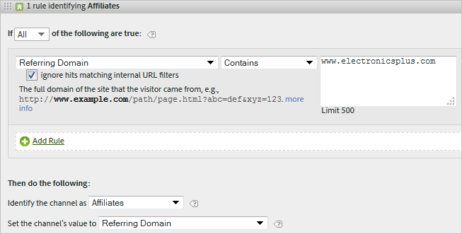
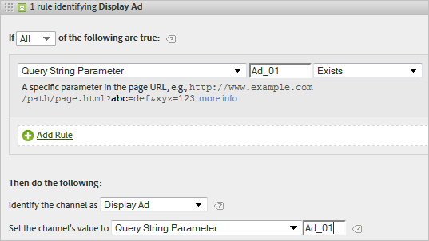

# Frequently asked questions and examples

Read about best practices and examples of how to populate various rules you can set up for your marketing channels.

* [Frequently Asked Questions](../../components/c-marketing-channels/c-faq.md#section_E490CEAF0E76422C91D34D8A80A0C573) 
* [No Channel Identified](../../components/c-marketing-channels/c-faq.md#section_451E42994DA247A8A7B8559C715A5EE7) 
* [Paid Search](../../components/c-marketing-channels/c-faq.md#section_E934BFE182E4404A93FE07AFEAE64DC1) 
* [Natural Search](../../components/c-marketing-channels/c-faq.md#section_A4C6B8F0360449BE94F0128FF7C71386) 
* [Affiliates](../../components/c-marketing-channels/c-faq.md#section_8D142C7074CD4DEC87DF55B691107622) 
* [Social Networks](../../components/c-marketing-channels/c-faq.md#section_492B72A3B261479D9C84F631E90C03D8) 
* [Display](../../components/c-marketing-channels/c-faq.md#section_4FD846B89FCE4ECFB7781BD02874A1AB) 
* [Internal](../../components/c-marketing-channels/c-faq.md#section_179A2BE5C8E24719A9E5C0DC09AF0947) 
* [Email](../../components/c-marketing-channels/c-faq.md#section_4A927BE947B748E39595F4525B7280DE) 
* [Direct](../../components/c-marketing-channels/c-faq.md#section_D0A1DD9D5EEF4A05A1CC81F9EADC074A)

See [Create Marketing Channel Processing Rules](../../components/c-marketing-channels/t-rules.md#task_84EDE9F46F404CB9B7CA0537328CEE08) for definitions of fields displayed on the [!UICONTROL Marketing Channel Processing Rules] page.

## Frequently asked questions {#section_E490CEAF0E76422C91D34D8A80A0C573}

Every implementation of marketing channel processing rules can differ, depending on your tracking codes. Configuring rules that provide results you are looking for can require some creative thinking to solve problems.

**Question**: My tracking codes do not follow a pattern, and I have thousands that must be specified for my Affiliates channel.

* Use the process of elimination. If your Email and Affiliates channels use the same query string parameter, but you have only a few email tracking codes, you can specify the email tracking codes in a rule set defining email. Then, you classify all other tracking codes with *`affiliates.`* 
* In your email system, add a query string parameter to all landing page URLs, such as *`&ch=eml`*. Create a rule set detecting whether the ch query parameter equals *`eml`*. If it does not contain *`eml`*, then it is an affiliate.

**Question**:&nbsp;Referring domains contain more data than I expect.

* Referring domains might be too high in the processing rule list. It should be one of the last (or the last) rule sets, because processing order is important.

**Question**: I've created a rule that matches a query string parameter and it's not working.

* Make sure that the parameter name is specified in the query string parameter fields (typically an alphanumeric value). Also, make sure that the parameter value is specified after the operator, as shown in the following example of an email rule.

  

**Question**: Why is all of my last-touch traffic is attributed to an internal domain?

* You have a rule that matches internal traffic. Keep in mind that these rules process for every hit that a visitor makes on your site, not only the first visit. If you have a rule like *`Page URL exists`* without other criteria, that channel is matched on each successive hit on your site, because a page URL always exists.

**Question**: How do I debug traffic displaying in No Channel Identified on the report?

* Rules process in order. If no specific criteria has matched, hits fall into one of three categories:

1. No referrer (a direct visit).

  2. Internal referrer, on the first page of a visit.

  3. A processing glitch on the page.

  Make sure that you have a channel for these three possibilities. For example, create rules that say:

1. **[!UICONTROL Referrer]** and **[!UICONTROL Does Not Exist]** and **[!UICONTROL Is First Page of Visit]**. (See [Direct](../../components/c-marketing-channels/c-faq.md#section_D0A1DD9D5EEF4A05A1CC81F9EADC074A).)

  2. **[!UICONTROL Referrer Matches Internal URL Filters]** and **[!UICONTROL Is First page of Visit]**. (See [Internal](../../components/c-marketing-channels/c-faq.md#section_179A2BE5C8E24719A9E5C0DC09AF0947).)

  3. **[!UICONTROL Referrer]** and **[!UICONTROL Exists]** and **[!UICONTROL Referrer Does Not Match Internal URL Filters]**.

  Lastly, create an *Other* channel that captures the remaining hits, as described in [No Channel Identified](../../components/c-marketing-channels/c-faq.md#section_451E42994DA247A8A7B8559C715A5EE7).

## No Channel Identified {#section_451E42994DA247A8A7B8559C715A5EE7}

When your rules do not capture data, or if rules are not configured correctly, the report displays the data in the [!UICONTROL No Channel Identified] row on the report. You can create a rule set called *Other*, for example, at the end of your processing order, that also identifies internal traffic.

This kind of rule serves as a catch-all to ensure that channel traffic always matches external traffic, and typically does not end up in **[!UICONTROL No Channel Identified]**. Be careful not to create a rule that also identifies internal traffic. Setting the channel's value to **[!UICONTROL Referring Domain]** or to **[!UICONTROL Page URL]** are the most common, useful ways to create an effective Other rule.

> [!NOTE] There might be still some channel traffic that can fall into the No Channel Identified category. For example: A visitor comes to the site and bookmarks a page and in the same visit comes back the page via the bookmark. Since this is not the first page of the visit, it will go neither in the Direct channel nor in the Other channel because there is no referring domain.

## Paid Search {#section_E934BFE182E4404A93FE07AFEAE64DC1}

A paid search is a word or phrase that you pay a search engine for placement in search results. To match paid search detection rules, the marketing channel uses settings configured on the [!UICONTROL Paid Search Detection] page. ( **[!UICONTROL Admin]** > **[!UICONTROL Report Suites]** > **[!UICONTROL Edit Settings]** > **[!UICONTROL General]** > **[!UICONTROL Paid Search Detection]**). The destination URL matches the existing paid search detection rule for that search engine.

For the marketing channel rule, the [!UICONTROL Paid Search] settings are as follows:

See [Paid Search Detection](https://marketing.adobe.com/resources/help/en_US/reference/paid_search_detection.html) in Admin for more information.

## Natural Search {#section_A4C6B8F0360449BE94F0128FF7C71386}

A natural search occurs when visitors find your website through a Web search, where the search engine ranked your site without you paying for the listing. You can control the destination URL the search engine uses to link to your site. This URL allows Analytics to identify whether a search is natural.

There is no natural search detection in Analytics. After you set up Paid Search Detection, the system knows that if a search referrer was not a paid search referrer, it must be a natural search referrer. For a natural search, the destination URL does not match the existing paid search detection rule for that search engine.

For the marketing channel rule, the Natural Search settings are as follows:

See [Paid Search Detection](https://marketing.adobe.com/resources/help/en_US/reference/paid_search_detection.html) in the Admin for more information.

## Affiliates {#section_8D142C7074CD4DEC87DF55B691107622}

An affiliate rule identifies visitors that originate from a specified set of referring domains. In the rule, you list the domains of affiliates you would like to track, as follows:

## Social Networks {#section_492B72A3B261479D9C84F631E90C03D8}

This rule identifies visitors that originate from a social network, such as Facebook&#42;. The settings can be as follows:

## Display {#section_4FD846B89FCE4ECFB7781BD02874A1AB}

This rule identifies visitors originating from banner advertisements. It is identified by a query string parameter in the destination URL, in this case *`Ad_01`*.

## Internal {#section_179A2BE5C8E24719A9E5C0DC09AF0947}

This rule identifies visitors that originate with a referrer that matches the internal URL filters for the report suite.

## Email {#section_4A927BE947B748E39595F4525B7280DE}

To set up this rule, you provide the query string parameter for your email campaign. In this example, the parameter is *`eml`*:

If your rule contains Tracking Codes, enter one value per line, as shown here:

## Direct {#section_D0A1DD9D5EEF4A05A1CC81F9EADC074A}

This rule identifies visitors that have no referring domain. This rule includes visitors that come to your site directly, such as from a Favorites link or by pasting a link in their browser.

