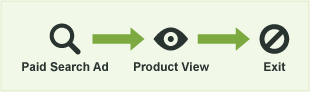
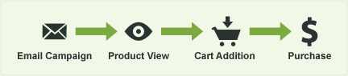
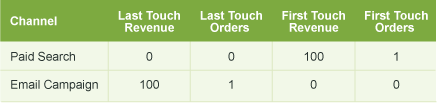
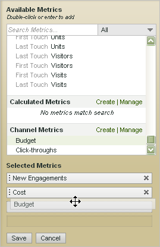

# Metrics used in Marketing Channel reports

How to use metrics in Marketing Channel reports.

Add (or edit) metrics.

Add a column to the report.

## First and last-touch metrics {#first-and-last-touch}

First-touch and last-touch are channel attributes that let you see how many new engagements (or metric data like product views, revenue, and orders) result from a visitor's activity in the channel. 

When a success event occurs, Analytics looks at the entire visitor's activity and history (back to the [visitor's engagement expiration](/help/components/c-marketing-channels/visitor-engagement.md)). It notes the first channel the user came through, as well as the most recent channel. It then gives credit of the success event to each appropriate channel.

<!-- 

<note>
  A first-touch value has a rolling expiration based on the frequency of a visitor returning to the site. This first-touch expiration resets whenever a visitor returns to the site. This effects reporting by causing first-touch values to persist longer than you might expect. For example, this can occur if an instance of an first-touch channel was created a year ago. Remove the values on the eVar in the admin console to reset. 
</note>

 -->

**Example**

Suppose that you set up two marketing channels: Paid Search, and Email Campaign.

Paid Search is an ad for a product. It catches a visitor's interest and generates a product view but fails to result in a conversion event.

A month later you run an email campaign for the same product. It results in a $100 purchase (or other desired conversion event).

In the Marketing Channel Report, the result can be displayed as follows:

The Paid Search channel is credited for $100 as the first-touch channel for revenue, with 1 first-touch order. The Email Campaign channel is credited for $100 as the last-touch revenue channel (the channel the user last touched before the conversion event), and with 1 last-touch order. In other words, a primary purpose of the report is to see how the breakdown of revenue across first touch channels differs from the breakdown of revenue across last touch channels.

Every success event instance will have exactly one First Touch channel and exactly one Last Touch channel. This means that if you add up a given metric column for any success event, it will always exactly equal the total for the same time period. This total will also exactly equal the total number of events in the appropriate [!UICONTROL Site Metrics] > [!UICONTROL Custom Events] report. Non-success event metrics, such as visits and visitors, will not match up 1 to 1, as multiple channels can fire in the same visit.

>[!NOTE]
>
>This report uses the first-touch or last-touch version of each metric. Thus, the data shown in a [!UICONTROL Marketing Channel] report might not match the data shown in other reports.

## Metric definitions {#metric-defs}

| Metric  | Definition  |
|--- |--- |
|First-touch channel|The first marketing channel to engage a visitor. Technically, the first-touch channel is an eVar with original allocation.|
|First-touch visitor|In channel reporting, a first-touch visitor is a Daily Unique Visitor that originated from a channel. The visitor's engagement is stored for the duration of the engagement period with the site, which can last many visits.|
|Last-touch channel|The conversion channel, meaning, the last marketing channel to engage the visitor and result in a conversion. Only one channel is set as the first touch channel. The last touch channel can change with every return visit to the site. Every visit has a first-touch and last-touch channel, but the value of the first-touch channel never changes with subsequent visits.|

## Click-through {#click-through}

A click-through is an instance on the last-touch channel. It is an eVar with the most recent allocation. 

For example, assume that a visitor comes to your website once a day, with each visit originating from a different marketing channel:

* Day 1: Paid Search 
* Day 2: Display 
* Day 3: Natural Search 
* Day 4: Display 
* Day 5: Paid Search 
* Day 6: Display 
* Day 7: Natural Search

The First-Touch Channel report would show 1 new engagement for Paid Search. Each other channel would show 0 new engagements. The Last-Touch Channel report would show 2 click-throughs for Paid Search; 3 for Display; and 2 for Natural Search. 

## Add metrics to a Marketing Channel report {#add-metrics-to-mktg-channel-rpt}

Add metrics to the Marketing Channel report. You can add up to four metrics to each column in the report, and as many columns as you want.

1. Open the [!UICONTROL Marketing Channel Report].
1. Click Add Metrics.

   

1. Under [!UICONTROL Available Metrics], drag-and-drop metrics from the [!UICONTROL Available Metrics] section to the [!UICONTROL Selected Metrics] section.

   

1. To create calculated metrics, scroll to [!UICONTROL Calculated Metrics], then click **[!UICONTROL Create]**.
1. Click **[!UICONTROL Save.]**
