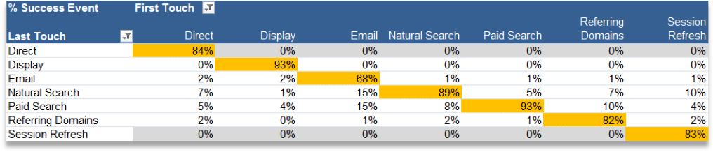

---

title: Processing rules for Marketing Channels
description: Marketing Channel processing rules determine if a visitor hit meets the criteria assigned to a channel. The rules process every hit a visitor makes on your site. When a rule does not meet the criteria for a channel, or if rules are not configured correctly, the system assigns the hit to No Channel Identified.
---

# Processing rules for Marketing Channels

Marketing Channel processing rules determine if a visitor hit meets the criteria assigned to a channel. The rules process every hit a visitor makes on your site. When a rule does not meet the criteria for a channel, or if rules are not configured correctly, the system assigns the hit to No Channel Identified.

Here are important guidelines for creating rules:

* Sort the rules in the order that you want them to be processed.
* At the end of your list, include a catch-all rule, such as Other. This rule identifies external traffic but not internal traffic.

   See [No Channel Identified.](/help/components/c-marketing-channels/c-faq.md)

> [!NOTE] Although these rules do not affect reporting outside of marketing channels, they affect marketing channel data collection. Data collected with these rules are 100% permanent, and rules altered after data is collected is not retroactive. It is strongly recommended to review and consider all circumstances before saving [!UICONTROL Marketing Channel Processing Rules] to mitigate data being collected in incorrect channels.

## Prerequisites

* Review the conceptual information in [Getting Started with Marketing Channels](/help/components/c-marketing-channels/c-getting-started-mchannel.md).
* Create one or more channels so that you can assign rules to them. See [Add marketing channels.](/help/components/c-marketing-channels/c-channels.md)

## Create Marketing Channel processing rules

Create Marketing Channel processing rules, which determine if a visitor hit meets the criteria assigned to a channel.

This procedure uses an email rule as an example. The example assumes that you have added an email channel to your list of channels on the Marketing Channel Manager page.

1. Click **[!UICONTROL Analytics]** > **[!UICONTROL Admin]** > **[!UICONTROL Report Suites]**.
1. Select a report suite.

   If your report suite does not have channels defined, the [!UICONTROL Marketing Channels: Auto Setup] page displays.

   See [Run the Automatic Setup](/help/components/c-marketing-channels/getting-started/c-getting-started-mchannel.md).

1. Click **[!UICONTROL Edit Settings]** > **[!UICONTROL Marketing Channels]** > **[!UICONTROL Marketing Channel Processing Rules]**.

   

1. From the **[!UICONTROL Add New Rule Set]** menu, select **[!UICONTROL Email]**.

   Here you are not selecting your channel, but a template that populates the rule with a few of the necessary parameters.

   

   Use Boolean logic (if / then statements) to configure a rule. For example, in an email channel rule, provide the settings or information emphasized in the following rule statement:

   `"If **[!UICONTROL All]** or **[!UICONTROL Any]** of the following are true:  **[!UICONTROL Query String Parameter]** *<value>* **[!UICONTROL exists]**...`

   `"Then identify the channel as **[!UICONTROL Email]**...`

   `"Then set the channel's value to **[!UICONTROL Query String Parameter]** *<value>*."`

   In this example, *`<value>`* is the query string parameter that you use for your email campaign, such as *`eml`*.
1. To continue creating rules, click **[!UICONTROL Add Rule]**.
1. To prioritize rules, drag-and-drop them to the desired position.
1. Click **[!UICONTROL Save.]**

>[!MORELIKETHIS]
>
>* [Frequently Asked Questions and Examples](/help/components/c-marketing-channels/c-faq.md)

## Marketing Channel rule criteria

This reference table defines the fields, options, and hit attributes you can select on the Marketing Channel Processing Rules page.

| Term  | Definition  |
|--- |--- |
|All|Activates this channel only when all of the rules in the numbered rule are true.|
|Any|Activates this channel when any of the rules in the rule set are true. This option is available only if more than one rule exists in the numbered rule.|
|AMO ID|The primary tracking code used by the Advertising Cloud and Advertising Analytics integrations. When one of these integrations is enabled, then the tracking code prefix can be used to identify Advertising Cloud specific channels. Use "AMO ID" starts with "AL" for Search, "AC" for Display, or "AO" for Social. When the AMO ID is used in marketing channels the click/cost/impression metrics can be attributed to the correct channel (when not configured, these metrics will go to Direct or None).|
|AMO ED ID|The secondary tracking code used by Advertising Cloud. The main purpose of this tracking code is to serve as the key for sending data back to Ad Cloud. It can however also be used to identify display ClickThroughs vs. display ViewThroughs if you desire to see these as two separate marketing channels. This can be done by setting the marketing channel logic for "AMO EF ID" ends with ":d" for Display ClickThroughs or "AMO EF ID" ends with ":i" for Display ViewThroughs. If you do not desire to split Display into two channels, then use the AMO ID dimension instead.|
|Conversion Variables|Consists of eVars that are enabled for this report suite, and applies only when these variables are set via the Adobe code on the page.  See the  Implementation Guide .|
|Exists|Several selections are available, including:<ul><li>**Does Not Exist**: Specifies that the hit attribute does not exist on the request. For example, in a referring domain, if the user types a URL or clicks a bookmark, the referring domain attribute does not exist.</li><li>**Is Empty**: Specifies that a hit attribute exists, usually an eVar or query string parameter, but there is no value associated with the hit attribute.</li><li>**Does Not Contain**: Lets you specify, for example, that a referring domain does not contain a specific value (as opposed to using the selection "Contains".)</li></ul>|
|Identify the channel as|Associates the rule with a marketing channel that you added to the  Marketing Channel Manager  page.  See  Add marketing channels .|
|Matches Paid Search Detection Rules|A paid search detected by Adobe. Paid searches are when companies pay a fee for the search engine to list their site. Paid searches usually appear at the top or the right side of the search results.|
|Matches Natural Search Detection Rules|A non-paid search detected by Adobe reporting.|
|Referrer Matches Internal URL Filters|A visit whose page URL matches an internal URL filter, as defined for the report suite in Admin Tools.|
|Referrer Does Not Match Internal URL Filters|The referring URL does not match an internal URL filter, as defined for the report suite in Admin Tools. You can use this setting with  Page URL  and  Exists  to set up a catch-all rule, so that no visits land in the  No Channel Identified  section of the report.|
|Ignore hits matching internal URL filters|(For referrers) Tracks only hits coming from externally referred sites. Typically, leave this setting enabled unless you want to include internal traffic.|
|Is First Page of Visit|The first page of a visit detected by Adobe reporting.|
|Page|The page name of a web page on your site that is tagged using Adobe's web beacon. This value is equivalent to  s.pageName . Examples include `Home Page` and `About Us`.|
|Page Domain|The domain of the page on which the visitor lands, such as `products.example.co.uk`.|
|Page Domain and Path|The domain and path, such as `products.example.co.uk/mens/pants/overview.html` .|
|Page Root Domain (TLD+1)|The root domain of the page on which the visitor lands, such as example.co.uk .|
|Page URL|The URL of a web page on your site.|
|Referring Domain|The domain your visitors came from before they visited your site, for example, referrers coming from `abcsite.com` versus `xyzsite.com`.|
|Query String Parameter|If a page URL on your site looks like `https://example.com/?page=12345&cat=1`, then page and cat are both query string parameters. (See `https://en.wikipedia.org/wiki/Query_string`.)  You can specify only one query string parameter per rule set. To add additional query string parameters, use `ANY` as your operator, then add new query string parameters to the rule.|
|Referrer|The web page location (full URL) your visitors were at before coming to your site. A referrer exists outside your defined domain.|
|Referring Domain and Path|A concatenation of the Referring Domain and URL path. Examples include:    `www.example.com/products/id/12345` or `ad.example.com/foo`|
|Referring Parameter|A query string parameter on the referrer URL. For example, if your visitors come from `example.com/?page=12345&cat=1`, then page and cat are the referring parameters.|
|Referring Root Domain|The root domain of the referrer. A referrer exists outside of your defined domain.|
|Search Engine|A search engine like Google or Yahoo! that brought visitors to your site.|
|Search Keywords|A word used to perform a search using a search engine.|
|Search Engine + Keywords|A concatenation of the Search Keyword and Search Engine to uniquely identify the search engine. For example, if you search for the word computer, the search engine and keyword are identified as follows: `Search Tracking Code = "<search_type>:<search engine>:<search keyword>" where    search_type = "n" or "p", search_engine = "Google", and search_keyword = "computer"`**Note:** n = natural; p = paid|
|Set the channel's value to|In addition to knowing which marketing channel brings a visitor to your site, you can know which banner ad, search keyword, or email campaign within the channel is getting credit for a visitor's site activity. This ID is a channel value that is stored along with the channel. Often this value is a campaign ID embedded in the landing page or the referring URL; in other cases it is the search engine and search keyword combination, or the referring URL that most correctly identifies the visitor from a particular channel.|

## Internal (Session Refresh) channel

The Internal Channel (often renamed to Session Refresh) consists of visits to the site where the referring URL matches the Internal URL Filters setup in the Admin Console, meaning the visitor came from within the site to start their visit.

### Override best practices

It is a best practice to uncheck the override last-touch option for Direct and Internal channels, so that they can’t take credit from other persisting last touch channels (or each other). 

>[!NOTE]This document assumes that Direct and Session Refresh have Override settings unchecked.

### Engagement period

Both the first- and last-touch channels for a visitor are reset after 30 days of inactivity on that browser. 

>[!NOTE] 30 days is the default and can be modified as needed through the Admin settings.

If the visitor uses the site frequently, the engagement window will roll with them. They must be inactive for 30 days for the period to expire and channels to be reset. 
Example:

* Day 1: User comes to the site on Display. First & Last-touch channels will get set to Display.

* Day 2: User comes to the site on Natural Search. First-touch remains Display, and Last touch is set to Natural Search.

* Day 35: User has not been to the site in 33 days and comes back using the tab they had open in their browser. Assuming a 30 day engagement window, the window would have closed and Marketing Channel cookies would be expired. The first touch & last touch channel will get reset, and will be set to Session Refresh since the user came from an internal URL.

### Relationship between First & Last Touch

To understand the interaction between first and last touch, and confirm that overrides work as expected, you can pull a first-touch channel report, sub-related to a last-touch channel report, with your key success metric added in (see example below). The example demonstrates the interaction between first and last-touch channels.

The intersection where first equals last touch is highlighted in orange. Both Direct and Session Refresh only get last-touch credit if they were also the first-touch channel, because they cannot take credit from other persisting channels (highlighted rows in gray).

### Why does Session Refresh occur?

Since we know that last-touch Session Refresh can only occur if it was also the first touch, the scenarios below explain how Session Refresh could be a first-touch channel.

**Scenario 1: Session timeout**

A visitor comes to the website and then leaves the tab open in their browser to use at a later date. The visitor’s engagement period expires (or they voluntarily delete their cookies), and they use the open tab to visit the website again. Since the referring URL is an internal domain, the visit will be classified as Session Refresh.  

**Scenario 2: Not all site pages are tagged**

A visitor lands on Page A which is not tagged, and then moves to page B which is tagged. Page A would be seen as the internal referrer and the visit would be classified as Session Refresh.

**Scenario 3: Redirects**

If a redirect is not set up to pass referrer data through to the new landing page, the true entry referrer data is lost and now the redirect page (likely an internal page) appears as the referring domain. The visit will be classified as Session Refresh.

**Scenario 4: Cross-Domain Traffic**

A visitor moves from one domain which fires to Suite A, to a second domain which fires to Suite B. If in Suite B, the internal URL filters include the first domain, the visit in Suite B will be recorded as Internal, since Marketing Channels see it as a new visit in the second suite. The visit will be classified as Session Refresh.

**Scenario 5: Long entry-page load times**

A visitor lands on Page A which is heavy on content, and the Adobe Analytics code is located at the bottom of the page. Before all the content (including Adobe Analytics image request) can load, the visitor clicks to Page B. Page B fires its Adobe Analytics image request. Since Page A’s image request never loaded, the second page appears as the first hit of the visit in Adobe Analytics, with Page A as the referrer. The visit gets classified as Session Refresh.

**Scenario 6: Clearing cookies mid-site**

A visitor comes to the site, and mid-session clears their cookies. Both First & Last-touch channels would get reset, and the visit would be classified as Session Refresh (because referrer would be internal).
