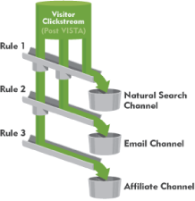

# Define channels

Before channels and channel data can be displayed in the report, create the channels and the underlying rules that process data. You can also create cost and budget amounts for associated channels, and specify how long you want the visitor engagement period to last. You perform report configuration tasks in Admin Tools.

Think of a channel as a container for visits. The rules assign visits to the proper container.

Adobe provides several predefined channels during an [automatic setup](/help/components/c-marketing-channels/getting-started/c-channel-autosetup.md) that you can edit to suit your needs.

>[!NOTE]
>
>Adobe recommends that you set up your report in a report suite that you can use as a template for testing purposes. You can use the template to apply channel and rule sets globally to one or more production report suites.
>
>See [Apply Template Report Suite Settings to Multiple Report Suites](/help/components/c-marketing-channels/getting-started/t-template.md).

## Prerequisites {#prereqs}

If necessary, contact Customer Care to assist you with these prerequisites:

* In the Administration Console (General Account Settings), enable the **[!UICONTROL Conversion Level]** (e-commerce) option for the report suite.

  See [General Account Settings](https://docs.adobe.com/content/help/en/analytics/admin/admin-tools/general-acct-settings-admin.html) in Analytics help for more information.

* Set up user group access to the **[!UICONTROL Marketing Channel Report]**.

  See [Configure User Group Access](/help/components/c-marketing-channels/mc-access/t-user-groups.md).

* Ensure that your account manager has enabled **[!UICONTROL Channel Reports]** for your report suite.

## Important processing notes {#important-proc-rules}

* The system processes the rules in the order you specify, and when a rule is met, the system stops processing the remaining rules.
* Rules can access variables that VISTA has set, but cannot access data that VISTA has deleted.
* Channels store only conversion metrics. Traffic metrics are not available.
* Two marketing channels never receive credit for the same event (such as purchases or clicks). In this way, marketing channels differ from eVars (where two eVars might receive credit for the same event).
* The report can process up to 25 channels at a time.

