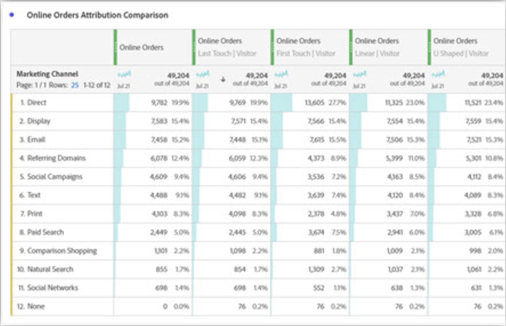
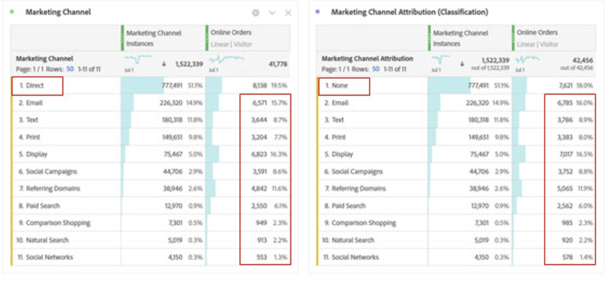
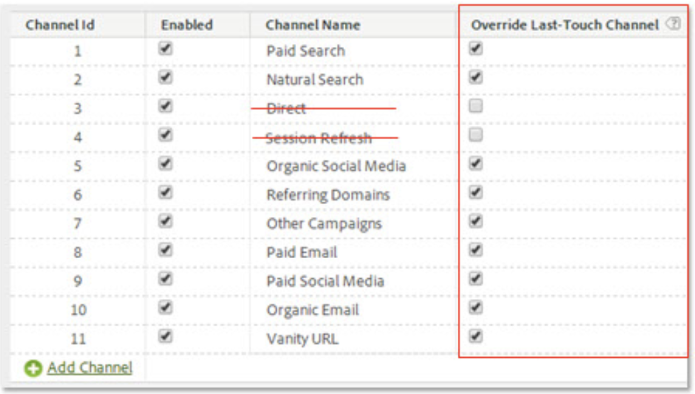
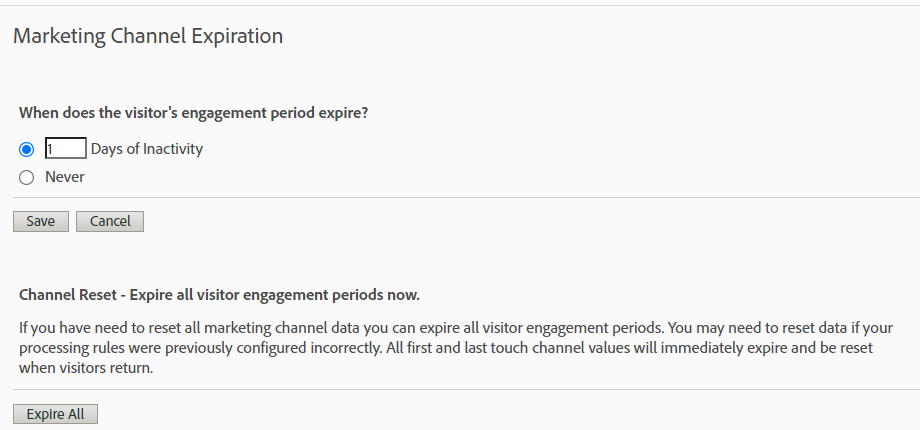

# Attribution IQ with Marketing Channels - Best Practices

[Marketing Channels](/help/components/c-marketing-channels/c-getting-started-mchannel.md) are a valuable and powerful feature of Adobe Analytics. The current guidance regarding Marketing Channel implementation was formulated at a time when neither [Attribution IQ](https://experienceleague.adobe.com/docs/analytics/analyze/analysis-workspace/attribution/overview.html#analysis-workspace)  nor [Customer Journey Analytics](https://experienceleague.adobe.com/docs/analytics-platform/using/cja-usecases/marketing-channels.html#cja-usecases) existed.

In order to future-proof your Marketing Channels implementation and to ensure that there is reporting consistency with Attribution IQ and with Customer Journey Analytics, we are issuing a set of updated best practices. If you are already using Marketing Channels, you can choose the best options among these new guidelines. If you are new to Marketing Channels, we would advise you to adhere to all new best practices.

When Marketing Channels were first introduced, they came with only first-touch and last-touch dimensions. Explicit first/last touch dimensions are no longer needed with the current version of attribution. Adobe provides generic 'Marketing Channel' and 'Marketing Channel Detail' dimensions so you can use them with your desired attribution model. These generic dimensions behave identically to Last-Touch Channel dimensions, but are labeled differently to prevent confusion when using Marketing Channels with a different attribution model.

Since Marketing Channel dimensions depend on a traditional Visit definition (as defined by their processing rules), their Visit definition cannot be changed using Virtual Report Suites. These revised practices enable clear and controlled lookback windows with Attribution IQ and with CJA.

## Best Practice #1: Leverage Attribution IQ for controlled analysis

We recommend using [Attribution IQ](https://experienceleague.adobe.com/docs/analytics/analyze/analysis-workspace/attribution/overview.html#analysis-workspace) instead of the existing Marketing Channel attribution to fine tune your Marketing Channel analysis. Follow the other best practices to ensure consistency and robust controls over your analysis with Attribution IQ.

* Configuration of the dimensions Marketing Channel and Marketing Channel Detail establishes touchpoints to be evaluated, corresponding to each Marketing Channel Instance.
* For metric analysis, your organization should align on one or more attribution model/s. Save custom metrics with this model for easy reuse.
* By default, data is allocated using Last Touch and the setting of the Visitor Engagement Period. Attribution IQ metric models offer greater control over the lookback windows and more variety, including [algorithmic attribution](https://experienceleague.adobe.com/docs/analytics/analyze/analysis-workspace/attribution/algorithmic.html#analysis-workspace).

## Best Practice #2: No Direct and Session Refresh channel definitions

Direct and Internal/Session Refresh channels are not recommended for use with custom attribution models (Attribution IQ).

What if your organization already has Direct and Session Refresh configured? In this case, we recommend that you [create a classification](/help/admin/admin/c-manage-report-suites/c-edit-report-suites/marketing-channels/classifications-mchannel.md) for First Touch/Last Touch and leave Direct and Session Refresh channels unclassified. The classified dimension will yield the same Attribution IQ results as if those channels were never configured.

## Best Practice #3: Enable Override Last-Touch Channel for all channels

Custom attribution models used with the Marketing Channel dimension in Workspace work best when this setting is enabled. Enabling this setting causes a Marketing Channel Instance to count when a new channel/detail is encountered. You should enable this for all channels except for Direct or Internal/Session Refresh, which we no longer recommend for use with custom attribution models (Attribution IQ).

## Best Practice #4: Minimize Visitor Engagement period

Setting the Visitor Engagement period to the minimum of "1 Day" minimizes the likelihood of persisting values. Because custom attribution models (AIQ) allow flexible lookback windows, we recommend setting the minimum value to minimize the impact of this setting.

## Best Practice #5: Marketing Channels Processing Rules should exist only for enabled channels

Ensure that you remove any Marketing Channel Processing Rules for disabled channels. Rules should exist only for Marketing Channels that are checked as enabled.
