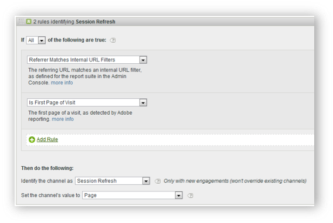
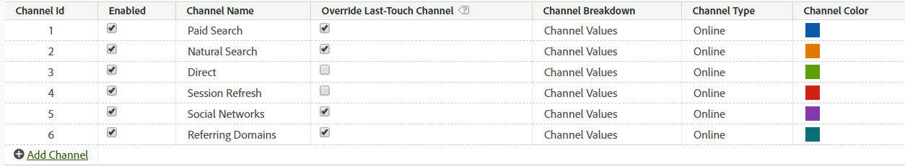

# Internal (Session Refresh) channel

The Internal Channel (often renamed to Session Refresh) consists of visits to the site where the referring URL matches the Internal URL Filters setup in the Admin Console, meaning the visitor came from within the site to start their visit.

## Override best practices

It is a best practice to uncheck the override last-touch option for Direct and Internal channels, so that they can’t take credit from other persisting last touch channels (or each other). 

>[!NOTE]This document assumes that Direct and Session Refresh have Override settings unchecked.

## Engagement period

Both the first- and last-touch channels for a visitor are reset after 30 days of inactivity on that browser. 

>[!NOTE] 30 days is the default and can be modified as needed through the Admin settings.

If the visitor uses the site frequently, the engagement window will roll with them. They must be inactive for 30 days for the period to expire and channels to be reset. 
Example:

* Day 1: User comes to the site on Display. First & Last-touch channels will get set to Display.

* Day 2: User comes to the site on Natural Search. First-touch remains Display, and Last touch is set to Natural Search.

* Day 35: User has not been to the site in 33 days and comes back using the tab they had open in their browser. Assuming a 30 day engagement window, the window would have closed and Marketing Channel cookies would be expired. The first touch & last touch channel will get reset, and will be set to Session Refresh since the user came from an internal URL.

## Relationship between First & Last Touch

To understand the interaction between first and last touch, and confirm that overrides work as expected, you can pull a first-touch channel report, sub-related to a last-touch channel report, with your key success metric added in (see example below). The example demonstrates the interaction between first- and  last-touch channels.

The intersection where first equals last-touch is highlighted in orange. Both Direct and Session Refresh only get last-touch credit if they were also the first-touch channel, because they cannot take credit from other persisting channels (highlighted rows in gray).

## Why does Session Refresh occur?

Since we know that last-touch Session Refresh can only occur if it was also the first-touch, the scenarios below explain how Session Refresh could be a first-touch channel.

### Scenario 1: Session timeout

A visitor comes to the website and then leaves the tab open in their browser to use at a later date. The visitor’s engagement period expires (or they voluntarily delete their cookies), and they use the open tab to visit the website again. Since the referring URL is an internal domain, the visit will be classified as Session Refresh.  

### Scenario 2: Not all site pages are tagged

A visitor lands on Page A which is not tagged, and then moves to page B which is tagged. Page A would be seen as the internal referrer and the visit would be classified as Session Refresh.

### Scenario 3: Redirects

If a redirect is not set up to pass referrer data through to the new land¬ing page, the true entry referrer data is lost and now the redirect page (likely an internal page) appears as the referring domain. The visit will be classified as Session Refresh.

### Scenario 4: Cross-Domain Traffic

A visitor moves from one domain which fires to Suite A, to a second domain which fires to Suite B. If in Suite B, the internal URL filters include the first domain, the visit in Suite B will be recorded as Internal, since Marketing Channels see it as a new visit in the second suite. The visit will be classified as Session Refresh.

### Scenario 5: Long entry-page load times

A visitor lands on Page A which is heavy on con¬tent, and the Adobe Analytics code is located at the bot¬tom of the page. Before all the con¬tent (including Adobe Analytics image request) can load, the vis¬i¬tor clicks to Page B. Page B fires its Adobe Analytics image request. Since Page A’s image request never loaded, the second page appears as the first hit of the visit in Adobe Analytics, with Page A as the referrer. The visit gets classified as Session Refresh.

### Scenario 6: Clearing cookies mid-site

A visitor comes to the site, and mid-session clears their cookies. Both First & Last-touch channels would get reset, and the visit would be classified as Session Refresh (because referrer would be internal).
