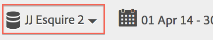
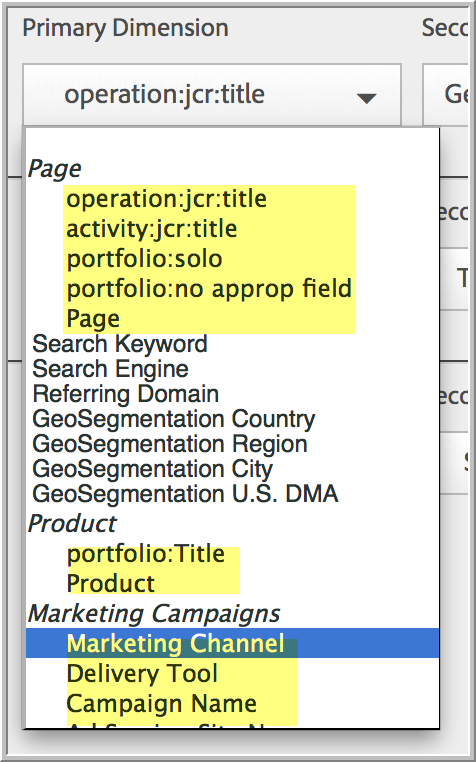

# Configure real-time reports

Administrative steps for setting up Real-Time reports.

Setting up real-time reports within Reports & Analytics consists of selecting the report suite and configuring up to 3 reports for it. 

1. Select the report suite for which you want to enable real-time reports.

   Navigate to **[!UICONTROL Analytics]** > **[!UICONTROL Reports]** > **[!UICONTROL View All Reports > Site Metrics]** > **[!UICONTROL Real-Time]** and select the report suite from the drop-down at the top:

   

   If you try to view real-time reports for a report suite that has not been set up for real-time reporting, a message displays that enables you to set up the report suite.

   

1. Click **[!UICONTROL Configure]** (gear icon) to run the [!UICONTROL Report Suite Manager].

   (Also available under **[!UICONTROL Analytics]** > **[!UICONTROL Admin > Report Suites]** > **[!UICONTROL Edit Settings]** > **[!UICONTROL Real-Time]**.) 

1. Turn on the **[!UICONTROL Enable Real-Time]** setting.
1. Set up real-time data collection for up to three reports, with one metric and three dimensions or classifications per report.

   

   For information on supported real-time metrics and dimensions, see [Supported Metrics and Dimensions](realtime_metrics.md#concept_B86D8DF89AD448839332AD84B1DF2AE7).

   If you have created classifications, they appear indented under the dimension for which they are defined:

   

   >[!NOTE]
   >
   >For a single Real-Time report, we do not currently support enabling duplicate dimensions, even if a different classification is selected for each dimension.

   For more information about classifications, see [About Classifications](../../components/c-classifications2/c-classifications.md#concept_4CEC7FF1A9E24204A7DA6B9AC70709DE).

   >[!NOTE]
   >
   >Some dimensions, such as "Search Keyword" or "Product", do not persist in Real-Time like they do elsewhere in Adobe Analytics. When you select a non-persistent metric, this warning appears:

   

1. Click **[!UICONTROL Save]** or **[!UICONTROL Save and View Report]**.

   After this initial report setup, it can take up to 20 minutes for the data to begin streaming. From then on, data is immediately available. For information on viewing Real-Time reports, see [Run a Real-Time Report](http://marketing.adobe.com/resources/help/en_US/sc/user/reports_realtime.html). 

1. By default, all users have access to Real-Time reports.
