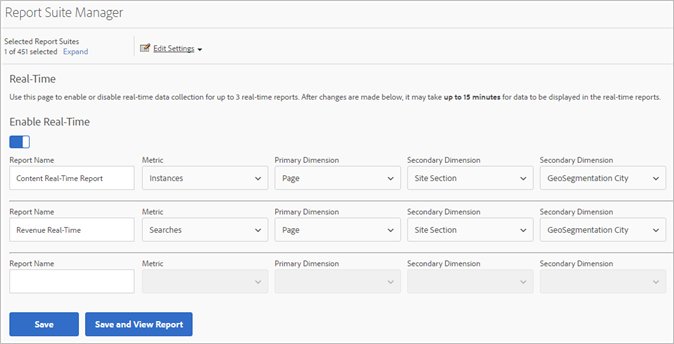

# Configure real-time reports

The following information contains administrative steps for setting up Real-Time reports.

This consists of selecting the report suite and configuring up to 3 reports for it.

1. Select the report suite for which you want to enable real-time reports.

   1. In Analysis Workspace, select the [!UICONTROL **Workspace**] tab, then select [!UICONTROL **Reports**] > [!UICONTROL **Engagement**] > **[!UICONTROL Real-Time]**.
   
   1. Select the report suite from the drop-down at the top:

      

      If you try to view real-time reports for a report suite that has not been set up for real-time reporting, a message displays that enables you to set up the report suite.

      

1. Select **[!UICONTROL Configure]** to run the [!UICONTROL Report Suite Manager].

   (Also available under **[!UICONTROL Analytics]** > **[!UICONTROL Admin > Report Suites]** > **[!UICONTROL Edit Settings]** > **[!UICONTROL Real-Time]**.) 

1. Turn on the **[!UICONTROL Enable Real-Time]** setting.
1. Set up real-time data collection for up to three reports, with one metric and three dimensions or classifications per report.

   

   For information on supported real-time metrics and dimensions, see [Supported Metrics and Dimensions](/help/admin/tools/manage-rs/edit-settings/realtime/realtime-metrics.md).

   If you have created classifications, they appear indented under the dimension for which they are defined:

   

   >[!NOTE]
   >
   >For a single Real-Time report, we do not currently support enabling duplicate dimensions, even if a different classification is selected for each dimension.

   >[!NOTE]
   >
   >Some dimensions, such as "Search Keyword" or "Product", do not persist in Real-Time like they do elsewhere in Adobe Analytics. When you select a non-persistent metric, this warning appears:

   

1. Select **[!UICONTROL Save]** or **[!UICONTROL Save and View Report]**.

   After this initial report setup, it can take up to 20 minutes for the data to begin streaming. From then on, data is immediately available.

1. By default, all users have access to Real-Time reports.
