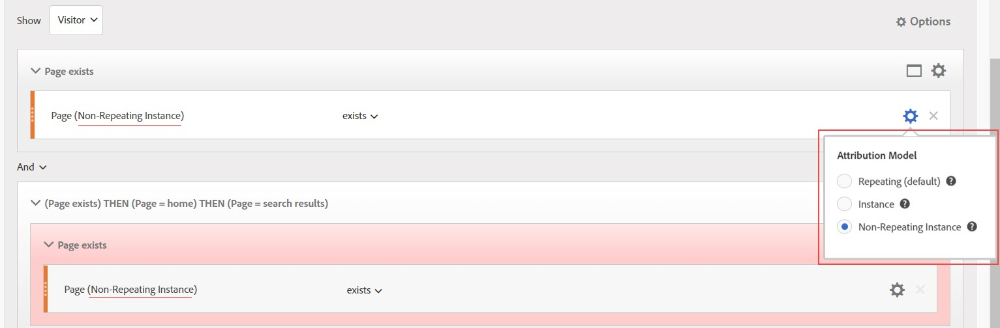
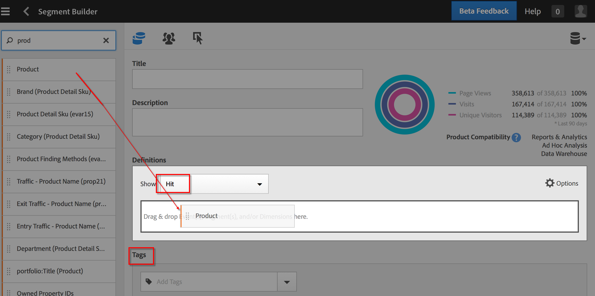

# Segment Builder

The Segment Builder provides a canvas to drag and drop Metric Dimensions, Segments, and Events to segment visitors based on container hierarchy logic, rules, and operators. This integrated development tool lets you build and save simple or complex segments that identify visitor attributes and actions across visits and page hits.

The [!UICONTROL Segment Builder] provides a canvas to drag and drop Metric Dimensions, Segments, and Events to segment visitors based on container hierarchy logic, rules, and operators. This integrated development tool lets you build and save simple or complex segments that identify visitor attributes and actions across visits and page hits. 

>[!IMPORTANT]
>
>We introduced dimension attribution models in the June 2019 release. See #6 under Web UI Features below.

There are several ways to access the Segment Builder:

* **Analytics top navigation:** Click **[!UICONTROL Analytics]** > **[!UICONTROL Components]** > **[!UICONTROL Segments]**. 
* **[!UICONTROL Analysis Workspace]:** Click **[!UICONTROL Analytics]** > **[!UICONTROL Workspace]**, open a project and click **[!UICONTROL + New]** > **[!UICONTROL Create Segment]**. 
* **[!UICONTROL Reports & Analytics]:** Click **[!UICONTROL Analytics]** > **[!UICONTROL Reports]**, open an existing report and click the Segments icon   in the left navigation, then click **[!UICONTROL Add]**. 
* **[!UICONTROL Ad Hoc Analysis]:** [Build Segments in Ad Hoc Analysis](/help/components/c-segmentation/c-segmentation-workflow/seg-build.md#build-segments). 
* **[!UICONTROL Report Builder]:** [Add or edit segments in Report Builder](https://marketing.adobe.com/resources/help/en_US/arb/segmentation.html).

## Segment Builder user interface {#concept_643F2DF74C544796B58F4656ABC5F726}

The [!UICONTROL Segment Builder] lets you build simple or complex segments that identify visitor attributes and actions across visits and page hits. It provides a canvas to drag and drop metric dimensions, events, or other segments in order to segment visitors based on hierarchy logic, rules, and operators.

## Web UI Features {#section_F61C4268A5974C788629399ADE1E6E7C}

The [!UICONTROL Segment Builder] lets you build and edit segments in the web UI (or in a [Java UI in Ad Hoc Analysis](/help/components/c-segmentation/c-segmentation-workflow/seg-workflow.md)). You can add rule definitions and containers to refine your segments, stack segments, and nest them to refine them. You can also validate how many page views, visits, and unique visitors result from your current segment definition. Then save the segment for future needs.

Access the Segment Builder by:

* Displaying an existing report and clicking the Segments icon   in the left navigation. In the segment rail that displays, click **[!UICONTROL Add]**. 

* From within the Segment Manager, clicking **[!UICONTROL + Add]**. 
* Clicking an existing segment title in the Segment Manager to edit the segment in Segment Builder.

1. **[!UICONTROL Title:]** Lets you name or rename the segment. 
1. **[!UICONTROL Description:]** Provide a description for the segment. You must provide a description if you want to share the segment. 
1. **[!UICONTROL Tags:]** [Tag the segment](/help/components/c-segmentation/c-segmentation-workflow/seg-workflow.md) you are creating by picking from a list of existing tags or creating a new tag. 
1. **[!UICONTROL Definitions:]** This is where you [build and configure segments](/help/components/c-segmentation/c-segmentation-workflow/seg-workflow.md), add rules, and nest and sequence containers. Allows you to provide a description for the new segment by selecting the container and dragging and dropping dimensions, segments, or metrics into the definition. 
1. **[!UICONTROL Show:]** (Top Container selector.) Lets you select the top-level [container](/help/components/c-segmentation/seg-overview.md) ( [!UICONTROL Visitor], [!UICONTROL Visit], [!UICONTROL Hit]). The default top-level container is the Hit container. 
1. **[!UICONTROL Options:]** (gear) icon

    * **[!UICONTROL + Add container:]** Lets you add a new container (below the top-level container) to the segment definition. 
    * **[!UICONTROL + Add container from selection:]** Lets you create a new container from the element/s that you (multi-) selected in the Definitions field. 
    * **[!UICONTROL Exclude:]** Lets you define the segment by excluding one or more dimensions, segments, or metrics.

   **[!UICONTROL Attribution Models:]** For dimension segmentation. Dimension models are particularly useful in sequential segmentation, such as in those that support Flow visualizations:
    * **[!UICONTROL Repeating]** ((default)): Includes instances and persisted values for the dimension.
    * **[!UICONTROL Instance]**: Includes instances for the dimension.
    * **[!UICONTROL Non-repeating instance]**: Includes unique instances (non-repeating) for the dimension.
    
    

1. **[!UICONTROL Dimensions:]** Dimension are dragged and dropped from the Dimensions list (orange sidebar). 
1. **[!UICONTROL Comparison:]** You can compare and constrain values using selected operators. 
1. **[!UICONTROL Value:]** The value you entered or selected for the dimension or segment or metric. 
1. **[!UICONTROL And/Or/Then]**: Assigns the [!UICONTROL AND/OR/THEN] operators between containers or rules. The THEN operator lets you [define sequential segments](/help/components/c-segmentation/c-segmentation-workflow/seg-sequential-build.md). 
1. **[!UICONTROL Metric]**: (Green sidebar) Metric that was dragged and dropped from the Metrics list. 
1. **[!UICONTROL Comparison]** operator: You can compare and constrain values using selected operators. 
1. **[!UICONTROL Value]**: The value you entered or selected for the dimension or segment or metric. 
1. **[!UICONTROL X]**: (Delete) Lets you delete this part of the segment definition. 
1. **[!UICONTROL Save]** or **[!UICONTROL Cancel]**: Saves or cancels the segment. After clicking **[!UICONTROL Save]**, you are taken to the Segment Manager where you can manage the segment. 
1. **[!UICONTROL Search:]** Searches the list of dimensions, segments, or metrics. 
1. **[!UICONTROL Dimensions:]** (List) Click the header to expand. 
1. **[!UICONTROL Metrics:]** Click the header to expand. 
1. **[!UICONTROL Segments:]** Click the header to expand. 
1. **[!UICONTROL Report suite selector:]** Lets you select the reports suite that this segment will be saved under. You can still utilize the segment in all report suites. 
1. **[!UICONTROL Segment Preview:]** Lets you preview the key metrics to see whether you have a valid segment and how broad the segment is. Represents the breakdown of the data set you can expect to see if you apply this segment. Shows 3 concentric circles and a list to show the number and percentage of matches for [!UICONTROL Hits], [!UICONTROL Visits], and [!UICONTROL Visitors] for a segment run against a data set. This chart is updated immediately after you create or make changes to your segment definition. 
1. **[!UICONTROL Product Compatibility:]** Provides a list of which Adobe Analytics products (Analysis Workspace, [!UICONTROL Reports & Analytics], Ad Hoc Analysis, Data Warehouse) with which the segment you created is compatible. Most segments are compatible with all products. However, not all operators and dimensions are compatible with all Analytics products, especially [Data Warehouse](/help/components/c-segmentation/seg-reference/seg-compatibility.md). This chart is updated immediately after you make changes to your segment definition.

   Segments with embedded date ranges continue to operate differently in Analysis Workspace versus [!UICONTROL Reports & Analytics]: In Workspace, a segment with an embedded date range overrides the panel date range. By contrast, [!UICONTROL Reports & Analytics] gives you the intersection of the report date range and the segment's embedded date range.

**[!UICONTROL Publish to Experience Cloud (for `<report suite name>`)]**: (Not shown on screen) This option appears only if the report suite that you are saving this segment to is [enabled for the Experience Cloud](/help/components/c-segmentation/c-segmentation-workflow/seg-workflow.md). By publishing a segment to the Experience Cloud, you can use the segment for marketing activity in the [!UICONTROL Audience Library], [!DNL Target], and [!DNL Audience Manager]. A segment title and description are required.

>[!NOTE]
>
>In Analytics, you can edit or delete a published segment. If the segment is in use, a warning message is issued when you edit a segment. You cannot delete a published segment that is in use by Adobe [!DNL Target].

>[!IMPORTANT]
>
>You must limit the number of audiences shared from Analytics to 20 to avoid additional processing delays. Audiences shared to the Experience Cloud from Analytics cannot exceed 20 million unique members. Also, due to caching, deleted report suites in Analytics require 12 hours before the deletion is shown in the Experience Cloud.

>[!IMPORTANT]
>
>Once a visitor qualifies for the audience shared from Analytics, there is a 24 - 48 hour delay before that information is actionable in [!DNL Target], [!DNL Advertising Cloud], and [!DNL Campaign].

## Build segments {#build-segments}

1. Simply drag a Dimension, Segment, or Metric Event from the left pane to the [!UICONTROL Definitions] field.

   

   The default top-level [!UICONTROL Hit] container is shown after dragging an element to [!UICONTROL Definitions]. You can change the container type to Visit or Visitor from the **[!UICONTROL Show]** drop-down menu. 

1. Set the [operator](/help/components/c-segmentation/seg-reference/seg-operators.md) from the drop-down menu. 
1. Enter or select a value for the item selected. 
1. Add additional containers if needed, using **[!UICONTROL And]**, **[!UICONTROL Or]**, or **[!UICONTROL Then]** rules. 
1. After placing the containers and setting the rules, see the results of the segment in the validation chart at the top right. The validator indicates the percentage and absolute number of page views, visits, and unique visitors that match the segment you created. 
1. Under **[!UICONTROL Tags]**, [tag](/help/components/c-segmentation/c-segmentation-workflow/seg-tag.md) the container by selecting an existing tag or creating a new one. 
1. Click **[!UICONTROL Save]** to save the segment.

You are now taken to the [Segment Manager](/help/components/c-segmentation/c-segmentation-workflow/seg-manage.md), where you can tag, share, and manage your segment in multiple ways.

## Build and nest containers {#section_1C38F15703B44474B0718CEF06639EFD}

You can [build a framework of containers](/help/components/c-segmentation/seg-overview.md) and then place logic rules and operators between.

1. Click **[!UICONTROL Options > Add Container]**.

   

   A new [!UICONTROL Hit] container opens without a [!UICONTROL Hit] (Page View) identified.

   

1. Change the container type as needed. 
1. Drag a Dimension, Segment, or Event from the left pane to the container. 
1. Continue to add new containers from the top-level **[!UICONTROL Options]** > **[!UICONTROL Add container]** button at the top of the definition, or add containers from within a container to nest logic.

   **OR**

   Select one or more rules and then click **[!UICONTROL Options]** > **[!UICONTROL Add container from selection]**. This turns your selection into a separate container.

## Use date ranges in segments {#concept_252A83D43B6F4A4EBAB55F08AB2A1ACE}

You can build segments that contain rolling date ranges in order to answer questions about ongoing campaigns or events. 

For example, you can easily build a segment that includes "everyone who has made a purchase over the past 60 days".

You create a Visit container and within it, add the [!UICONTROL Last 60 days] time range and the metric [!UICONTROL Orders is greater than or equal to 1], with an AND operator:

## Stack segments {#task_58140F17FFD64FF1BC30DC7B0A1B0E6D}

Stacking segments works by combining the criteria in each segment using an 'and' operator, and then applying the combined criteria. 

For example, stacking a "mobile phone users" segment and a "US geography" segment would return data only for mobile phone users in the US.

Think of these segments as building blocks or modules that you can include in a segment library, for users to use as they see fit. That way, you can dramatically reduce the number of segments needed. For example, assume you have 40 segments:

* 20 for mobile phone users in different countries (US_mobile, Germany_mobile, France_mobile, Brazil_mobile, etc.) 
* 20 for tablet users in different countries (US_tablet, Germany_tablet, France_tablet, Brazil_tablet, etc.)

By using segment stacking, you can reduce your segment count to 22 and stack them as needed. You would need to create these segments:

* one segment for mobile users 
* one segment for tablet users 
* 20 segments for the different geographies

>[!NOTE]
>
>When stacking two segments, they are by default joined by an AND statement. This cannot be changed to an OR statement.

1. Go to the Segment Builder.
1. Provide a title and description for the segment.

   Step Result 1. Click **[!UICONTROL Show Segments]** to bring up the list of segments in the left navigation.

   Step Result 1. Drag and drop the segments you want to stack to the segment definition canvas. Here is an example of a segment that stacks the existing segments "Visits from Tablets" and "US Geo":

   

1. Save the segment.

   Step Result 

## Use segment templates {#concept_5098446CC78D441E93B8E4D1D1EA6558}

Templates represent the old pre-configured and suite segments. 

In the Segment Manager, click **[!UICONTROL Add]**, which takes you to the Segment Builder. Now click the Segments icon  

to bring up the segment rail. The segment templates appear at the bottom of the segment list. They are distinguishable by a folder icon to the left of the template name:

You can drag these templates into the Definitions canvas and use them as they have been defined, or modify them. 

<table id="table_98B87D807E9344C9BEBF072C65D87B1B"> 
 <thead> 
  <tr> 
   <th colname="col1" class="entry"> Template Name </th> 
   <th colname="col2" class="entry"> Definition </th> 
  </tr> 
 </thead>
 <tbody> 
  <tr> 
   <td colname="col1"> Abandon Cart </td> 
   <td colname="col2">View data for visitors that added items to their carts but did not order anything. In the Segment Definition, the container is Visit. The rule for this sequential segment is 
 Cart Additions is not null 
 
Then 
 
Orders equals 0. 
 </td> 
  </tr> 
  <tr> 
   <td colname="col1"> First Time Visits </td> 
   <td colname="col2">View data for visitors that have visited a maximum of one [1] times. In the Segment Definition, the container is Visit. The rule is 
Visit Number equals 1. 
 </td> 
  </tr> 
  <tr> 
   <td colname="col1"> Non-Purchasers </td> 
   <td colname="col2">View data for visitors that have not participated in an order event. In the Segment Definition, the container is Visitor. This segment uses the Exclude logic. The rule is 
Orders is not null. 
 </td> 
  </tr> 
  <tr> 
   <td colname="col1"> Non-Single Page Visit (Non-Bounces) </td> 
   <td colname="col2">View data for visitors that visited more than once. In the Segment Definition, the container is Visitor. This segment uses the Exclude logic. The rule is 
Single Access is not null. 
 </td> 
  </tr> 
  <tr> 
   <td colname="col1"> Paid Search </td> 
   <td colname="col2">View data from visitors originating from a paid search. In the Segment Definition, the container is Visit. The rule is 
Paid Search equals 1. 
 </td> 
  </tr> 
  <tr> 
   <td colname="col1"> Purchasers </td> 
   <td colname="col2">View data for visitors that have participated in an order event. In the Segment Definition, the container is Visitor. The rule is 
Orders is not null. 
 </td> 
  </tr> 
  <tr> 
   <td colname="col1"> Return Visits </td> 
   <td colname="col2">View data from visitors that have visited at least once. In the Segment Definition, the container is Visit. The rule is 
Visit Number is greater than 1. 
 </td> 
  </tr> 
  <tr> 
   <td colname="col1"> Single Page Visits </td> 
   <td colname="col2"> View data from visits in which you see a single page value, even though you may submit multiple page views during that visit. Single-page visits with exit link events are included in the segment. In the Segment Definition, the container is Visit. The rule is 
Single Page Visits equals 1. 
 </td> 
  </tr> 
  <tr> 
   <td colname="col1"> Viewed Product Didn't Add to Cart </td> 
   <td colname="col2">View data for visitors that viewed products but had no cart additions. In the Segment Definition, the container is Visit. The rule for this sequential segment is 
Product Views is not null 
 
Then 
 
 Cart Additions equals 0. 
 </td> 
  </tr> 
  <tr> 
   <td colname="col1"> Visits from Campaign </td> 
   <td colname="col2">View data from visitors referred by campaigns. In the Segment Definition, the container is Visit. The rule is 
Tracking Code is not null. 
 </td> 
  </tr> 
  <tr> 
   <td colname="col1"> Visits from Mobile Devices </td> 
   <td colname="col2">View data from visitors using mobile devices. In the Segment Definition, the container is Visit. The rule is 
Mobile Device is not null. 
 </td> 
  </tr> 
  <tr> 
   <td colname="col1"> Visits from Natural Search </td> 
   <td colname="col2">View data from visitors not originating from a paid search. In the Segment Definition, the container is Visit. The rule is 
Paid Search equals 0. 
 </td> 
  </tr> 
  <tr> 
   <td colname="col1"> Visits from Non-Mobile Device </td> 
   <td colname="col2">View data from visitors not using mobile devices. In the Segment Definition, the container is Visit. This segment uses the Exclude logic. The rule is 
Mobile Device Type equals Mobile Phone 
 
Or 
 
Mobile Device Type equals Tablet. 
 </td> 
  </tr> 
  <tr> 
   <td colname="col1"> Visits from Phones </td> 
   <td colname="col2">View data from visitors using phones. In the Segment Definition, the container is Visit. The rule is 
Device Type equals Mobile Phone. 
 </td> 
  </tr> 
  <tr> 
   <td colname="col1"> Visits from Search Engines </td> 
   <td colname="col2">View data from visitors referred by search engines. In the Segment Definition, the container is Visit. The rule is 
Referrer Type equals Search Engines. 
 </td> 
  </tr> 
  <tr> 
   <td colname="col1"> Visits from Social Sites </td> 
   <td colname="col2">View data from visitors referred by social sites. In the Segment Definition, the container is Visit. The rule is 
Referrer Type equals Social Networks. 
 </td> 
  </tr> 
  <tr> 
   <td colname="col1"> Visits from Tablets </td> 
   <td colname="col2">View data from visitors using tablets. In the Segment Definition, the container is Visit. The rule is 
Device Type equals Tablet. 
 </td> 
  </tr> 
  <tr> 
   <td colname="col1"> Visits with Visitor ID Cookie </td> 
   <td colname="col2">View data from visitors to your site, where a persistent cookie is required. In the Segment Definition, the container is Visit. The rule is 
Persistent Cookie equals 1. 
 </td> 
  </tr> 
 </tbody> 
</table>

## Example: Campaign visitors segment {#concept_61AC6115097B4EB3AEFE8CE98F38315D}

Shows an example of this frequently used segment. 

Many customers want to see metrics from visitors who responded to specific campaigns. Creating a campaign visitors segment is an easy way of getting this data.

Building this segment in the Segment Builder means that from a top-level Visit container, you drag in a campaign dimension, in this case Campaign Name:

(Optional) You can also apply a Campaigns tag to this segment, if you wish to easily filter on all your campaign-related segments. 
