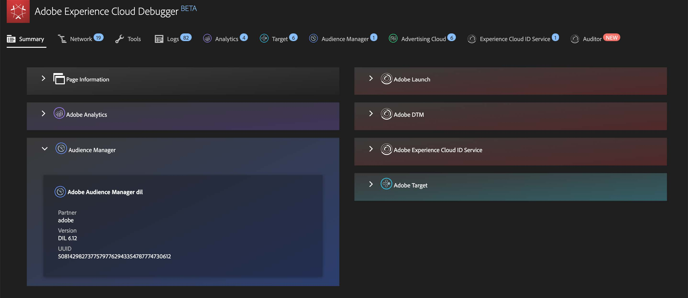
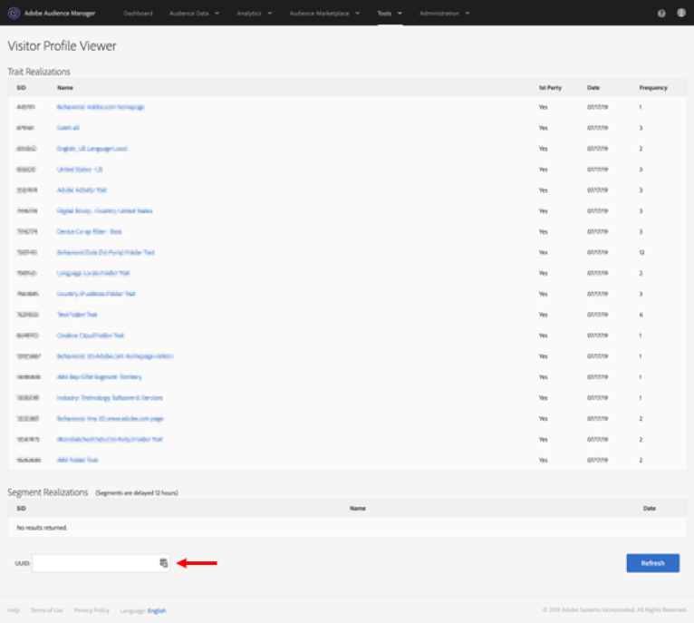

# Publish segments to the Experience Cloud

>[!IMPORTANT]
>
>The latency improvements regarding segment publishing and the user interface that are described on this page are not rolled out to all customers yet. The current production environment is described [here](https://docs.adobe.com/content/help/en/core-services/interface/audiences/t-publish-audience-segment.html).

Publishing a segment to the Experience Cloud lets you use the segment for marketing activity in the [!UICONTROL Audience Library], [!DNL Target], [!DNL Audience Manager], and [!DNL Advertising Cloud]. Recent updates have significantly optimized the publishing workflow. Previously, publishing a usable segment took approximately 48 hours. 

Now, processing can take up to 8 hours, but depending on other traffic and on the segment size, processing may be even faster. (However, we currently do not have a way to inform you when the segment is available, so you will have to check manually.) We have also increased the maximum number of publishable segments to 75 (from 20). You can view published segments in Components > Segments. 

## Prerequisites

* Ensure that the report suite that you are saving this segment to is [enabled for the Experience Cloud](https://docs.adobe.com/content/help/en/core-services/interface/audiences/t-publish-audience-segment.html). Otherwise you cannot publish it to the Experience Cloud.
* Make sure you are working in a report suite that is [mapped to your Experience Cloud organization](https://docs.adobe.com/content/help/en/core-services/interface/about-core-services/report-suite-mapping.html).
* Before you can publish segments, your Admin needs to assign the [!UICONTROL Segment Publishing] permission to a product profile in the [Admin Console](https://docs.adobe.com/content/help/en/core-services/interface/manage-users-and-products/admin-getting-started.html), and add you to the product profile.

## Considerations

* **Report Suite limits**: You can publish up to 75 segments per report suite. This limit is enforced. If you already have 75 segments published, you cannot publish any additional segments until you un-publish enough segments to get below the 75-segment threshold.
* **Membership limits**: Audiences shared to the [!DNL Experience Cloud] from Analytics cannot exceed 20 million unique members. 
* **Data Privacy**: Audiences are not filtered based on the authentication state of a visitor. If a visitor can browse your site in un-authenticated and authenticated states, actions that occur when a visitor is un-authenticated can still cause a visitor to be included in an audience. Review [Adobe Experience Cloud privacy](https://www.adobe.com/privacy/experience-cloud.html) to understand the full privacy implications of audience sharing.
* For a discussion about the differences between segments in [!DNL Adobe Analytics] and [!DNL Audience Manager], go [here](https://docs.adobe.com/content/help/en/analytics/integration/audience-analytics/audience-analytics-workflow/aam-analytics-segments.html).

## Segment publishing timeline

|  What's available  | When it's available | Where it's available |
|---|---|---|
| Meta data (segment title and definition) | Immediately after publishing | [!DNL Audience Manager], [!UICONTROL Experience Cloud Audience Library], [!DNL Target] |
| Usable segment with membership | ~ 8 hours after publishing | Visitor Profile Viewer in [!DNL Audience Manager] |
| Trait and membership population | Within 24 hours | [!DNL Audience Manager] |

## Publish segments in [!UICONTROL Segment Builder]

1. Navigate to [!UICONTROL Analytics > Workspace > Components > Segments] > +
1. Create a segment in the [!UICONTROL Segment Builder]. 
1. Provide a title and a description for the segment - you won’t be able to save it otherwise.
1. Check [!UICONTROL Publish this segment to the Experience Cloud (for *report suite*)].

|  Element | Description |
|---|---|
| Publish this segment to the Experience Cloud (for `<report suite>`) | When this option is enabled, the segment title and definition (i.e. the shell audience as often used in ad platforms) are shared with the Experience Cloud instantaneously, while the segment membership is evaluated and shared every 4 hours.   When that audience is associated with an activity in [!DNL Target], for example, [!DNL Analytics] begins sending IDs for visitors that qualify for that Experience Cloud and [!DNL Target] audience. At that point, the audience name and corresponding data begins displaying on the Experience Cloud Audiences page.   |
| Audience Creation Window | The time frame you select is used to create the audience on a rolling-calendar basis. For example, “Last 30 days” (default) includes visitors that have qualified for the audience over the last 30 days from today's date (NOT from the original date when the segment was created.) |
| Create in Audience Library | The segments that you create and publish can be made available without latency in the Experience Cloud Audience Library. They are not dependent on Analytics updates. These segments do not count against your limit of 75 published segments. |
| x of 75 Published | Shows the number of segments you have published to the Experience Cloud. Click the link to see a list of published segments and their associated report suite and owner. |
| Save | Saves this segment. |

## Unpublish or delete segments

To delete a segment that has been published to the Experience Cloud, you have to unpublish it first. To unpublish a segment, just **unclick** the checkbox that you used to publish it. 

>[!NOTE]
>
>You **cannot** unpublish a segment that is currently in use by any of the following Adobe solutions: [!DNL Analytics] (in [!DNL Audience Analytics]), [!DNL Campaign], [!DNL Advertising Cloud] (for [!DNL Core Service] & [!DNL Audience Manager] customers) and all other external partners (for [!DNL Audience Manager] customers). You **can** unpublish a segment that is in use by [!DNL Target].

## View segment publishing status in the [!UICONTROL Segment Manager]

1. Navigate to [!UICONTROL Analytics > Components > Segments].
1. Notice the new [!UICONTROL Published] column. Yes/No refers to whether the segment has been published to the Experience Cloud or not.

## Retrieve the [!DNL Audience Manager] UUID

There are 2 ways to capture the AAM UUID currently associated with the browser:

* Adobe Experience Cloud Debugger
* Native developer tool in browsers (e.g., Chrome Developer Tools)

The following screenshots show you how to retrieve the AAM UUID on your browser and use it in Audience Manager Visitor Profile Viewer to validate trait & segment membership.

**Method 1: Use Adobe Experieence CLoud Debugger**

1. Download and install [Adobe Experience Cloud Debugger](https://docs.adobe.com/content/help/en/analytics/implementation/testing-and-validation/debugger.html) in the Chrome Web Store.
1. Launch the debugger when loading a page.
1. Scroll to the Audience Manager section and find the AAM UUID set on the current browser page
(`50814298273775797762943354787774730612` in the example below)

**Method 2: Use Chrome Developer Tools (or other browser developer tools)**

1. Launch Chrome Developer Tools before loading a page
1. Load the page and check Applications > Cookies. The AAM UUID should be set in the 3rd-party
Demdex cookie ([adobe.demdex.net](https://marketing.adobe.com/resources/help/en_US/aam/demdex-calls.html) in the example below). The field demdex is the AAM UUID set
on the browser (`50814298273775797762943354787774730612` in the example below).

## Use Audience Manager [!UICONTROL Visitor Profile Viewer]

The AAM UUID on the browser will be used by default when [!UICONTROL Visitor Profile Viewer] is loaded. If verifying trait realizations for other users, input a UUID in the UUID field and click [!UICONTROL Refresh]. Refer to [Visitor Profile Viewer](https://marketing.adobe.com/resources/help/en_US/aam/t_visitor_profile_viewer.html) for more information.

## View the segment traits in [!DNL Audience Manager]

In AAM, the list of visitors with ECIDs for a given segment are evaluated in a streaming fashion as Analytics shares segments with Experience Cloud.

1. In [!DNL Audience Manager], go to [!UICONTROL Audience Data > Traits > Analytics Traits]. You will see a folder for each Analytics reports suite that is mapped to your Experience Cloud organization. These folders (for Traits, Segments, and Data Sources) get created when the Profiles and Audiences/People core service gets initiated or provisioned.
1. Select the folder for the report suite in which you previously created the segment you wanted to share with [!DNL Audience Manager]. You will see the segment/audience you created. When you share a segment, 2 things happen in [!DNL Audience Manager]:
* A trait gets created, first with no data in it. Approx. 8 hours after the segment gets published in [!DNL Analytics], the list of ECIDs gets onboarded and shared with [!DNL Audience Manager] and other Experience Cloud solutions.

* A one-trait segment gets created. It uses the data source that is associated with the report suite where you published the segment.

## View the segment in [!DNL Adobe Target]

The [!UICONTROL Publish this segment to the Experience Cloud] checkbox during the segment creation process in Adobe Analytics allows the segment to be available within the Adobe Target's custom audience library. A segment created in Analytics or Audience Manager can be used for activities in Target. For example, you can create campaign activities based on Analytics conversion metrics and audience segments created in Analytics.
], click [!UICONTROL Audiences].
1. On the [!UICONTROL Audiences] page, locate the audience sourced from the [!DNL Experience Cloud]. These audiences are available for use in [!DNL Target] activities.
