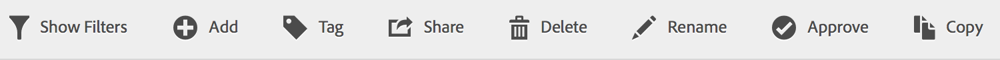

# Tag segments

In the Segment Manager, tagging segments allows you to organize them.

All users can create tags for segments and apply one or more tags to a segment. However, you can see tags only for those segments that you own or that have been shared with you. What kinds of tags should you create? Here are some suggestions for useful tags:

* Tags based on **team names**, such as Social Marketing, Mobile Marketing. 
* **Project** tags (analysis tags), such as Entry-page analysis. 
* **Category** tags: Men's; geography. 
* **Workflow** tags: To be approved; Curated for (a specific business unit)

1. In the Segment Manager, mark the checkbox next to the segment you want to tag. The segment management tool bar appears:

   

1. Click **[!UICONTROL Tag]** and either

    * select from existing tags, or 
    * add a new tag and press **[!UICONTROL Enter]**.

      

1. Click **[!UICONTROL Tag]** again to tag the segment.

The tag should now appear in the Tags column. (Click the gear icon on the top right to manage your columns.)

You can also filter on tags by going to **[!UICONTROL Filters]** > **[!UICONTROL Tags]**. 
