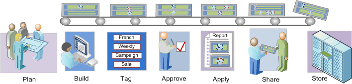

# Segmentation workflow overview

Describes a suggested workflow for segments created with the Segment Builder and managed through the Segment Manager.

## Segmentation workflow overview {#concept_6D2E1A72A3AD4EBBB9135094F2D9DEDF}

Describes a suggested workflow for segments created with the Segment Builder and managed through the Segment Manager.

<!-- 

seg_workflow.xml

 -->

 [ Plan Segments](../../../components/c-segmentation/c-segmentation-workflow/seg-plan.md#concept_D8BE6AB8D8E540E58C3462F9E02F4847)

Have you asked all the right questions before building segments and setting up a segment management environment? Have you designed the segment with its intended purpose and distinct usage in mind?

See the Segment Planning Checklist for help in planning and organizing your segments.

 [Build Segments](../../../components/c-segmentation/c-segmentation-workflow/seg-build.md#concept_BD4C17B01C5B4E378D0C14C852D055D4) 

Build and edit segments for use in all Analytics capabilities.

See [Build Sequential Segments](../../../components/c-segmentation/c-segmentation-workflow/seg-sequential-build.md#concept_83AEC78CD25F442EBEE364856A889560) for how to build segments with the THEN operator.

 [ Tag Segments](../../../components/c-segmentation/c-segmentation-workflow/seg-tag.md#concept_CD892CEB326C4986A1B67487052DBA50)

Tag segments for ease of organization and sharing. Tagging replaces folder hierarchies in ad hoc analysis. See how to plan and assign tags for simple and advanced searches and organization.

 [ Approve Segments](../../../components/c-segmentation/c-segmentation-workflow/seg-approve.md#concept_DF477F151A9E483A92ED1DDAAF035953)

Approve segments to make them canonical.

 [ Apply Segments](../../../components/c-segmentation/c-segmentation-workflow/t-seg-apply.md#task_13E69C7D428A43EF9CCCA7F1104F1E8F)

You can apply segments directly from a report, from the segment rail ( Show Segments).

 [ Share Segments](../../../components/c-segmentation/c-segmentation-workflow/t-seg-share.md#task_7DC54643083E42C28F918E4F0845C5A5)

Share your segments with the intended audience in other Analytics tools and to Adobe Target and the Adobe Experience Cloud.

 [ Filter Segments](../../../components/c-segmentation/c-segmentation-workflow/t-seg-filter.md#task_B59946C6D38945629C1FEACF80A85746)

Filter by tags, owners, and other filters (Show All, Mine, Shared With me, Favorites, and Approved.)

 [ Mark Segment as Favorites](../../../components/c-segmentation/c-segmentation-workflow/t-seg-favorite.md#task_F45DFA3FBF0C4082B46A0D032CB20FC5)

Marking segments as favorites is another way to organize them for ease of use.

[Manage Segments](../../../components/c-segmentation/c-segmentation-workflow/seg-manage.md#concept_7A2E019317864065B7C641DC3315928F)

The Segment Manager offers many ways of curating segments, such as sharing, filtering, tagging, approving, copying, deleting, and marking as favorites.