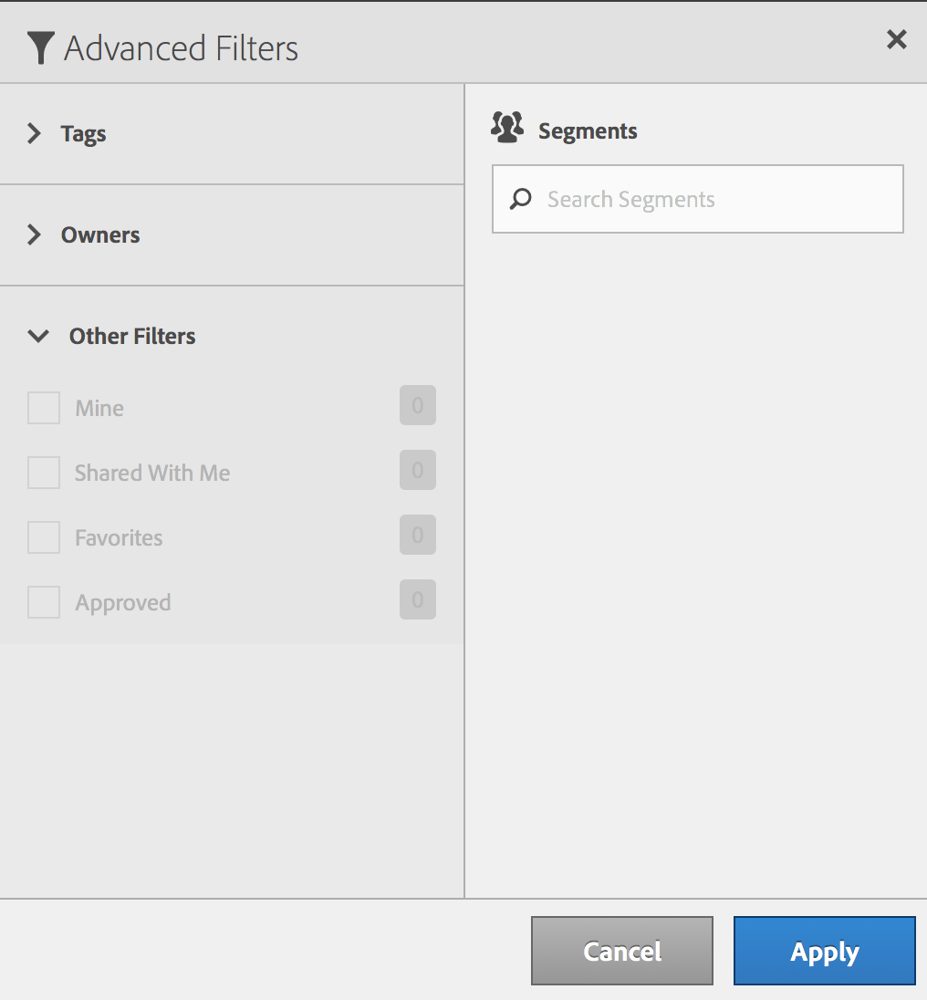

# Filter segments

Filter by tags, owners, and other filters (Show All, Mine, Shared With me, Favorites, and Approved.)

Filtering makes it easier to search for segments in the segment rail.

1. In the Segment Manager, click the **[!UICONTROL Filters]** icon:  

   

1. The following filters are available:

   |  Filter Name  | Description  |
   |---|---|
   |  Tags  |Lets you filter on segments with specific [tags](/help/components/c-segmentation/c-segmentation-workflow/seg-tag.md). The Tags column is shown by default.  |
   |  Owners  | Lets you filter segments by owner.  |
   |  Other Filters > Show All  | **(Admin only)** Shows all segments, their owner, and the last date they were modified.  |
   |  Other Filters > Mine  | Shows all segments that you own.  |
   |  Other Filters > Shared with Me  |Shows all segments that others [shared](/help/components/c-segmentation/c-segmentation-workflow/t-seg-share.md) with you.  |
   |  Other Filters > Favorites  |Shows all segments you marked as [Favorites](/help/components/c-segmentation/c-segmentation-workflow/t-seg-favorite.md).  |
   |  Other Filters > Approved  |Shows all officially [approved](/help/components/c-segmentation/c-segmentation-workflow/seg-approve.md) segments.  |
   |  Search Segments  | Lets you search for segments by name.  |

