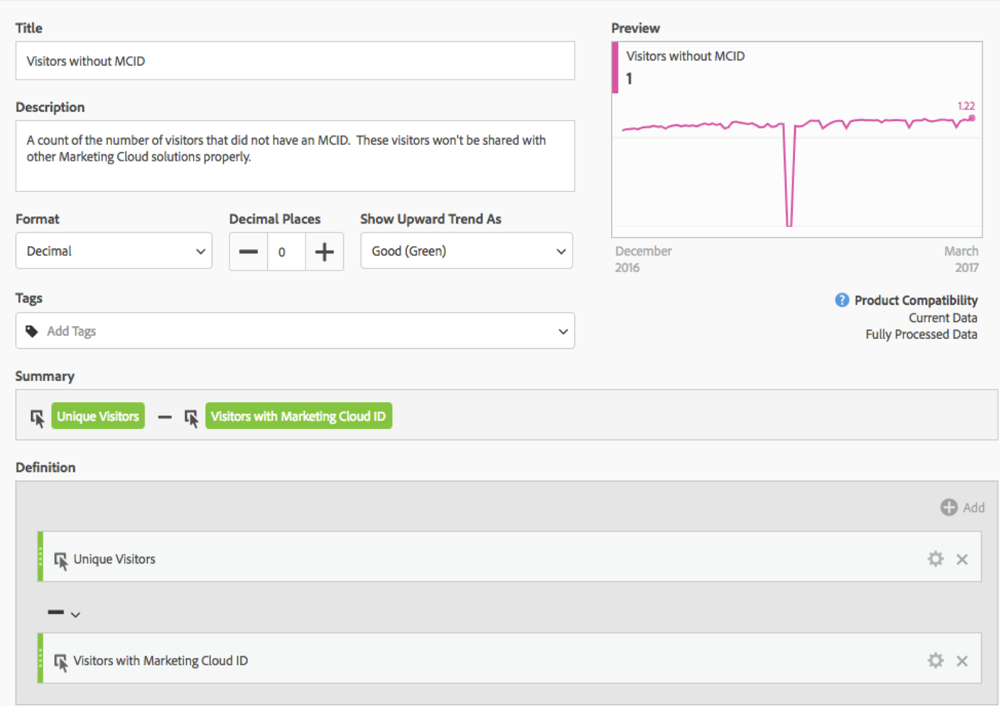
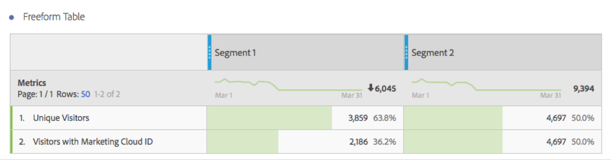

# Visitors with Experience Cloud ID

Available in Analysis Workspace and the Segment Builder.

Shows the number of visitors that have a Experience Cloud ID. You can understand which pages have the Experience Cloud ID service deployed, and you can understand how many visitors can be shared with other Experience Cloud solutions. You can also use this metric in segments that are shared to the Experience Cloud.

>[!IMPORTANT]
>
>For this metric to appear, you have to have the [Experience Cloud ID service](https://marketing.adobe.com/resources/help/en_US/mcvid/) running for the report suite.

## Debug your Experience Cloud ID Setup {#section_679E62142A3E46548FF8FBDA46568005}

The [!UICONTROL Visitors with Experience Cloud ID] metric is a useful metric in Adobe Analytics intended to help you find and debug your [!UICONTROL Experience Cloud ID Service]setup. The metric is a count of the number of visitors in a report suite that have been assigned a Experience Cloud ID from the Experience Cloud ID Service. This metric can be very useful in diagnosing why certain Experience Cloud integrations may not be sharing as many visitors as expected, or identifying areas of your site that may not have MCID deployed yet.

To use the Visitors with Experience Cloud ID metric, simply drag it in to any report as a metric, such as this [!UICONTROL Pages] report:

In this example, notice that each page has the same number of Unique Visitors as Visitors with a Experience Cloud ID. However, the total number of Unique Visitors is greater than the total number of Visitors with Experience Cloud ID. To find the pages that are not setting the MCID for all visitors, [create a calculated metric](https://marketing.adobe.com/resources/help/en_US/analytics/calcmetrics/cm_build_metrics.html) with this definition:

By adding the calculated metric to the report, you can sort the Pages report so that the pages with the highest number of visitors without an MCID are surfaced:

Now you can quickly see that the “Product Quick Views” pages are not properly implemented with the Experience Cloud ID Service and should be updated as soon as possible. A similar report can be constructed around any type of dimension such as browser type, site section, or content types.

Once you’ve identified pages that have visitors without an MCID, you should be able to take that back to your implementation team so that they can fix those pages.

In some cases, you may find that a small number of MCIDs are not set for some visitors even though the MCID Service has been implemented on the page. In those cases, this is most likely due to a common misconfiguration of the Analytics JavaScript or DTM configuration in which the AppMeasurement function is called before providing a report suite. To avoid this, make sure you [insert core AppMeasurement code](https://marketing.adobe.com/resources/help/en_US/sc/implement/dtm/t_appmeasurement-code.html) properly.

Be aware that any segments based on the “Product Quick Views” page (as shown above) that you share with the Experience Cloud will likely have a very low match rate with other Experience Cloud solutions. To check the MCID coverage for any segment, you can construct a report like this:

From this table, which compares the number of Unique Visitors to the Visitors with a Experience Cloud ID, it’s easy to see that “Segment 1” does not have 100% MCID coverage, whereas “Segment 2” does. This means that if I were to share Segment 1 with the Experience Cloud, only 2,186 of the total 3,859 visitors would be eligible for sharing. 
