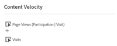
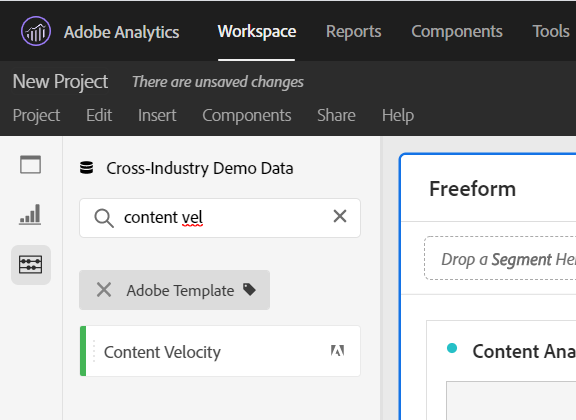

# Content Velocity

Content Velocity as an Adobe metric template that is provided out of the box. Content Velocity is defined as [Page Views | Visit Participation] / [Visits] and helps you measure how impactful a particular content piece (Page, Site section, etc.) was on downstream content. It can help you understand which content is and is not retaining users on the website or mobile app.

Content Velocity can be found in Analysis Workspace by filtering the left rail, either by searching or using tags (#Adobe Template).

Content velocity is commonly used in content analysis alongside other key metrics such as page views, visits, and bounce rate.

