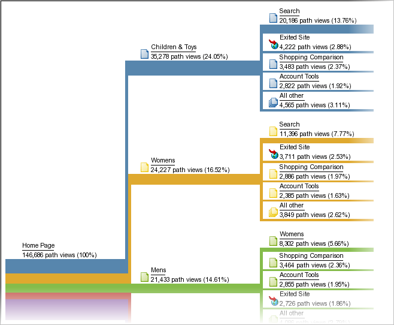

# Pathing

A group of reports based on path analysis. Technically, pathing means to move from one page name to another (from one value to another).

Use [Analysis Workspace Flow](https://marketing.adobe.com/resources/help/en_US/analytics/analysis-workspace/flow.html) for more flexible pathing options.

> [!NOTE] To enable pathing, go to **[!UICONTROL Admin > Report Suites > Edit Settings > Traffic > Traffic Variables]**. To enable pathing on the Site Section and Server reports, contact Customer Care.

If you need to know the order in which values are collected, then you need to enable pathing for the variable collecting those values. Pathing is enabled by default for pages. Pathing is not enabled for any props by default, because it is only appropriate in certain cases. Contact Customer Care to enable pathing on a prop.

> [!NOTE] In Ad Hoc Analysis, when you enable classifications on a prop, pathing metrics become available for all the classifications set up for the enabled prop.

**Example - Pathing on Site Sections**

Enabling pathing for the *`s.channel`* variable allows you to track how site visitors move between Site Sections (as the value changes).


Pathing is then available in various paths reports, such as [!UICONTROL Next Site Section Flow], which displays how visitors move through page groups, or sections of your site.



**Example - Pathing on Searches**

This same concept of going from one value to another value applies to other traffic variables as well, including *`s.props`*. For example, if you enable pathing for your Internal Search Term *`s.prop`*, you could see the path visitors take through search terms.

**Example - Pathing per Login Status**

You might want to know how people path through your site based on a visitor's log-in status. To see this information you would not look at the pathing reports for login status, because they would show you how visitors changed values in that report, or how visitors might have changed from logged-in to logged-out. Instead, concatenate the segment value with the *`s.pageName`* variable, and then path that resultant variable. Here is sample code for page pathing per member status:

```js
s.pageName="Home Page"; 
s.prop18="Gold"; // Member Status 
s.prop19=s.prop18 + ":" + s.pageName;
```

Then, enable pathing for *`s.prop19`* to see how members path through pages.

> [!NOTE] If you perform ad hoc analysis, you can segment page paths without the need to concatenate segment values, and apply any segment to pathing reports.

