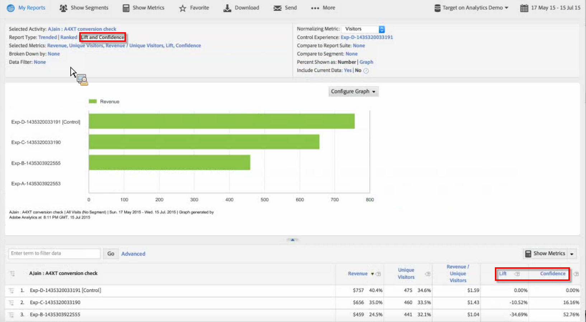

# Target Lift and Confidence

Lets you assess the success of campaigns in Adobe Analytics in the same way you have done in [!DNL Target Classic]  in the past.

 **[!UICONTROL Analytics]** > **[!UICONTROL Reports]** > **[!UICONTROL View All Reports]** > **[!UICONTROL Adobe Target]** > **[!UICONTROL Analytics for Target]** > **[!UICONTROL Target Activities]** .

The Adobe Target documentation contains more information on [Lift](https://marketing.adobe.com/resources/help/en_US/target/target/?f=c_estimating_lift_in_revenue) and [Confidence](https://marketing.adobe.com/resources/help/en_US/rec/?f=c_Confidence_Level_and_Confidence_Interval).

To calculate Lift and Confidence:

1. In the **[!UICONTROL Target Activities]** report, click on an activity to bring up its details. 
1. Under Report Type, select **[!UICONTROL Lift and Confidence]**. 
1. Click **[!UICONTROL Show Metrics]** to add one metric. You cannot add more than one metric for this type of report, since it is best practice to evaluate a test by only one metric. More metrics would only add noise and reduce the signal of the test. 
1. (Optional) Under **[!UICONTROL Normalizing Metric]**, select one of the following: Visitors, Visits, or Impressions. Most of the time, this will be the default, Visitors.

1. The report will add these metrics, including the ratio between metric and normalizing metric.

## Report Settings {#section_3508439E09CA4E38B2EA309BA477C01D}

<table id="table_0FBB257C96454CDA82D487DC68459C13"> 
 <thead> 
  <tr> 
   <th colname="col1" class="entry"> Setting </th> 
   <th colname="col2" class="entry"> Description </th> 
  </tr> 
 </thead>
 <tbody> 
  <tr> 
   <td colname="col1"> Selected Activity </td> 
   <td colname="col2"> The Target activity that you are currently viewing and calculating lift and confidence for. </td> 
  </tr> 
  <tr> 
   <td colname="col1"> Report Type </td> 
   <td colname="col2"> This is where you select Lift and Confidence - they will appear as metrics in the report results below. </td> 
  </tr> 
  <tr> 
   <td colname="col1"> Selected Metrics </td> 
   <td colname="col2"> Shows the metric you selected (in the example above, Revenue), the normalizing metric (Unique Visitors), the ratio between those 2 metrics, and then the Lift and Confidence calculations in comparison to the Control Experience. </td> 
  </tr> 
  <tr> 
   <td colname="col1"> Broken Down by </td> 
   <td colname="col2"> You can further break down the report by other reports. </td> 
  </tr> 
  <tr> 
   <td colname="col1"> Data Filter </td> 
   <td colname="col2"> Lets you apply specific filters to this report. </td> 
  </tr> 
  <tr> 
   <td colname="col1"> Normalizing Metric </td> 
   <td colname="col2"> You can normalize using Visits, Visitors, or Impressions. The normalizing metric becomes the denominator of the lift calculation. It also affects how the data is aggregated before the confidence calculation is applied. </td> 
  </tr> 
  <tr> 
   <td colname="col1"> Control Experience </td> 
   <td colname="col2"> The Target experience to which you are comparing and for which you are calculating lift. </td> 
  </tr> 
  <tr> 
   <td colname="col1"> Compare to Report Suite </td> 
   <td colname="col2"> Lets you choose other report suites to compare to. </td> 
  </tr> 
  <tr> 
   <td colname="col1"> Compare to Segment </td> 
   <td colname="col2"> Lets you choose segments to compare to. </td> 
  </tr> 
  <tr> 
   <td colname="col1"> Percent Shown as Number/Graph </td> 
   <td colname="col2"> Shows the Lift and Confidence percent as a number or a graph. </td> 
  </tr> 
  <tr> 
   <td colname="col1"> Include Current Data </td> 
   <td colname="col2"> 
The Include Current Data option in Reports &amp; Analytics lets you view the latest Analytics data, often before data is fully processed and finalized. Current data displays most metrics within minutes, providing actionable data for quick decision making. 
 </td> 
  </tr> 
 </tbody> 
</table>

