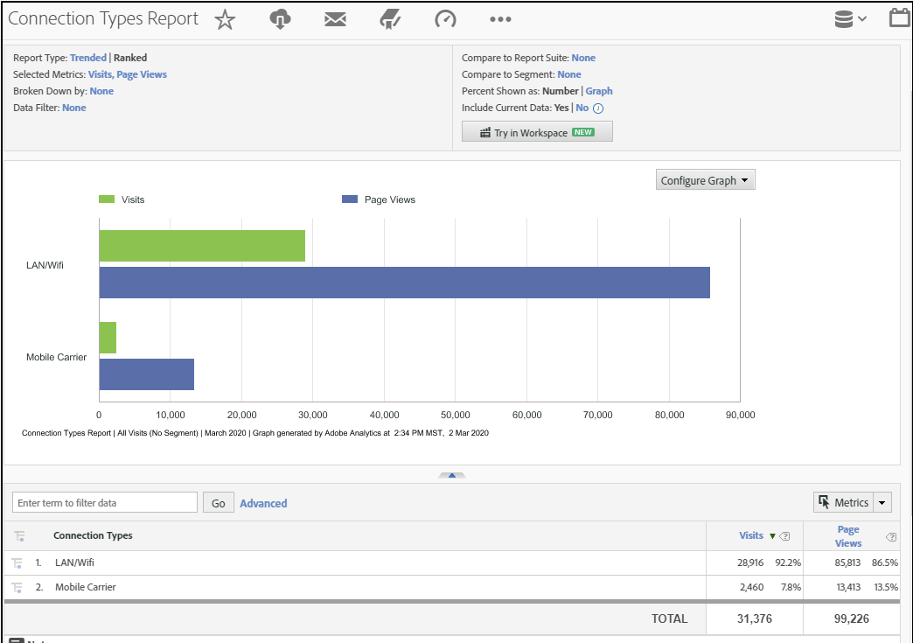

# Connection Type

Displays metrics for internet connection type, including modem, LAN/Wifi, mobile carrier, and so forth.

## Example

The following report compares connection types for the metrics [Visits](https://docs.adobe.com/content/help/en/analytics/components/variables/metrics/metrics-visit.html) and [Page Views](https://docs.adobe.com/content/help/en/analytics/components/variables/dimensions-reports/reports-page-views.html):

You can find additional insights into the mobile carrier connection type by viewing the [**Mobile Carrier Report**](https://docs.adobe.com/content/help/en/analytics/components/variables/dimensions-reports/reports-mobile-carrier.html).
