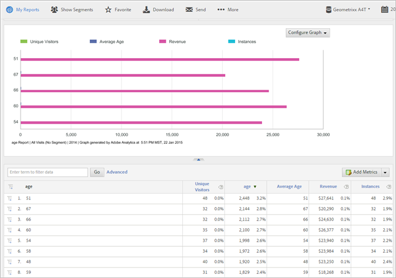

# Customer Attributes

An Analytics FAQ for customer attributes, and how to run the Customer Attributes report.

**[!UICONTROL Reports]** **[!UICONTROL > Visitor Profile]** > **[!UICONTROL Customer Attributes]**

If you capture enterprise customer data in a customer relationship management (CRM) database, you can upload the data into a customer attribute data source in the Experience Cloud. After the data is uploaded, you can run the Customer Attributes report in Reports & Analytics.

* [Customer Attributes and Reporting Metrics in Analytics](../../../components/c-variables/dimensionslist/reports-customer-attributes.md#section_EF343662146B460A882D3DF772ADD86D) 
* [FAQ - Customer Attributes in Analytics](../../../components/c-variables/dimensionslist/reports-customer-attributes.md#section_E29641D1F3D649C1AC9EA5231921F038)

See [Customer Attributes](https://marketing.adobe.com/resources/help/en_US/mcloud/index.html?f=attributes) in Experience Cloud help for information about uploading customer attribute data.

## Customer Attributes and Reporting Metrics in Analytics {#section_EF343662146B460A882D3DF772ADD86D}

After you upload customer attributes and validate the schema (in the Experience Cloud), the system creates metrics based on the friendly names (like *`age`* or *`gender`*) that you map to the attribute strings and integers. These metrics appear in **[!UICONTROL Visitor Profile]** > **[!UICONTROL Customer Attributes]** reports.

For example:

**[!UICONTROL Visitor Profile]** > **[!UICONTROL Customer Attributes]** > **[!UICONTROL Age]**

**Example - Age Metrics**

If you specify a string as *`age`*, the system creates the following metrics and dimensions:

* Age dimension: Lets you run a report based on the Age attribute. 
* Age metric: A metric you can add to a report, such as a Unique Visitors report. 
* Count of Age metric: Lets you understand, for example, if visitors specified an *`age`* value on a form.

Because metrics are sums in a report table, you should [create a calculated metric](https://marketing.adobe.com/resources/help/en_US/analytics/calcmetrics/) that tells you the average age. The formula for this metric is `Age / Count of Age`.

## FAQ - Customer Attributes in Analytics {#section_E29641D1F3D649C1AC9EA5231921F038}

<table id="table_88631069013B408EBB0A810657662B36"> 
 <thead> 
  <tr> 
   <th colname="col1" class="entry"> Question </th> 
   <th colname="col2" class="entry"> Answer </th> 
  </tr> 
 </thead>
 <tbody> 
  <tr> 
   <td colname="col1"> 
Why is it preferable to use the Identity Service to set the Customer ID instead of populating the Customer ID in a prop or eVar? 
 </td> 
   <td colname="col2"> 
Using the Identity Service offers a number of benefits: 
 
    <ul id="ul_5D3659604D43419F9CA5920B4F93728E"> 
     <li id="li_BA2EF0715C5A47EFAFA7191CFAD088A4">If you do not set the Customer ID with the Identity Service, the customer records are available only to Adobe Analytics. If you want to use the customer records for real-time targeting, you must use the Identity Service. </li> 
     <li id="li_228358684E474A298E39578D427BF932">Using the Identity Service to set the Customer ID reduces the time it takes to synchronize IDs with the Experience Cloud. If you put the Customer ID in a prop or eVar, the Customer IDs are sent to the Experience Cloud via back-end server synchronization that occurs in batches. The Identity Service synchronizes the Customer ID with the Experience Cloud immediately. </li> 
     <li id="li_BCF28219E4014FCF9F747C3D8D270526"> Using the Identity Service instead of a prop or eVar frees up that prop or eVar for other uses. </li> 
    </ul> </td> 
  </tr> 
  <tr> 
   <td colname="col1"> 
If I am already storing a customer ID in a prop or eVar, why would I use this new functionality instead of classifying my prop or eVar with CRM attributes? 
 </td> 
   <td colname="col2"> 
Props and eVars are subject to Uniques Exceeded limitations. Using this functionality you can bring in attribute data for an unlimited number of customer IDs. Also, using the prop/eVar approach limits the CRM information to Analytics. 
 </td> 
  </tr> 
  <tr> 
   <td colname="col1"> 
How will my CRM attributes appear in Adobe Analytics? 
 </td> 
   <td colname="col2"> 
CRM attributes will be manifest in Analysis Workspace, Reports &amp; Analytics, Ad Hoc Analysis, the reporting API, and Report Builder. Text attributes will appear as reports/dimensions. Numeric attributes will appear as both dimensions and metrics. 
 </td> 
  </tr> 
  <tr> 
   <td colname="col1"> 
Will the CRM data be available in Data Warehouse and in Data Feeds? 
 </td> 
   <td colname="col2"> 
The CRM data is not currently available in Data Warehouse or Analytics Data Feed. 
 </td> 
  </tr> 
 </tbody> 
</table>

