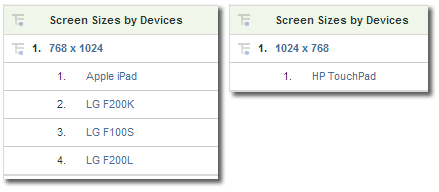

# Mobile

Displays information about web sites access from a mobile device. Mobile reports improve visitor identification by collecting data about mobile devices used to view your site. Mobile reports can identify a device's manufacturer and capabilities, such as screen sizes, video, audio, and cookie support, and other metrics. Mobile reports are available for all report suites.

## Mobile {#topic_D306EA4558194488AC47A45B9C570150}

Displays information about web sites access from a mobile device. Mobile reports improve visitor identification by collecting data about mobile devices used to view your site. Mobile reports can identify a device's manufacturer and capabilities, such as screen sizes, video, audio, and cookie support, and other metrics. Mobile reports are available for all report suites.

>[!NOTE]
>
>The Mobile Reports display mobile web traffic only. Mobile app data collected using the native iOS, Android, and other SDKs appear in the Mobile App Reports, and are displayed only when enabled in Admin Tools.

The following mobile reports are available: 

<table id="table_900BB8F2F3A746B6B97DC629B39910DA"> 
 <thead> 
  <tr> 
   <th colname="col1" class="entry"> Report </th> 
   <th colname="col2" class="entry"> Description </th> 
  </tr> 
 </thead>
 <tbody> 
  <tr> 
   <td colname="col1"> 
Devices 
 </td> 
   <td colname="col2"> 
Displays the number of visitors that accessed your site using mobile devices, such as devices running the iOS or Android. This report can help you understand the impact of mobile initiatives so you can plan accordingly. You can use this report to: 
 
 
     <ul id="ul_8CC40461C2944A63AED561E384275D24"> 
      <li id="li_4667815ED7384DE9824FB47F02040374"> 
Develop strategies that address mobile users 
 </li> 
      <li id="li_12C1F430E5464FB4AC29C2D970165935"> 
Identify your audience's preferences 
 </li> 
      <li id="li_BFECB3B1F5A345BA82FC22BF99E8E418"> 
Track the emergence of wireless and mobile users 
 </li> 
     </ul> 
 </td> 
  </tr> 
  <tr> 
   <td colname="col1"> Manufacturer </td> 
   <td colname="col2"> Groups mobile device hits to your site by mobile device manufacturer. The report displays the type of manufacturer, number of views for each manufacturer, and the corresponding percentages. </td> 
  </tr> 
  <tr> 
   <td colname="col1"> Screen Size </td> 
   <td colname="col2"> 
 Groups mobile device hits to your site by the screen size of the device. The report shows each screen size, the number of visitors to your site that used each screen size, and each screen size as a percentage of the total views. The Screen Size report shows both the height and width of the screen size as compared to the Screen Height report and Screen Width report. 
 
The mobile screen size report is currently static per device. Regardless of screen orientation, each device has a fixed screen resolution in the report. You can see this by breaking down Screen Size by Mobile Device. 
 </td> 
  </tr> 
  <tr> 
   <td colname="col1"> Screen Height </td> 
   <td colname="col2"> 
 Displays the screen height for various mobile devices and the number of views for each screen height. You can also view the  Screen Size report to see both the screen height and width. 
 </td> 
  </tr> 
  <tr> 
   <td colname="col1"> Screen Width </td> 
   <td colname="col2"> 
 Displays the screen width for various mobile devices and the number of views for each screen width. You can also view the  Screen Size report to see both the screen height and width. 
 </td> 
  </tr> 
  <tr> 
   <td colname="col1"> Cookie Support </td> 
   <td colname="col2"> 
Groups mobile device hits by whether they support cookies or not. Visitors are divided into groups the support cookies and groups that do not. The type of mobile device is identified in the user agent string. Adobe maintains a list of mobile devices that are known to support cookies. If the mobile device listed in the user agent string is also listed in Adobe’s list of mobile devices, then the  Supported line item in the  Cookie Support report is incremented. Otherwise, the  Not Supported line item in the report is incremented. 
 </td> 
  </tr> 
  <tr> 
   <td colname="col1"> Image Support </td> 
   <td colname="col2"> 
 Groups mobile devices based on the types of images they support. 
 
For example, if a visitor’s phone that supports  .jpeg images, accesses a site, the  Image Support report is incremented by at least one. If the phone supports more than one image format, then a visit to a site might result in multiple increments for that visit. In other words, if your phone supports  .jpeg,  .png, and  .gif formats, then each of those groups in the report is incremented. As such, the sum of the groups might be greater than the total shown at the bottom of the report. 
 </td> 
  </tr> 
  <tr> 
   <td colname="col1"> Color Depth </td> 
   <td colname="col2"> 
 Groups mobile device hits by the number of colors supported. The report shows the total number of visitors to your site who used a mobile device, and breaks them into groups based on the number of colors configured in their mobile devices. 
 
For example, if your visitor’s mobile phone supports 24 colors, then the report increments the line item corresponding to 24 colors. 
 </td> 
  </tr> 
  <tr> 
   <td colname="col1"> Audio Support </td> 
   <td colname="col2"> 
 Groups mobile devices based on the types of audio formats they support. 
 
For example, if a visitor’s phone supports the  .mp3 format, the Audio Support report increments by at least one. If the phone supports more than one image format, a visit to a site might result in increments for each supported audio type. In other words, if a phone supports  .mp3,  .aac, and  .amr formats, then each of those groups in the report is incremented. As such, the sum of the groups might be greater than the total shown at the bottom of the report. 
 </td> 
  </tr> 
  <tr> 
   <td colname="col1"> Video Support </td> 
   <td colname="col2"> 
 Groups mobile devices based on the types of video formats they support. 
 
For example, if a visitor's mobile device supports  .mp4, the Video Support report increments by at least one when it accesses your site. If the phone supports multiple image formats (such as  .mp4 and  .wmv), each of those groups in the report is incremented. Because of this, the sum of the groups might be greater than the total shown at the bottom of the report. 
 </td> 
  </tr> 
  <tr> 
   <td colname="col1"> DRM </td> 
   <td colname="col2"> 
 Groups mobile devices based on the type of Digital Rights Management (DRM) they support. DRM groups include  Forward Lock,  Combined Delivery,  Separate Delivery, and  Unknown. 
 </td> 
  </tr> 
  <tr> 
   <td colname="col1"> Net Protocols </td> 
   <td colname="col2"> 
 Groups mobile devices based on the network protocols (GPRS, CSD, EDGE, HSCSD, and so on) that they support. The report also includes an Unknown group for unidentified network protocols. 
 
When a visitor uses a mobile device to access your site, the Net Protocols report increments by at least one. If the phone supports multiple network protocols then each of those groups in the report increments. Because of this, the sum of the groups might be greater than the total shown at the bottom of the report. 
 </td> 
  </tr> 
  <tr> 
   <td colname="col1"> Operating System (deprecated) </td> 
   <td colname="col2"> 
 Groups mobile devices based on the mobile operating system running on the device. Mobile operating systems include Windows, RIM, iOS, Symbian, and so forth. The report also includes an Unknown group for unidentified mobile operating systems. 
 
Note: This report was deprecated when the Technology &gt; <a href="/help/components/c-variables/dimensionslist/reports-operating-system.md"  > Operating Systems</a> report was updated to include all operating systems, including mobile. You can create a segment where "mobile device" exists and apply it to the Technology &gt; Operating Systems report to view only mobile operating systems. 
 </td> 
  </tr> 
  <tr> 
   <td colname="col1"> Java Version </td> 
   <td colname="col2"> 
 Groups mobile devices based on the Java version that they support. The Java Version report identifies the Java version by the Java Specification Request (JSR) supported by the device. The report also includes an Unknown group for unidentified mobile operating systems. 
 
You can find out more about a given JSR at the <a href="https://jcp.org/en/jsr/overview"  format="html"> Java Community Process</a> website. 
 </td> 
  </tr> 
  <tr> 
   <td colname="col1"> Bookmark URL Length </td> 
   <td colname="col2"> 
 Groups mobile devices based on the maximum supported length, in characters, of a bookmark URL. 
 </td> 
  </tr> 
  <tr> 
   <td colname="col1"> Mail URL Length </td> 
   <td colname="col2"> 
 Groups mobile devices based on the maximum supported length, in characters, of an Email URL. 
 </td> 
  </tr> 
  <tr> 
   <td colname="col1"> Browser URL Length </td> 
   <td colname="col2"> 
 Groups mobile devices based on the maximum supported length, in characters, of a Web browser URL. 
 </td> 
  </tr> 
  <tr> 
   <td colname="col1"> Device Number Transit (ON/OFF) </td> 
   <td colname="col2"> 
 Groups mobile devices based on whether Device Number Transmit is supported. The report also includes an Unknown group for those devices where Device Number Transmit support cannot be determined. 
 </td> 
  </tr> 
  <tr> 
   <td colname="col1"> PTT </td> 
   <td colname="col2"> 
 Groups mobile devices based on whether the device supports Push To Talk (PTT). The report also includes an  Unknown group for those devices where PTT support cannot be determined. 
 </td> 
  </tr> 
  <tr> 
   <td colname="col1"> Decoration Mail Support </td> 
   <td colname="col2"> 
 Groups mobile devices based on whether the device supports DecoMail, which allows a user to decorate their mail with graphics and animations. The report also includes an  Unknown group for those devices where Decoration Mail support cannot be determined. 
 </td> 
  </tr> 
  <tr> 
   <td colname="col1"> Information Services </td> 
   <td colname="col2"> 
 Groups mobile devices based on the news services (Channel I/B, EZ News Flash, W+INFO, and so on.) that they support. When a visitor uses a mobile device with news service support to access your site, the  Information Services report increments by at least one. If the phone supports multiple news services, each of those groups in the report increments. Because of this, the sum of the groups might be greater than the total shown at the bottom of the report. 
 </td> 
  </tr> 
 </tbody> 
</table>

