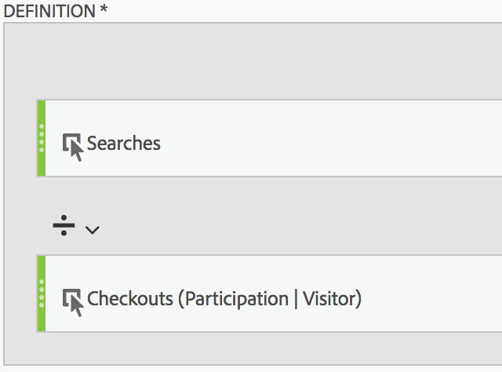

# Participation Metric

With the Calculated Metric builder, anyone can create a participation metric.

>[!NOTE]
>
>You used to have to do this via the Admin Tools. You can still enable participation metrics in the Admin Tools, but only for custom events 1 - 100.

Here is a simple use cases: You are a content owner and you want to see which pages contributed to (participated in) visits that contained an email sign-up. Here’s how:

1. Create a new metric in the Calculated Metric Builder. 
1. Drag the success event "Checkouts" into the Definition canvas. 
1. Change the [attribution model](../../../../c_calcmetrics/c_workflow/cm_workflow/c_build_metrics/m_metric_type_alloc.md#concept_B7A1FCFEFA9D4C4883208ACE8C9C8E5E) of that event to Participation. The definition should look similar to this:

   

1. Save the metric. 
1. Share it with the people who need it in your company.

