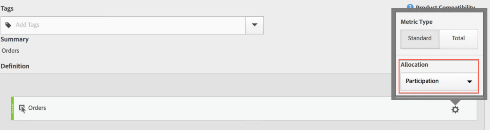
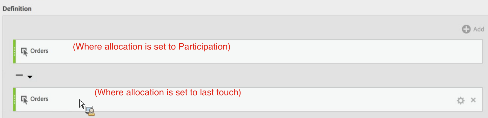
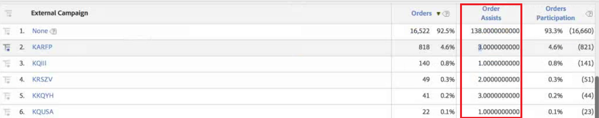

# Order Assists Metric

1. In the Calculated Metrics Builder, name the metric something like "Order Assists".
1. In the Definition canvas, drag in an Orders metric, but change the allocation to "Participation." Participation is similar to linear allocation, except full credit is given to all values.  

1. Drag in another Orders metric below this one, but leave the default (last touch) allocation.
1. Change the operator between the two metrics to a minus (-).This will subtract all orders where allocation went to the last campaign before the order.  

1. Save the metric.
1. Apply it to the External Campaigns report:  

This is an easy way to tell which campaigns assisted in the conversion of orders. 
