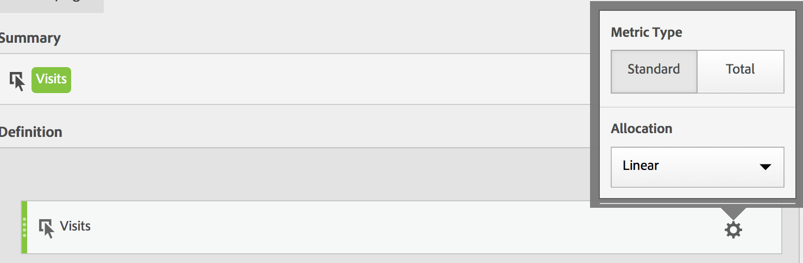

# Metric Type and Allocation

* [ Metric Type ](../../../c_calcmetrics_bucket/cm_workflow/cm_build_metrics/m_metric_type_alloc.md#section_34A86FB402F94E988724232283BF18B7)
* [ Allocation ](../../../c_calcmetrics_bucket/cm_workflow/cm_build_metrics/m_metric_type_alloc.md#section_F9690FD1943B403AB28E2FAC54EFE032)
* [ How Linear Allocation will work as of July 19, 2018 ](../../../c_calcmetrics_bucket/cm_workflow/cm_build_metrics/m_metric_type_alloc.md#section_EDBB2E14A6C248C5A79C0913C02D7CA1)

## Metric Type {#section_34A86FB402F94E988724232283BF18B7}

 
|  Metric Type  | Definition  |
|---|---|
|  Standard  | These metrics are the same metrics used in standard Analytics reporting. If a formula consisted of a single standard metric, it displays identical data to its non-calculated-metric counterpart. Standard metrics are useful for creating calculated metrics specific to each individual line item. For example, [Orders] / [Visits] takes orders for that specific line item and divides it by the number of visits for that specific line item.  |
|  Total  | Use the total for the reporting period in every line item. If a formula consisted of a single total metric, it displays the same total number on every line item. Total metrics are useful for creating calculated metrics that compare against site total data. For example, [Orders] / [Total Visits] shows the proportion of orders against ALL visits to your site, not just the visits to the specific line item.  |

## Allocation {#section_F9690FD1943B403AB28E2FAC54EFE032}

>[!IMPORTANT]
>
>On July 19th, Adobe Analytics will revise the way allocation models in calculated metrics are evaluated. As part of this change, calculated metrics that use a non-default allocation model will be migrated to new improved attribution models:
>
>* “Marketing Channel Last Touch” and “Marketing Channel First Touch” allocation models will be migrated to new “Last Touch” and “First Touch” attribution models respectively (Note: “Marketing Channels” will not be deprecated - only the two allocation models that appear in calculated metrics will be).
>* In addition, we will correct the way Linear allocation is calculated. For customers using calculated metrics with “Linear” allocation models, the reports may change slightly to reflect the new, corrected attribution model. This change to calculated metrics will be reflected in Analysis Workspace, Reports and Analytics, the Reporting API, Report Builder, and Ad Hoc Analysis. For more information, see [ How Linear Allocation will work as of July 19, 2018 ](../../../c_calcmetrics_bucket/cm_workflow/cm_build_metrics/m_metric_type_alloc.md#section_EDBB2E14A6C248C5A79C0913C02D7CA1).

<table id="table_2118C64DB0404767A6277B7BFFAAD76F"> 
 <thead> 
  <tr> 
   <th colname="col1" class="entry"> Allocation Type </th> 
   <th colname="col2" class="entry"> Definition </th> 
  </tr> 
 </thead>
 <tbody> 
  <tr> 
   <td colname="col1"> 
Default 
 </td> 
   <td colname="col2"> 
Uses the default allocation setting from whatever eVar the calculated metric is applied to. 
 </td> 
  </tr> 
  <tr> 
   <td colname="col1"> 
Linear 
 </td> 
   <td colname="col2"> 
All variable values within the visit of the success event receive equal divided credit. If the success event was a currency amount, the currency is split. If it is a counter event, each conversion variable value receives a fraction of the single instance. These fractions are summed then rounded in reporting. 
 
For more information on how linear allocation will change in the near future, see <a href="../../../c_calcmetrics_bucket/cm_workflow/cm_build_metrics/m_metric_type_alloc.md#section_EDBB2E14A6C248C5A79C0913C02D7CA1" format="dita" scope="local"> How Linear Allocation will work as of July 19, 2018 </a>. 
 </td> 
  </tr> 
  <tr> 
   <td colname="col1"> 
Visit Participation 
 </td> 
   <td colname="col2"> 
Participation metrics assign full credit from success events to all values of an eVar that were passed during a visit. Participation metrics are useful to determine which pages, campaigns, or other custom variable values are contributing most to the success of your site. Participation is visit based. 
 </td> 
  </tr> 
  <tr> 
   <td colname="col1"> 
Last Touch (Recent) 
 </td> 
   <td colname="col2"> 
Full credit is given to the last variable value associated with the success event. 
 </td> 
  </tr> 
  <tr> 
   <td colname="col1"> 
Reporting Window Participation 
 </td> 
   <td colname="col2"> 
Whenever this allocation type is used, the data set&amp;nbsp;that is returned&amp;nbsp;goes back to the start of the requested month. For example, if you set your date range to 15 October 2016-15 November 2016, the data that returns will actually be 1 October 2016-15 November 2016. The point is that it will almost always extend beyond the reporting window (unless your reporting window starts on the first of a month). The reason is to avoid discrepancies between line items and totals. 
 </td> 
  </tr> 
  <tr> 
   <td colname="col1"> 
Marketing Channel First Touch 
 </td> 
   <td colname="col2"> 
Full credit is given to the first variable value associated with the success event in a marketing channel. These calculated metrics are available only in the  Marketing Channel Overview  report. 
 
Note:  Will be deprecated as of July 19, 2018, and migrated to new “First Touch” attribution model. 
 </td> 
  </tr> 
  <tr> 
   <td colname="col1"> 
Marketing Channel Last Touch 
 </td> 
   <td colname="col2"> 
Full credit is given to the last variable value associated with the success event in a marketing channel. These calculated metrics are available only in the  Marketing Channel Overview  report. 
 
Note:  Will be deprecated as of July 19, 2018, and migrated to new “Last Touch” attribution model. 
 </td> 
  </tr> 
 </tbody> 
</table>

## How Linear Allocation works as of July 19, 2018 {#section_EDBB2E14A6C248C5A79C0913C02D7CA1}

Adobe Analytics changed how linear allocation is reported for Calculated Metrics. This change impacts Analysis Workspace, Ad Hoc Analysis, Reports and Analytics, Report Builder, Activity Map, and the Reporting APIs. The change primarily impacts eVars and other dimensions that have persistence. Note that these changes only apply to calculated metrics and do not impact other reports using linear allocation (such as the Pages report in Reports and Analytics). Other reports using linear allocation continue to use the existing method of linear allocation. 

The following example illustrates how calculated metrics with linear allocation have changed in reporting: 

<table id="table_E66D066A3E7B4232BBC220775F8B985A"> 
 <thead> 
  <tr> 
   <th colname="col1" class="entry"> </th> 
   <th colname="col2" class="entry"> Hit 1 </th> 
   <th colname="col3" class="entry"> Hit 2 </th> 
   <th colname="col4" class="entry"> Hit 3 </th> 
   <th colname="col5" class="entry"> Hit 4 </th> 
   <th colname="col6" class="entry"> Hit 5 </th> 
   <th colname="col7" class="entry"> Hit 6 </th> 
   <th colname="col8" class="entry"> Hit 7 </th> 
  </tr> 
 </thead>
 <tbody> 
  <tr> 
   <td colname="col1"> 
Data Sent In 
 </td> 
   <td colname="col2"> PROMO A </td> 
   <td colname="col3"> - </td> 
   <td colname="col4"> PROMO A </td> 
   <td colname="col5"> PROMO B </td> 
   <td colname="col6"> - </td> 
   <td colname="col7"> PROMO C </td> 
   <td colname="col8"> $10 </td> 
  </tr> 
  <tr> 
   <td colname="col1"> 
Last Touch eVar 
 </td> 
   <td colname="col2"> PROMO A </td> 
   <td colname="col3"> PROMO A </td> 
   <td colname="col4"> PROMO A </td> 
   <td colname="col5"> PROMO B </td> 
   <td colname="col6"> PROMO B </td> 
   <td colname="col7"> PROMO C </td> 
   <td colname="col8"> $10 </td> 
  </tr> 
  <tr> 
   <td colname="col1"> 
First Touch eVar 
 </td> 
   <td colname="col2"> PROMO A </td> 
   <td colname="col3"> PROMO A </td> 
   <td colname="col4"> PROMO A </td> 
   <td colname="col5"> PROMO A </td> 
   <td colname="col6"> PROMO A </td> 
   <td colname="col7"> PROMO A </td> 
   <td colname="col8"> $10 </td> 
  </tr> 
  <tr> 
   <td colname="col1"> 
Example prop 
 </td> 
   <td colname="col2"> PROMO A </td> 
   <td colname="col3"> - </td> 
   <td colname="col4"> PROMO A </td> 
   <td colname="col5"> PROMO B </td> 
   <td colname="col6"> - </td> 
   <td colname="col7"> PROMO C </td> 
   <td colname="col8"> $10 </td> 
  </tr> 
 </tbody> 
</table>

In this example, the values A, B, and C were sent into a variable on hits 1, 3, 4, and 6 before a $10 purchase was made on hit 7. In the second row, those values persist across hits on a last touch visit basis. The third row illustrates a first-touch visit persistence. Finally, the last row illustrates how data would be recorded for a prop which does not have persistence. 

**Summary of how linear allocation currently works** 

Currently (prior to July 19, 2018), linear attribution is calculated after first touch or last touch persistence has already occurred. This means that for the last touch eVar above, the $10 would be distributed as follows: A = 10 * (3/6) = $5, B = 10 * (2/6) = $3.33, C = 10 * (1/6) = $1.67. 

For the first touch eVar above, all $10 would be given to A. For the prop: A = 10 * (2/4) = $5, B = 10 * (1/4) = $2.50, and C = 10 * (1/4) = $2.50. To summarize linear allocation as it works today: 

|  Values  | Current Last Touch eVar  | Current First Touch eVar  | Current Prop  |
|---|---|---|---|
|  PROMO A  | $5.00  | $10.00  | $5.00  |
|  PROMO B  | $3.33  | $0  | $2.50  |
|  PROMO C  | $1.67  | $0  | $2.50  |
|  Total  | $10.00  | $10.00  | $10.00  |

**Summary of how linear allocation will work as of July 19, 2018** 

After July 19th, we will correct this behavior in calculated metrics. Instead of using the persisted values based on last touch or first touch, Analytics will use only the values that were passed in (the first row of the top table). As such, the dimension allocation settings will no longer impact the way linear allocation is calculated (meaning props and eVars will be treated in the same way), and the results will reflect what was originally passed in rather than the first or last touch values that may have persisted. So, in all three cases, A = 10 * (2/4) = $5, B = 10 * (1/4) = $2.50, and C = 10 * (1/4) = $2.50. 

|  Values  | New Last Touch eVar  | New First Touch eVar  | New Prop  |
|---|---|---|---|
|  PROMO A  | $5.00  | $5.00  | $5.00  |
|  PROMO B  | $2.50  | $2.50  | $2.50  |
|  PROMO C  | $2.50  | $2.50  | $2.50  |
|  Total  | $10.00  | $10.00  | $10.00  |

<!-- 
Additionally, as part of this change, Analytics is <b>changing how multiple sequential successes</b> are treated. In the following example, 7 hits occurred in the same visit with two orders, one $10 order on hit 4, and one $5 order on hit 7: 
 
<table id="table_4647AA466D1447F6961DDC10468FCCE1"> 
 <tgroup cols="8"> 
  <colspec colnum="1" colname="col1" colwidth="1.00*" /> 
  <colspec colnum="2" colname="col2" colwidth="1.04*" /> 
  <colspec colnum="3" colname="col3" colwidth="1.02*" /> 
  <colspec colnum="4" colname="col4" colwidth="1.02*" /> 
  <colspec colnum="5" colname="col5" colwidth="1.03*" /> 
  <colspec colnum="6" colname="col6" colwidth="1.02*" /> 
  <colspec colnum="7" colname="col7" colwidth="1.02*" /> 
  <colspec colnum="8" colname="col8" colwidth="1.03*" /> 
  <thead> 
   <tr> 
    <th colname="col1" class="entry"> </th> 
    <th colname="col2" class="entry"> Hit 1 </th> 
    <th colname="col3" class="entry"> Hit 2 </th> 
    <th colname="col4" class="entry"> Hit 3 </th> 
    <th colname="col5" class="entry"> Hit 4 </th> 
    <th colname="col6" class="entry"> Hit 5 </th> 
    <th colname="col7" class="entry"> Hit 6 </th> 
    <th colname="col8" class="entry"> Hit 7 </th> 
   </tr> 
  </thead> 
  <tbody> 
   <tr> 
    <td colname="col1"> 
Data Sent In 
 </td> 
    <td colname="col2"> PROMO A </td> 
    <td colname="col3"> - </td> 
    <td colname="col4"> PROMO B </td> 
    <td colname="col5"> $10 </td> 
    <td colname="col6"> - </td> 
    <td colname="col7"> PROMO C </td> 
    <td colname="col8"> $5 </td> 
   </tr> 
   <tr> 
    <td colname="col1"> 
Last Touch eVar 
 </td> 
    <td colname="col2"> PROMO A </td> 
    <td colname="col3"> PROMO A </td> 
    <td colname="col4"> PROMO B </td> 
    <td colname="col5"> $10 </td> 
    <td colname="col6"> PROMO B </td> 
    <td colname="col7"> PROMO C </td> 
    <td colname="col8"> $5 </td> 
   </tr> 
   <tr> 
    <td colname="col1"> 
First Touch eVar 
 </td> 
    <td colname="col2"> PROMO A </td> 
    <td colname="col3"> PROMO A </td> 
    <td colname="col4"> PROMO A </td> 
    <td colname="col5"> $10 </td> 
    <td colname="col6"> PROMO A </td> 
    <td colname="col7"> PROMO A </td> 
    <td colname="col8"> $5 </td> 
   </tr> 
   <tr> 
    <td colname="col1"> 
Example prop 
 </td> 
    <td colname="col2"> PROMO A </td> 
    <td colname="col3"> - </td> 
    <td colname="col4"> PROMO A </td> 
    <td colname="col5"> $10 </td> 
    <td colname="col6"> - </td> 
    <td colname="col7"> PROMO C </td> 
    <td colname="col8"> $5 </td> 
   </tr> 
  </tbody> 
 </tgroup> 
</table> 

 
 

Currently (<b>prior to July 19, 2018</b>), linear attribution would carry forward past the initial conversion and persist into the second conversion 
 
<ul id="ul_FD09813B59F04FF2A96A70BBE0A8F349"> 
 <li id="li_2EC965DDAE334C1795530F7C6F1674C5">In our first-touch eVar example, the total revenue for each promotion would be calculated using the promos prior to conversion on hit 4 for revenue on hit 4, but all promos for the conversion on hit 7. </li> 
 <li id="li_687C03C4B0A941AA800084F324A95FD6">In our last-touch eVar example, this would be: A = (2/3) * 10 + (2/5) * 5 = $8.66, B = (1/3) * 10 + (2/5) * 5 = $5.33, C = (1/5) * 5 = $1.00. In our FT eVar example: A = (3/3) * 10 + (5/5) * 5 = $15.00, and for the prop: A = (1/2) * 10 + (1/3) * 5 = $6.66, B = (1/2) * 10 + (1/3) * 5 = $6.66, and C = (1/3) * 5 = $1.66. </li> 
</ul> 

Resulting in a distribution as follows: 
 
<table id="table_6A066E602BF641B0BD4B175EE9753C6E"> 
 <tgroup cols="4"> 
  <colspec colnum="1" colname="col1" colwidth="*" /> 
  <colspec colnum="2" colname="col2" colwidth="*" /> 
  <colspec colnum="3" colname="col3" colwidth="*" /> 
  <colspec colnum="4" colname="col4" colwidth="*" /> 
  <thead> 
   <tr> 
    <th colname="col1" class="entry"> Values </th> 
    <th colname="col2" class="entry"> Current Last Touch eVar </th> 
    <th colname="col3" class="entry"> Current First Touch eVar </th> 
    <th colname="col4" class="entry"> Current Prop </th> 
   </tr> 
  </thead> 
  <tbody> 
   <tr> 
    <td colname="col1"> PROMO A </td> 
    <td colname="col2"> $8.66 </td> 
    <td colname="col3"> $15.00 </td> 
    <td colname="col4"> $6.66 </td> 
   </tr> 
   <tr> 
    <td colname="col1"> PROMO B </td> 
    <td colname="col2"> $5.33 </td> 
    <td colname="col3"> $0.00 </td> 
    <td colname="col4"> $6.66 </td> 
   </tr> 
   <tr> 
    <td colname="col1"> PROMO C </td> 
    <td colname="col2"> $1.00 </td> 
    <td colname="col3"> $0.00 </td> 
    <td colname="col4"> $1.66 </td> 
   </tr> 
   <tr> 
    <td colname="col1"> Total </td> 
    <td colname="col2"> $15.00 </td> 
    <td colname="col3"> $15.00 </td> 
    <td colname="col4"> $15.00 </td> 
   </tr> 
  </tbody> 
 </tgroup> 
</table> 

 
 

<b>After July 19, 2018</b>, Analytics will treat each sequence of conversions independently, meaning linear attribution will no longer carry forward from one conversion to another. In the previous example, attribution will always be treated the same way (regardless of the eVar allocation settings as stated above) and will be calculated as follows: A = (1/2) * 10 = $5, B = (1/2) * 10 = $5, and C = (1/1) * 5 = $5. To summarize: 
 
<table id="table_2D39CCD158BF488EA404324DF50B9579"> 
 <tgroup cols="4"> 
  <colspec colnum="1" colname="col1" colwidth="*" /> 
  <colspec colnum="2" colname="col2" colwidth="*" /> 
  <colspec colnum="3" colname="col3" colwidth="*" /> 
  <colspec colnum="4" colname="col4" colwidth="*" /> 
  <thead> 
   <tr> 
    <th colname="col1" class="entry"> Values </th> 
    <th colname="col2" class="entry"> New Last Touch eVar </th> 
    <th colname="col3" class="entry"> New First Touch eVar </th> 
    <th colname="col4" class="entry"> New Prop </th> 
   </tr> 
  </thead> 
  <tbody> 
   <tr> 
    <td colname="col1"> PROMO A </td> 
    <td colname="col2"> $5.00 </td> 
    <td colname="col3"> $5.00 </td> 
    <td colname="col4"> $5.00 </td> 
   </tr> 
   <tr> 
    <td colname="col1"> PROMO B </td> 
    <td colname="col2"> $5.00 </td> 
    <td colname="col3"> $5.00 </td> 
    <td colname="col4"> $5.00 </td> 
   </tr> 
   <tr> 
    <td colname="col1"> PROMO C </td> 
    <td colname="col2"> $5.00 </td> 
    <td colname="col3"> $5.00 </td> 
    <td colname="col4"> $5.00 </td> 
   </tr> 
   <tr> 
    <td colname="col1"> Total </td> 
    <td colname="col2"> $15.00 </td> 
    <td colname="col3"> $15.00 </td> 
    <td colname="col4"> $15.00 </td> 
   </tr> 
  </tbody> 
 </tgroup> 
</table> -->
